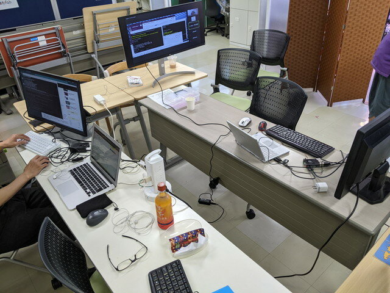
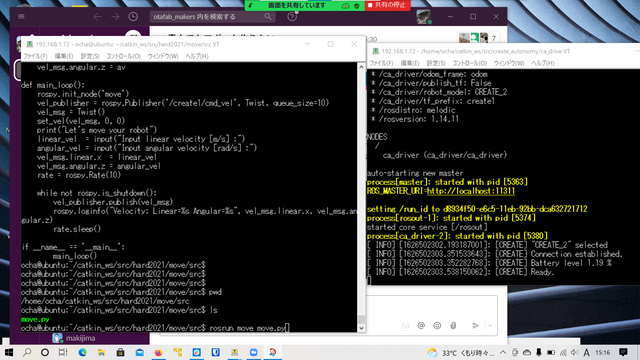

[おおたfab](https://ot-fb.com/ "おおたfab")さんでは、「[素人でもロボットをつくりたい](https://ot-fb.com/event/%e7%ac%ac44%e5%9b%9e%e3%80%80%e7%b4%a0%e4%ba%ba%e3%81%a7%e3%82%82%e3%83%ad%e3%83%9c%e3%83%83%e3%83%88%e4%bd%9c%e3%82%8a%e3%81%9f%e3%81%84%ef%bc%81%e3%83%ab%e3%83%b3%e3%83%90%e6%94%b9%e9%80%a0%e4%b8%ad/ "素人でもロボットをつくりたい")」という勉強会を定期的に行っています。前回は[ROSをつかってキーボードでルンバを動かす](https://kanpapa.com/2021/07/Roomba-robot-ros-part1-otafab.html "ルンバをROSで動かしてみました。（おおたfab 第43回 素人でもロボットをつくりたい）")ことに成功しました。今回はルンバのシミュレータでPythonプログラムの動作を確認し、ルンバ実機で動かしてみます。



今回も[demura.net](https://demura.net/ "demura.net")さんの記事を参考にして進めてみます。

- [HARD2021: ルンバをPythonプログラムで動かそう！](https://demura.net/robot/hard/20101.html "HARD2021: ルンバをPythonプログラムで動かそう！")

<!--more-->

### Pythonプログラムを眺めてみる

記事にはPythonで書かれたプログラムが掲載されています。39行でコメントもついていて読みやすいです。Pythonプログラムでmoveというnodeを作り、/create1/cmd\_velというtopicを一定間隔でGazeboシミュレーターにpublishして仮想のルンバを動かすというものです。

これをrqtというツールで構造を可視化すると次の図が表示されます。（クリックして拡大）


オレンジ色の枠で囲んだところが今回Pythonプログラムで作成したmoveノードになります。

/create1はルンバ本体のノードです。

### Gazeboシミュレータでルンバの動きを確認する

記事通りの手順で実際に動かすとこのような画面が表示されます。この画面はPC上のUbuntuですが、勉強会では各自で持ち込んだRaspberry Pi 4(4GB)上で動かしました。


3Dでルンバが表示されたあとに、Pythonで書いたmoveノードを起動すると、円を描くように動きます。YouTubeに動画も載せておきました。

このようにシミュレータ上ではルンバを動かすことができました。これを実際のルンバで試してみます。

### ルンバの実機で動作を確認

Pythonで書いたmoveノードをルンバ実機で動かしてみます。


以下の手順を行います。

1\. Raspberry Pi 4にモバイルバッテリーを接続し電源を入れる。

2\. [前回の勉強会の時のように](https://kanpapa.com/2021/07/Roomba-robot-ros-part1-otafab.html "ルンバをROSで動かしてみました。（おおたfab 第43回 素人でもロボットをつくりたい）")Raspberry Pi 4のUSBにUSB-シリアル変換を使ってルンバを接続し、ルンバの電源を入れる。

3\. 新たなターミナルを１つ立ち上げて以下のコマンドを入力する。

```
　$ roslaunch ca_driver create_2.launch

```

4\. 新たなターミナルを１つ立ち上げてmove.pyノードを実行する。

```
　$ roscd move/src
$ rosrun move move.py

```

起動時のパラメタはlinear velocity (並進速度)：0.2 \[m/s\]、Angular velocity（角速度）: 0.2 \[rad/s\]としました。



実際に動かしたときの動画です。シミュレータと同様に円を描いて動いていることがわかります。しかもかなり正確な動きで、狭い椅子の間を通り抜けていきます。

動画をみるとわかりますが、ルンバの上にスマホを載せて動画を撮ってみました。下から見上げた景色の動画が撮れてこれだけでも楽しかったです。

### 次回からはプログラミング

これでシミュレータを使って動作を確認したあとに実機での動きを確認するという一連の流れを体験することができました。あとはPythonでプログラムを書くだけですが、まずは/create1ノードの使い方を理解する必要があります。次回はこのあたりを試してみようと思います。
