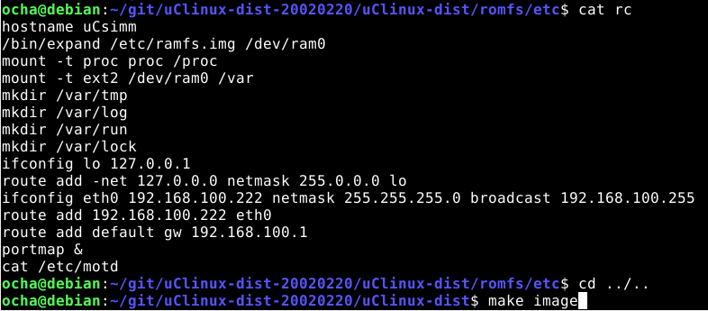

uClinuxの起動時には/etc/rcが実行され、ここに記述されているネットワーク設定が行われます。この設定はromfsにあるため変更はできません。このままだと起動するたびにネットワークの再設定を行わなくてはなりません。これを自宅ネットワークの設定に合わせることで手間をなくします。

## romfsの内容を変更する

ビルド環境のuClinux-dist/romfsにromfsのイメージを作成するためのファイルがおかれています。/etc/rcもここにあります。uClinux-dist/romfs/etc/rcの内容を変更したあとにimage.binを作り、それをフラッシュメモリに書き込めばよいはずです。

実際に修正してみました。

 <!--more-->

etc/rcの中にネットワーク設定の部分があるので、これを書き換えました。書き換えたあとはmake imageを行います。

これでromfsが変更されたimage.binができあがるので、あとはフラッシュメモリに書き込めばOKです。

## 起動時にネットワークに接続

これでuClinuxを起動した時点でネットワークに接続されます。これで起動後は手間をかけずにネットワークがすぐ使えます。

この手順はromfsをカスタマイズする際にも応用できます。

## WiFiへの接続

自宅のネットワーク環境はルーターから少し距離があるので、有線LANを使う場合はリビングをまたいで長いLANケーブルを這わせています。これがやや不評なのでWiFi対応を行いました。といっても小型WiFiルーターをLANケーブルで接続するだけですが。

これでWiFi対応になりました。
