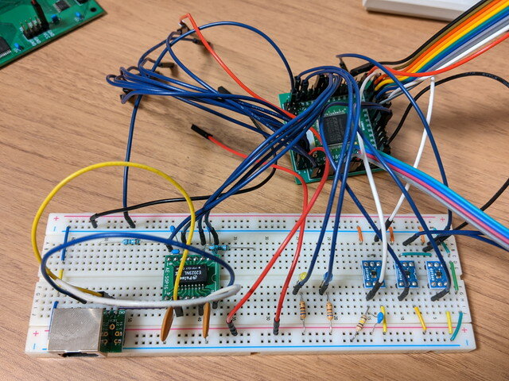
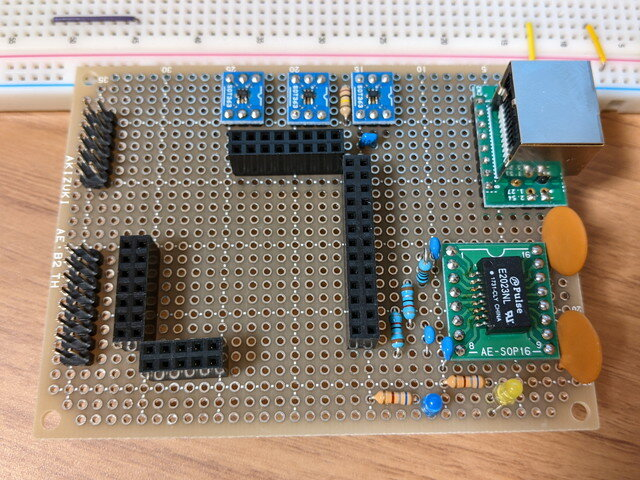
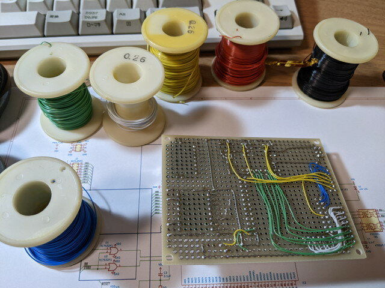
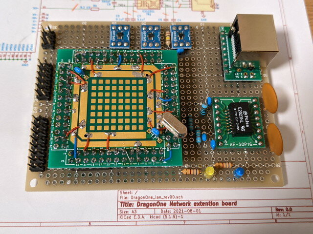
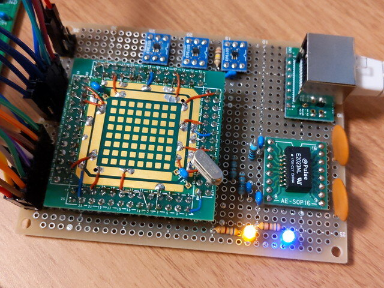
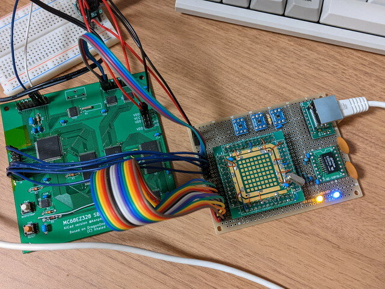
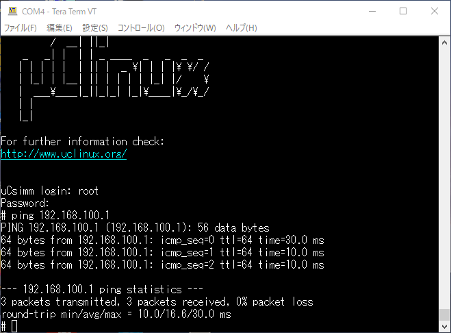

これまでブレッドボードでLANボードを試作してきましたが、配線数も多くこのままだと移動もままならないのでブレッドボードに載せ替えることにしました。より安定した動作も望めます。

### ブレッドボードからパーツを取り外す

MC68EZ328 SBCに接続しているブレッドボードをはずします。もじゃ配線です。

これらのパーツをすべて外していきます。

<!--more-->

### 新基板のレイアウトを決める

回路図をみながら部品のレイアウトを決めていきます。LANコントローラーの部分は手持ちのコネクタに合わせて使用しているピンのところだけピンソケットを取り付けることにします。

そんなに部品数は多くないのでシンプルに並べることにしました。

これでレイアウトはほぼ確定です。

### ラッピングワイヤーで配線する

決定したレイアウトに従って配線していきます。私の場合は６色のラッピングワイヤー(AWG30)を使い分けて、はんだ付けしています。

配線が終わったLANボードです。最初のレイアウトを見直し、3X2のピンヘッダを電源用として追加しています。

### MC68EZ328 SBCでの動作確認

完成したLANボードをMC68EZ328 SBCに接続して動作確認をしたところ、残念ながら通信はできませんでした。

このあと配線を見直し、いくつかのミスを修正したところ、pingが返ってくるようになりました。

 

こんな感じでピカピカLANっぽくLEDが点滅します。

### 次は専用基板でさらに小型化

これでブレッドボードへの載せ替えは完了です。

今回は秋月電子のB基板(95x72mm)を使用して製作しました。同じ回路をKiCadで基板を設計してみたところ、C基板（72x47.5mm)のサイズに納めることができました。

まだ基板発注はしていませんがいずれ製作してみようと思います。
