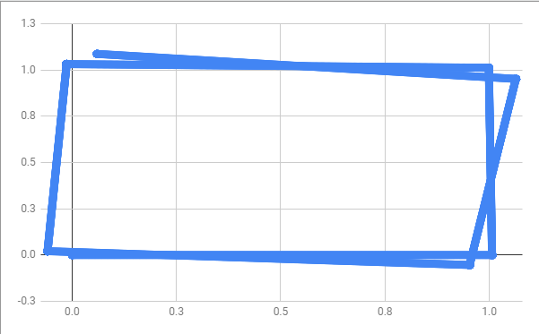
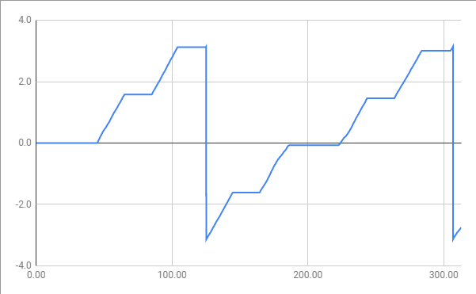
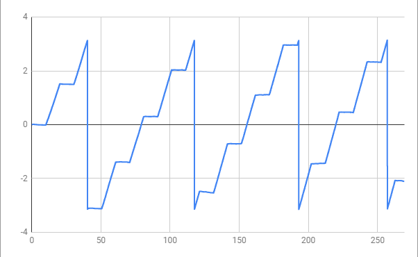

[おおたfab](https://ot-fb.com/ "おおたfab")さんでは、「[素人でもロボットをつくりたい](https://ot-fb.com/event_shop/%e7%b4%a0%e4%ba%ba%e3%81%a7%e3%82%82%e3%83%ad%e3%83%9c%e3%83%83%e3%83%88%e4%bd%9c%e3%82%8a%e3%81%9f%e3%81%84/ "素人でもロボットをつくりたい")」という勉強会を定期的に行っています。前回は[シミュレータで動きとルンバ実機の動きを比較してみました](https://kanpapa.com/2021/08/Roomba-robot-ros-part3-otafab.html "ルンバをPythonで動かしてみました（その２） （おおたfab 第46回 素人でもロボットをつくりたい）")が、動きが大きく異なることがわかりました。今回はオドメトリ(Odometry)情報を取得して、細かい動きを比較してみることで、どのようにプログラムをすれば正確な動きになるのかを考えてみます。


今回も[demura.net](https://demura.net/ "demura.net")さんの記事を参考にして進めています。

- [HARD2021:ルンバの位置をPythonプログラムで知ろう！](https://demura.net/robot/hard/20085.html "HARD2021:ルンバの位置をPythonプログラムで知ろう！")

<!--more-->

### オドメトリ情報を取得してみる

オドメトリとは車輪の移動量や回転角度などから、自分の位置を推定する手法です。シミュレータであるGazeboやルンバの実機ではこのオドメトリ情報を取得することができます。これを取得して比較することで、どのようなプログラムを書けばいいのかを考察するのが目的です。

demura.netさんの記事にサンプルプログラムとして、odometry.py があります。これをmoveパッケージにコピーして動かすことにします。

ルンバ実機はRaspberry Pi 4で動かします。条件を同じにするためにGazeboシミュレーターもRaspberry Pi 4で動かしてオドメトリ情報を取得します。

ルンバを動かすプログラムは前回作成した正方形を描くためのプログラム [move4k.py](https://github.com/docofab/RoombaControlls/blob/main/ROS/move_tutorial/move4k.py "move4k.py") を使用します。

### Gazeboシミュレータでオドメトリ情報を取得する

以下の手順で進めます。

1. Raspberry pi 4でGazeboシミュレーターの起動 以下のコマンドを入力する。 $ roslaunch ca\_gazebo create\_empty\_world.launch
2. 別ターミナルでOdometryのログをとる。 $ roscd move $ rosrun move odometry.py > odometry\_log.txt
3. 別ターミナルでmove4k.pyを動かす。 $ roscd move $ rosrun move move4k.py

ログはこのような内容で出力されます。

```
[INFO] [1631945047.655083, 100.482000]: Odomery: x=0.297618993425 y=1.02597236053 theta=3.1221896538
[INFO] [1631945047.699162, 100.508000]: Odomery: x=0.295120633009 y=1.0260208392 theta=3.12219213783
[INFO] [1631945047.744048, 100.524000]: Odomery: x=0.292622271882 y=1.02606931167 theta=3.12219462099
[INFO] [1631945047.787399, 100.555000]: Odomery: x=0.290123910053 y=1.02611777796 theta=3.12219710338
[INFO] [1631945047.831292, 100.588000]: Odomery: x=0.287625547531 y=1.02616623805 theta=3.12219958513
[INFO] [1631945047.875719, 100.608000]: Odomery: x=0.285127184324 y=1.02621469195 theta=3.12220206637
[INFO] [1631945047.919322, 100.640000]: Odomery: x=0.282628820443 y=1.02626313966 theta=3.12220454727
```

### ルンバ実機でオドメトリ情報を取得する

以下の手順で進めます。

1. Raspberry Pi 4をシャットダウンして、電源にモバイルバッテリーを接続して起動します。
2. [https://github.com/docofab/RoombaControlls/blob/main/ROS/instructions/setup-real-roomba-rasppi.md](https://github.com/docofab/RoombaControlls/blob/main/ROS/instructions/setup-real-roomba-rasppi.md "setup-real-roomba-rasppi.md") に従って実機が動くようにします。
3. USBシリアル基板でルンバに接続します。
4. ルンバドライバを動かします。 roslaunch ca\_driver create\_2.launch
5. Raspberry Pi 4にsshログインしてOdometryのログをとります。 $ roscd move $ rosrun move odometry.py > odometry\_roomba.txt
6. Raspberry Pi 4にsshログインしてmove4k.pyを動かします。 $ roscd move $ rosrun move move4k.py

ログはこのような内容で出力されます。

```
[INFO] [1631948222.040955]: Odomery: x=0.792674958706 y=1.22487735748 theta=-3.13697779972
[INFO] [1631948222.078213]: Odomery: x=0.792674958706 y=1.22487735748 theta=-3.13697779972
[INFO] [1631948222.094412]: Odomery: x=0.79245275259 y=1.22487401962 theta=-3.1199537595
[INFO] [1631948222.138556]: Odomery: x=0.79245275259 y=1.22487401962 theta=-3.1199537595
[INFO] [1631948222.182565]: Odomery: x=0.79245275259 y=1.22487401962 theta=-3.1199537595
[INFO] [1631948222.226556]: Odomery: x=0.792230546474 y=1.22486805916 theta=-3.1029287656
[INFO] [1631948222.270708]: Odomery: x=0.792230546474 y=1.22486805916 theta=-3.1029287656
```

実際に動作している様子です。

### 取得したデータの比較

取得したデータをCSVフォーマットに置換して、Googleスプレッドシートに読み込みました。

まずはX,Yの情報をプロットしてみます。横軸がX座標、縦軸がY座標です。1mの正方形を描くようにプログラムしているので、正確に動いた場合はX軸、Y軸ともに０～１の範囲になります。

#### Gazeboシミュレーター



Gazeboシミュレーターではある程度正確な動きをしていますが、完全とはいえません。角が正確に曲がれていないのがわかります。

#### ルンバ実機


同じプログラムを使っているのですが、実機はシュミレーターとはかなり異なる動きになっています。角で曲がるところで大きくずれが生じています。

次に曲がるときに重要となる角速度θの情報をプロットしてみます。横軸は時間でms。縦軸がθです。90°の場合θは1.57radですから、斜めになっている部分が1.57増加することで90°回転していることになります。

#### Gazeboシミュレーター



#### ルンバ実機



シミュレーターはある程度正確な動きに見えますが、ルンバ実機はばらつきがあるように見えます。またタイムラインも異なるように見えます。この差は何なのかもう少し調べてみる必要がありそうです。

### まとめ

やはり実機は床面を動くこともあり、シミュレーターのように毎回正確には動きません。各角で直角に動くようにオドメトリ情報で判断して補正すれば正確に動かないでしょうか。次回はそれを試してみます。
