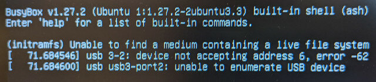

これまでROSをVMWare上のUbuntu 18.04 LTSで動かしてきましたが、動作が重いので改善したいと考えていました。最近使っていなかった[ThinkCentre M73 Tiny](https://www.lenovo.com/jp/ja/desktops/thinkcentre/m-series-tiny/10AY1/p/11TC1TMM73010AY "ThinkCentre M73 Tiny") (Core i3-4130T, 8GB RAM, 250GB SSD）を引っ張りだして、Windows10を削除し、ROS専用のUbuntuデスクトップ環境にしてみました。

### Ubuntuデスクトップ専用環境でROS＋Gazeboを動かす

定番の[Rufus](https://rufus.ie/ja/ "Rufus")で[Ubuntu Desktop 18.04 LTS 日本語RemixのISOイメージ](https://www.ubuntulinux.jp/products/JA-Localized/download "Ubuntu Desktop 日本語 Remixのダウンロード")をUSBメモリ(やや古めの4GB)に書き込み、ブートしましたが、なぜか途中で止まってしまいます。

おかしいなと別のUSBメモリ(新しめの32GB)に書き込んでブートしたら問題なく立ち上がってくれました。OSブートの場合は古いUSBメモリは使わないのが良さそうです。

インストールが完了し、ROSとGazeboの環境を準備しました。このあたりは何度もインストールしているので、GitHubにまとめたドキュメントを見ながらです。

- [Roombaのシミュレーション環境のセットアップ(VMware + Lubuntu 18.04 + ROS Melodic)](https://github.com/docofab/RoombaControlls/blob/main/ROS/instructions/setup-gazebo-vmware.md "Roombaのシミュレーション環境のセットアップ(VMware + Lubuntu 18.04 + ROS Melodic)")

ROSとGazeboを動かしてみると、なんとヌルヌル快適に動きます。いままでVMWareで苦労して動かしていたのは何だったのでしょうか。

<!--more-->

### Ubuntuデスクトップ環境を本気で整備してみる

せっかくなのでこのUbuntuデスクトップ環境を本気で整備してみることにしました。日本語Remix版をインストールしているので、すぐ日本語入力が使えるのも嬉しいところです。

最近はアプリケーションがクラウドになっているものが多いので、Webブラウザがあれば大抵のものは使えます。私がよく使っているものは以下のものです。

- OneDrive
- OneNote
- Googleスプレッドシート
- Googleドライブ
- Box
- TweetDeck (Twitter)
- Slack
- Zoom

これらはすべてブラウザで動きますが、Linux版のアプリもいくつかありました。今回はSlackアプリとZoomアプリのLinux版をインストールしました。

あとVisual Studio Codeも忘れずにインストールです。

最終的にはこのような素晴らしいROS開発環境が構築できました。

### Ubuntuデスクトップ環境良いかも！

これまでは気軽に仮想環境が作れるので、VMを作っては壊しということを繰り返していました。このため今回のようにじっくりとUbuntuのデスクトップ環境に取り組む機会がなかったのですが、最近はクラウドサービスやLinux版アプリが充実し、必ずしもWindowsやmacOSを使う必要はなくなってきたのかもしれません。今後はノートPCでもUbuntuデスクトップ環境を作ってみたいと思います。

追伸：本記事はすべて今回作成したUbuntuデスクトップ環境で書きました。写真はGIMPで加工しています。
