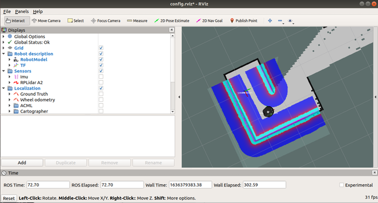
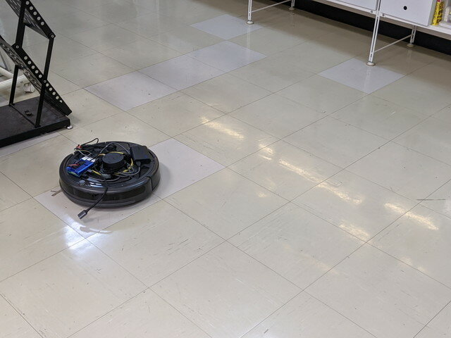
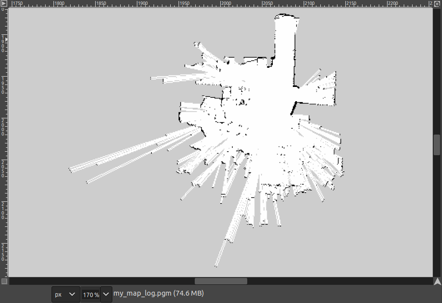
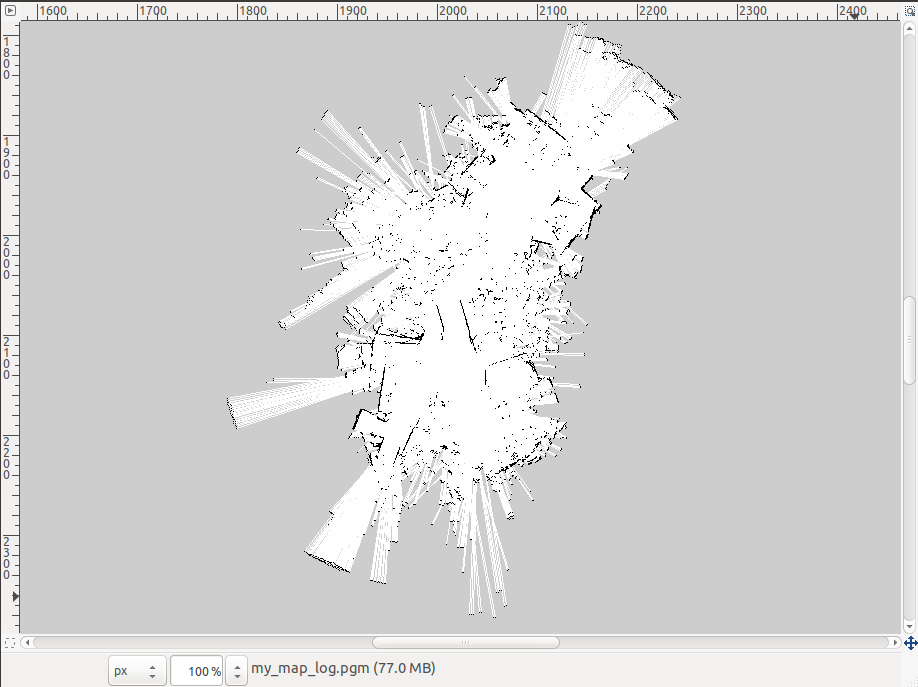

[おおたfab](https://ot-fb.com/ "おおたfab")さんでは、「[素人でもロボットをつくりたい](https://ot-fb.com/iot/6353/ "素人でもロボットをつくりたい")」という勉強会を定期的に行っています。[前回](https://kanpapa.com/2021/10/Roomba-robot-ros-part6-otafab49.html "ルンバで地図をつくってみました （おおたfab 第49回 素人でもロボットをつくりたい）")は[LiDAR](https://ja.wikipedia.org/wiki/LIDAR "LiDAR")を使って地図の作成を行いましたが、はっきりとした地図はできませんでした。もう一度地図作成にチャレンジする前にRVIZでロボットの状態を可視化してみます。

### Rvizでロボットの状態を可視化してみる

Gazeboを動かし、Rvizを動かします。

1\. ターミナルを開いて以下を入力します

```
$ export LOCALIZATION=slam
$ export RVIZ=true
$ export NUM_ROBOTS=1
$ export LASER=rplidar
$ roslaunch ca_gazebo create_maze.launch
```



<!--more-->

2\. もう一つターミナルを開いて以下を入力します。

```
$ roslaunch ca_tools keyboard_teleop.launch

```

3\. Rviz の機能をいろいろ触ってみます。

- Robot description
    - RobotModelのチェックをはずすとロボットの外観がみえなくなります。
- TF(座標変換：transformation)の表示  
    - TFのFramesでAll Enabledにチェックを入れると様々な座標が見えます。
    - 見やすくするために以下のところだけチェックをいれます。
        - create1/base\_footprint
        - create1/base\_link
        - create1/odm
        - create1/wheel\_left\_link
        - create1/wheel\_right\_link
        - map
    - Addボタンを押す→By display typeでtfを選択→Topicで/create1/base\_footprintを選択→OK
- LaserScanの表示
    - Addボタンを押す→By display typeでLaserScanを選択→Topicで/create1/rplider/scanを選択→OK

4\. 2枚目のターミナルからキーボードでルンバを動かしてみる

- create1/wheel\_left\_link, create1/wheel\_right\_link の座標が回転しているのがわかります。
- create1/odom や /map は元の位置にとどまっているのがわかります。


5\. TFがツリー構造になっているのがわかります。


- map　ワールドの原点（大体は起動した絶対的な位置）
- create1/odom　ワールドの基準点（様々な原因で起こる微妙なずれを調整するためのもの）
- create1/base\_footprint ロボットの現在位置（車軸の中心の地上面）
- create1/base\_link ロボットの基準位置
- create1/battery\_link　バッテリーの位置
- create1/wheel\_left\_link　 左車輪の位置
- create1/wheel\_right\_link　右車輪の位置

### URDFをRvizで見てみる

URDF (Unified Robot Description Format)は、ロボットの構造を記述するためのXMLのフォーマットです。いろいろなURDFをRvizで表示してみました。

この部分は以下のサイトを参考にしました。

- [ROS講座 可視化編(Rvizモデル表示)](https://qiita.com/srs/items/5f44440afea0eb616b4a#%E5%8F%AF%E8%A6%96%E5%8C%96%E7%B7%A8rviz%E3%83%A2%E3%83%87%E3%83%AB%E8%A1%A8%E7%A4%BA "ROS講座  可視化編(Rvizモデル表示)")

### ルンバ実機で地図を作ってみよう

もう一度ルンバで地図を作成してみます。

#### 初期設定

１．ca\_driverのconfigファイルで/tfをpublishするように設定する。

- 変更するファイル

```
~/catkin_ws/src/create_autonomy/ca_driver/config/default.yaml
```

- 変更箇所

```
# Whether to publish the transform between odom_frame and base_frame#publish_tf: falsepublish_tf: true
```

２．rplidarのlaunchファイルでlaserとbase\_footprintのリンクをpublishするように設定する。

- 変更するファイル

```
~/catkin_ws/src/rplidar_ros/launch/rplidar.launch
```

- 追加部分

```

```

#### ルンバを動かす

１．bagデータを取得

```
$ cd ~/bag$ rosbag record -a
```

２．ルンバのドライバを起動する

```
$ roslaunch ca_driver create_2.launch
```

３．RPLiDARのノードを起動する。

```
$ roslaunch rplidar_ros rplidar.launch
```

４．キーボード操作でルンバを動かす

```
$ roslaunch ca_tools keyboard_teleop.launch
```

５．動かし終わったらbagデータの取得を止める



#### 地図を作成する

１．gmappingを起動する。

```
$ rosparam set use_sim_time true$ rosrun gmapping slam_gmapping _base_frame:=create1/base_footprint _odom_frame:=create1/odom
```

２．取得したbugデータを再生する。

```
$ rosbag play 2021-11-03-15-32-21.bag --clock
```

３．再生が終わったらmap情報を取得する。

```
$ rosrun map_server map_saver -f my_map_log
```

### 作成できた地図

#### 1回目（2021-11-03取得）

途中でバッテリーが切れたため中途半端な地図になりました。しかし通路がはっきりわかります。



#### 2回目（2021-11-06取得）

データをしっかりとろうと細かく動かしすぎたせいか通路や壁もわからなくなってしまいました。これは失敗です。



### 次回の予定

データの取得はコツが必要のようです。もう少し試したあとに自律走行に向けて準備をしてみます。
