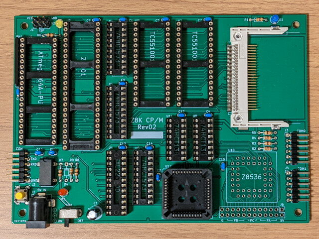
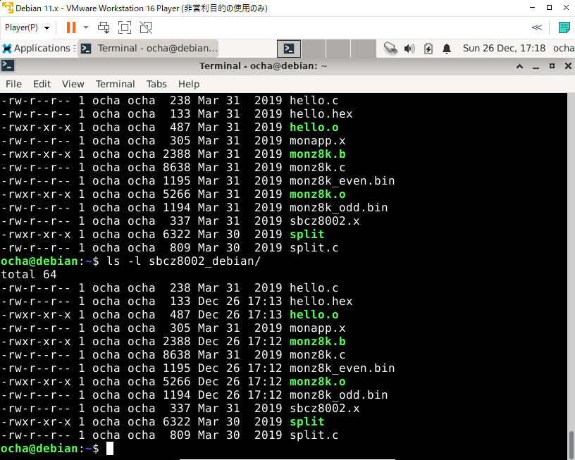

四寸五分さんがGithub.comで公開している[Z8001MB](https://github.com/4sun5bu/Z8001MB "Github 4sun5bu / Z8001MB")をベースにtomi9さんが製作した[Z8K CP/Mボード](https://sbc738827564.wordpress.com/2021/12/22/z8k-cp-m-%e3%83%9c%e3%83%bc%e3%83%89/ "Z8K CP/Mボード")のRev.2 基板をいただきました。Z8000系はまだ一度も触ったことがなくぜひ組み立ててCP/Mを動かしてみたいと思っていたところでした。

到着した基板とパーツです。tomi9さんありがとうございました。

 <!--more-->

### Z8K CP/M基板の組み立て

早速パーツ集めです。Z8530以外は揃えることができました。Z8530はeBayで発注済です。


完成した基板です。まだチップは取り付けていません。またツェナーダイオードの手持ちがなくて未実装です。



### Z8000クロス開発環境のセットアップ

まずはATmega164Pにファームウェアを書き込まなければいけません。

そのためにもZ8000の開発環境が必要になるので、電脳伝説さんの[Z8000のクロス開発環境](https://vintagechips.wordpress.com/2019/04/17/z8000%e3%81%ae%e9%96%8b%e7%99%ba%e7%92%b0%e5%a2%83/ "Z8000のクロス開発環境")の記事通りにセットアップをしようとしたのですが、私が使っているVMware Workstation PlayerではFedora 9がうまく動きません。

ダメ元でMC68EZ328のuClinuxビルド環境に使っているDebian 11 i386に[z8kgcc](http://www.z80ne.com/m20/index.php?argument=sections/download/z8kgcc/z8kgcc.inc "z8kgcc")を展開してみたところ問題なく動くように見えました。z8kgccのインストール手順はFedora Core 9と同じです。

本当に大丈夫かなと電脳伝説さんの[SBCZ8002のデータパック](https://vintagechips.wordpress.com/2019/04/20/sbcz8002%E3%81%AE%E3%82%A2%E3%83%97%E3%83%AA%E9%96%8B%E7%99%BA%E6%89%8B%E9%A0%86/ "SBCZ8002のアプリ開発手順")のプログラムを一通りコンパイルしたところ、生成されたバイナリは同じ結果となりました。



これでVMware Workstation Playerでも最新版のDebian i386の上でZ8000クロス開発環境ができました。

### ATmega164Pのファームウェア作成

次にATmega164Pに書き込むファームウェアを作ります。こちらは[Z8001MB](https://github.com/4sun5bu/Z8001MB "Github 4sun5bu / Z8001MB") にある [z8kboot](https://github.com/4sun5bu/Z8001MB/tree/master/z8kboot "z8kboot") を使います。リセット時にZ8001のモニタプログラムをSRAMにコピーし、Z8001で実行するものです。

最初にgcc-avrをDebian i386にインストールします。

```
$ sudo apt install gcc-avr binutils-avr avr-libc make

```

次にgithubからcloneした[z8kboot](https://github.com/4sun5bu/Z8001MB/tree/master/z8kboot "z8kboot")のディレクトリでmakeを実行します。


このように問題なくz8kbooter.hexができました。これをATmega164Pに書き込みます。

### AVRISPが見当たらない

いつものようにAtmel AVRISP mkIIを使ってATmega164Pに書き込もうとしたのですが、AVRISPがみつかりません。汎用ROMライターもみつかりません。どこかにしまい込んでしまったようです。

このあとGALの書き込みも必要になるので、まずはこれらのツールを探すことにします。

どこにしまったんだろう・・・。

（続く）
