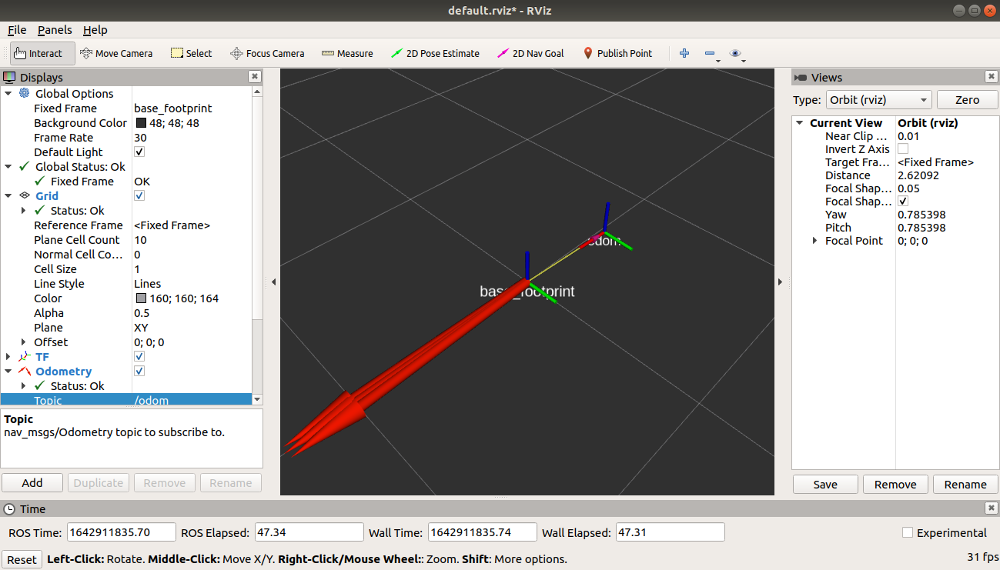

### Pololu RomiでROSにチャレンジ

[Pololu Romi](https://kanpapa.com/2022/01/pololu-romi-assemble.html "Pololu Romi ロボットカーを組み立ててみました")をROSで動かしてみます。以下の記事を参考にしました。

- [Introducing RomiPi: A ROS Package for the Pololu Romi](http://www.peterklemperer.com/blog/2019/05/02/introducing-romipi-a-ros-package-for-the-pololu-romi/ "Introducing RomiPi: A ROS Package for the Pololu Romi")

ソースはGitHubに登録されています。

- [RomiPi](https://github.com/ftPeter/RomiPi "RomiPi")

ソースをみた感じではかなり完成系に近いように見えます。これは期待できそうです。

 <!--more-->

### ROS Melodicのインストール

Raspberry Pi 3B+にROS Melodicをインストールします。これまでRaspberry OSで動いているのでこの環境にROS Melodicをインストールしてみました。

- [Installing ROS Melodic on the Raspberry Pi](http://wiki.ros.org/ROSberryPi/Installing%20ROS%20Melodic%20on%20the%20Raspberry%20Pi "Installing ROS Melodic on the Raspberry Pi")

しかし、こちらはソースからすべてをビルドしなくてはならず、Raspberry Pi 3B+にはちと荷が重いようです。また今後のメンテナンスも大変になりそうです。

やむなくこちらは一度中断し、別のSDカードにRaspberry Pi用のUbuntu 18.04 Serverをインストールし、パッケージ版のROSをインストールすることにしました。以下の記事を参考にしています。

- [Raspberry Pi 3 Model B+にUbuntu 18.04 LTSをインストールする](https://gihyo.jp/admin/serial/01/ubuntu-recipe/0564 "Ubuntu Weekly Recipe 第564回　Raspberry Pi 3 Model B+にUbuntu 18.04 LTSをインストールする")
- [Ubuntu install of ROS Melodic](http://wiki.ros.org/melodic/Installation/Ubuntu "Ubuntu install of ROS Melodic")

さらにI2Cのバス速度を設定します。/boot/firmware/config.txtをエディタで開いて、dtparam=i2c... の1文を追記しました。

```
[all]
device_tree_address=0x03000000
dtparam=i2c_baudrate=400000
```

これで400000Hzになります。

### RomiPiのインストール

作成したcatkin\_ws/srcにRomiPiのソースを展開します。私の場合はcatkin buildでまとめてビルドを行い、特に問題はなくビルドが完了しました。


### Romi32U4にスレーブプログラムを書き込む

RomiPiのArduinoのディレクトリにRomi32U4用のスレーブプログラムがあります。これをRomi32U4にArduino IDEで書き込みます。


### RomiでROSを動かす

RomiPiにはたくさんのROSパッケージがありますが、以下のように動かせば良さそうです。

1.新しいターミナルを起動して以下のように入力する。

```
roslaunch romipi_astar romipi_astar.launch
```

2.新しいターミナルを起動して以下のように入力する。

```
roslaunch romipi_teleop romipi_teleop_key.launch
```

ここまでは問題ないように見えたのですが、 romipi\_teleop を動かした途端に次のエラーが赤い文字で連続して表示され、正常に動きませんでした。

```
[ERROR] [1642828616.621967]: bad callback: >
Traceback (most recent call last):
  File "/opt/ros/melodic/lib/python2.7/dist-packages/rospy/topics.py", line 750, in _invoke_callback
    cb(msg)
  File "/home/ubuntu/catkin_ws/src/romipi_astar/nodes/romipi_astar_node.py", line 49, in cmd_vel_callback
    self.romi.twist(linear_x, angular_z)
  File "/home/ubuntu/catkin_ws/src/romipi_astar/src/romipi_astar/romipi_driver.py", line 78, in twist
    self.write_pack(53, 'ff', linear_x_m_s, angular_z_rad_s)
  File "/home/ubuntu/catkin_ws/src/romipi_astar/src/romipi_astar/romipi_driver.py", line 58, in write_pack
    self.bus.write_i2c_block_data(20, address, data_array)
TypeError: Third argument must be a list of at least one, but not more than 32 integers
```

エラーメッセージからみると、romipi\_driver.pyの58行目にあるself.bus.write\_i2c\_block\_data(20, address, data\_array)の三番目の引数の型が一致していないようです。そこで、data\_arrayの型をみたところ、stringのリストのようでした。本来はintegerのリストでないといけないので、これでは動きません。

そのため、以下のように修正しました。

```
        data_array = list(struct.pack(format, *data))
        data_array_int = [ord(s) for s in data_array]
        self.bus.write_i2c_block_data(20, address, data_array_int)
```

これでintegerのリストになり、修正後はエラーがでることはなくなりました。

romipi\_teleopのターミナルでキーボードを操作すると、車輪が回り始めました。前進・後進・左右回転ができることを確認しました。

こちらの動画をYouTubeに入れておきました。

### ROSトピックを確認する

ここでどのようなROSトピックが出ているのかを確認してみます。

```
ubuntu@ubuntu:~$ rostopic list
/battery_state
/clicked_point
/cmd_vel
/initialpose
/joint_states
/move_base_simple/goal
/odom
/rosout
/rosout_agg
/tf
/tf_static
ubuntu@ubuntu:~$
```

各種トピックが流れているのがわかります。内容も見てみます。

/battery\_state - バッテリ電圧の情報が刻々と送られています。この時点ではバッテリーは8.2Vのようです。

```
---
header:
  seq: 23
  stamp:
    secs: 1642909891
    nsecs: 552347898
  frame_id: ''
voltage: 8.27299976349
current: 0.0
charge: 0.0
capacity: 0.0
design_capacity: 1.89999997616
percentage: 0.757666647434
power_supply_status: 0
power_supply_health: 0
power_supply_technology: 0
present: True
cell_voltage: []
location: ''
serial_number: ''
---
```

/odom - オドメトリ情報です。

```
---
header:
  seq: 4392
  stamp:
    secs: 1642915136
    nsecs: 684336900
  frame_id: "odom"
child_frame_id: "base_footprint"
pose:
  pose:
    position:
      x: -3.00028014183
      y: -2.05812335014
      z: 0.0
    orientation:
      x: 0.0
      y: 0.0
      z: -0.706350826574
      w: 0.707861928485
  covariance: [0.0, 0.0, 0.0, 0.0, 0.0, 0.0, 0.0, 0.0, 0.0, 0.0, 0.0, 0.0, 0.0, 0.0, 0.0, 0.0, 0.0, 0.0, 0.0, 0.0, 0.0, 0.0, 0.0, 0.0, 0.0, 0.0, 0.0, 0.0, 0.0, 0.0, 0.0, 0.0, 0.0, 0.0, 0.0, 0.0]
twist:
  twist:
    linear:
      x: -0.0534507110715
      y: 0.0
      z: 0.0
    angular:
      x: 0.0
      y: 0.0
      z: -0.109083071351
  covariance: [0.0, 0.0, 0.0, 0.0, 0.0, 0.0, 0.0, 0.0, 0.0, 0.0, 0.0, 0.0, 0.0, 0.0, 0.0, 0.0, 0.0, 0.0, 0.0, 0.0, 0.0, 0.0, 0.0, 0.0, 0.0, 0.0, 0.0, 0.0, 0.0, 0.0, 0.0, 0.0, 0.0, 0.0, 0.0, 0.0]
---
```

/tf - transforms情報です。

```
---
transforms:
  -
    header:
      seq: 0
      stamp:
        secs: 1642917933
        nsecs: 387064933
      frame_id: "odom"
    child_frame_id: "base_footprint"
    transform:
      translation:
        x: 0.0
        y: 0.0
        z: 0.0
      rotation:
        x: 0.0
        y: 0.0
        z: 0.0
        w: 1.0
---
```

これらの情報をRvizで可視化してみます。

### Rvizで可視化する

RvizはROS MelodicがインストールされているノートPC(192.168.100.34)で動かすことにします。Raspberry Pi(192.168.100.110)で動いているROSのmasterに接続することで、ノートPCにも同じトピックが流れてきます。

具体的には以下の手順で環境変数の設定を行い、ノードが見えることを確認し、Rvizを起動します。

```
export ROS_MASTER_URI=http://192.168.100.110:11311
export ROS_IP=192.168.100.34
rosnode list
rosrun rviz rviz

```

この状態でRvizを立ち上げてトピックを可視化することができました。



ただし、しばらくすると次のようなエラーでRvizが落ちてしまいました。トピックの情報に例外情報が含まれてしまうことがあるようです。

```
ocha@ocha-ThinkPad-X270:~$ rosrun rviz rviz
[ INFO] [1642911637.938122479]: rviz version 1.13.23
[ INFO] [1642911637.938159628]: compiled against Qt version 5.9.5
[ INFO] [1642911637.938171625]: compiled against OGRE version 1.9.0 (Ghadamon)
[ INFO] [1642911637.985052066]: Forcing OpenGl version 0.
[ INFO] [1642911638.262330237]: Stereo is NOT SUPPORTED
[ INFO] [1642911638.262413103]: OpenGL device: Mesa DRI Intel(R) HD Graphics 620 (KBL GT2)
[ INFO] [1642911638.262468532]: OpenGl version: 3.0 (GLSL 1.3).
rviz: /build/ogre-1.9-B6QkmW/ogre-1.9-1.9.0+dfsg1/OgreMain/include/OgreAxisAlignedBox.h:252: 
void Ogre::AxisAlignedBox::setExtents(const Ogre::Vector3&, const Ogre::Vector3&): 
アサーション `(min.x <= max.x && min.y <= max.y && min.z <= max.z) && 
"The minimum corner of the box must be less than or equal to maximum corner"' に失敗しました。
中止 (コアダンプ)
ocha@ocha-ThinkPad-X270:~$
```

これについてはもう少し調査が必要そうです。
