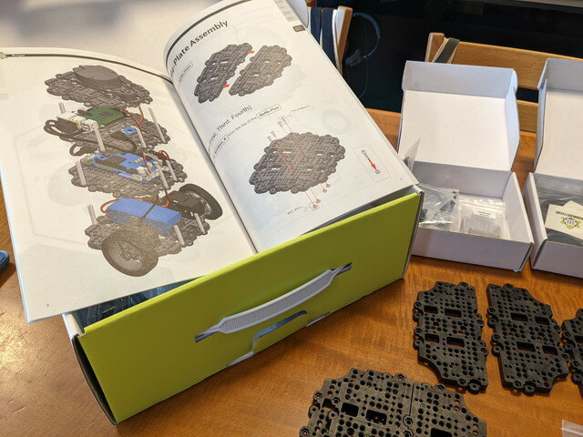
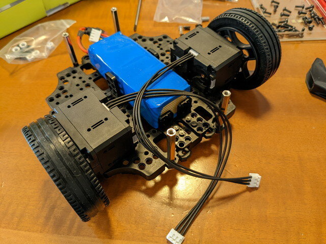
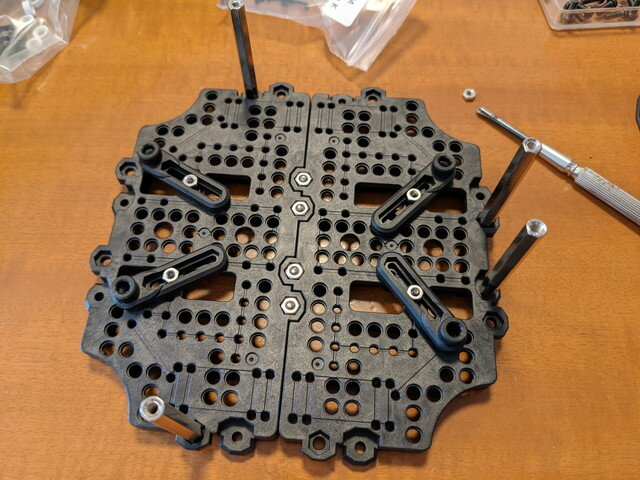
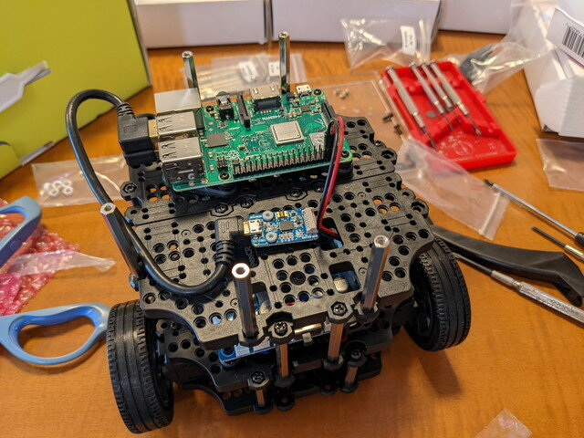
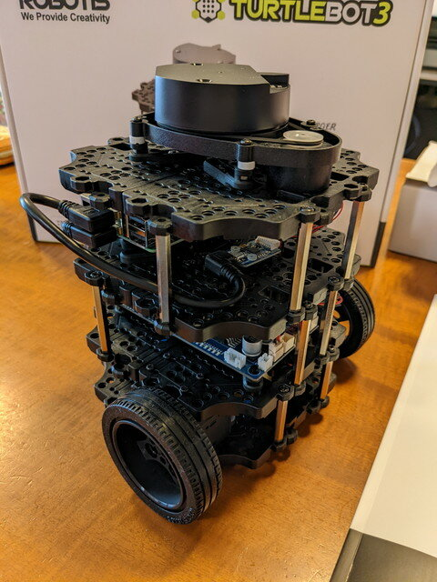

[TurtleBot3 Burgerのパーツ確認](https://kanpapa.com/2022/02/turtlebot3-burger-assembly1.html "TurtleBot3がやってきた（パーツ確認編）")が終わったところで組み立て開始です。マニュアルを外箱に載せて見ながら作業します。

### プレートの組み立て

まずはベースとなるプレートを４枚作ります。大量のネジがあるので間違えないように注意します。

プレート4枚が完成しました。2nd Layerだけネジの向きが違います。

完成したプレートにパーツを取り付けていきます。

### 1st Layerの組み立て

1st Layerではまずバッテリーを固定するパーツを取り付けます。

次にタイヤをホイールに取り付けて、モーターに固定します。こんな立派なモーターは使ったことがありません。

1st Layerにモーターとバッテリーを固定します。特に問題無さそうです。

### 2nd Layerの組み立て

2nd LayerはOpenCRボードを取り付けるために基板固定用のパーツを使いますが、この構造だといろんな基板に対応できそうです。

2nd LayerにOpenCRボードを取り付けたあとに、1st Layerと2nd Layerを合体しOpenCRボードにバッテリーとモーターを接続します。

### 3rd Layerの組み立て

3rd LayerにRaspberry Pi 3B+を載せて合体します。

### 4th Layerの組み立て

最後にLiDARを載せて完成です。（手前のネジを締め忘れていますが、あとで締めました）

次は[ROSのセットアップ](https://kanpapa.com/2022/02/turtlebot3-burger-assembly3.html "TurtleBot3がやってきた（ROSセットアップ編）")にはいります。（続く）
