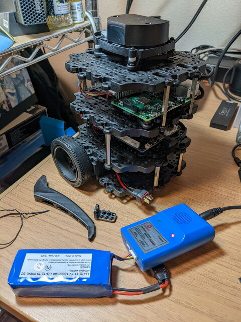
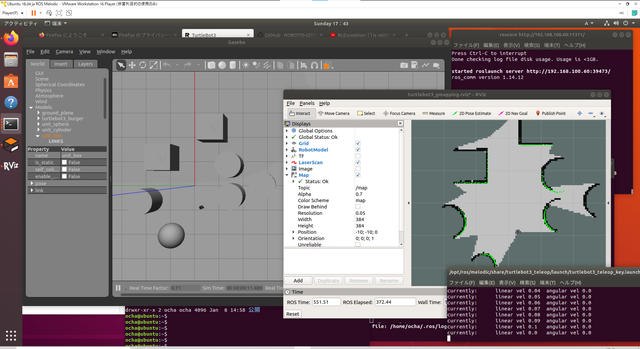
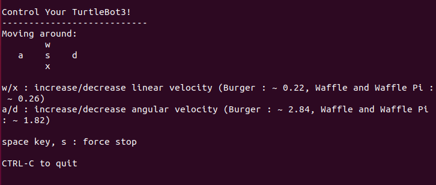

[TurtleBot3のハードウェアが完成](https://kanpapa.com/2022/02/turtlebot3-burger-assembly2.html "TurtleBot3がやってきた（組み立て編）")したところで、Quick Start Guideに従ってROSセットアップを行います。

- [TurtleBot3 Quick Start Guide](https://emanual.robotis.com/docs/en/platform/turtlebot3/quick-start/ "TurtleBot3 Quick Start Guide")

詳しい手順が書かれているのでその通りにすすめます。ROSのバージョンが選べますが今回は慣れているMelodicを使うことにしました。

### Linux PCにROSをセットアップ

まずはUbuntu 18.04 LTS Desktopの環境を準備します。手元にはVMware workstation PlayerにUbuntu 18.04 LTSをインストールしたROS Melodic環境があるのでそのまま使いました。ネットワークはブリッジモードにしているのでTurtleBot3のRaspberry Piから接続できます。

このUbuntuのIPアドレス(192.168.100.60)を確認して、以下のように~/.bashrcで環境変数に設定します。

```
export TURTLEBOT3_MODEL=burger
export ROS_MASTER_URI=http://192.168.100.60:11311
export ROS_HOSTNAME=192.168.100.60
```

ROSのmasterはこのLinux PCで動かします。

<!--more-->

### Raspberry PiにROSをセットアップ

このTurtleBot3にはRaspberry Pi 3B+が付属していました。TurtleBotの公式サイトからRaspberry Pi 3B+用のイメージファイルをダウンロードしてRaspberry Pi imagerで付属の16GB SDカードに書き込みます。

こちらも~/.bashrcに書かれている環境変数にLinux PCのIPアドレス(192.168.100.60)と、Raspberry PiのIPアドレス(192.168.100.59)をセットします。

```
export TURTLEBOT3_MODEL=burger
export ROS_MASTER_URI=http://192.168.100.60:11311
export ROS_HOSTNAME=192.168.100.59
```

### OpenCRボードのセットアップ

これもマニュアル通りにすすめます。OpenCRボードはRaspberry PiのUSBに接続されています。Raspberry PiにログインしてOpenCRボードのファームウェアを更新します。

### TurtleBot3 Burgerの起動

ソフトウェアの設定も完了したので、TurtleBot3の電源を入れたところ、ピーピーというアラーム音が鳴ったため、急いで電源を切りました。どうやらバッテリー電圧が低下していたようです。バッテリーを外して充電器に接続して充電開始です。満充電までは２時間程度かかるようです。



### TurtleBot3のシミュレーターを試す

Li-Poバッテリーの充電が終わらないので、この間にシミュレータのGazeboと可視化ツールのRvizを動かしてみました。

新しいターミナルを開き以下のコマンドを入力します。

```
$ export TURTLEBOT3_MODEL=burger
$ roslaunch turtlebot3_gazebo turtlebot3_empty_world.launch
```

新しいターミナルを開き以下のコマンドを入力します。

```
$ roslaunch turtlebot3_teleop turtlebot3_teleop_key.launch
```

キーボードを入力すると、表示されているTurtlebotが動きます。

さらに新しいターミナルを開いて、以下のコマンドを入力します。

```
$ export TURTLEBOT3_MODEL=burger
$ roslaunch turtlebot3_slam turtlebot3_slam.launch slam_methods:=gmapping
```

これでシミュレーター上でSLAMを試せました。



### TurtleBot3 Burgerの動作確認

充電器の緑LEDが点灯し充電が完了しました。


再び電源を投入し、Bringup TrutleBot3に従ってTurtleBot3のROSを動かします。

PCで新しいターミナルを開いて以下のコマンドを入力します。

```
$ roscore
```

これでROS masterがPCで動き始めます。

PCで新しいターミナルを開いて、TurtleBot3のRaspberry Piにログインし、TurtleBot3のROSアプリケーションを動かします。

```
$ ssh pi@192.168.100.59
$ roslaunch turtlebot3_bringup turtlebot3_robot.launch
```

正常に起動すれば以下のようなメッセージが表示されます。


この状態で、もう一つ新しいターミナルを開いて以下のコマンドを入力します。

```
$ export TURTLEBOT3_MODEL=burger
$ roslaunch turtlebot3_teleop turtlebot3_teleop_key.launch
```

正常に起動すれば以下のようなメッセージが表示されます。



このターミナルからキーボードでTurtleBot3の車輪の動きをコントロールできることを確認しました。

参考までにrqt\_graphでノードとトピックの状態を図にしてみました。


先ほどはシミュレーターでSLAMを試しましたが、いよいよ[実機でもSLAMを試してみます](https://kanpapa.com/2022/02/turtlebot3-burger-slam1.html "TurtleBot3がやってきた（SLAMで地図を作る編）")。
