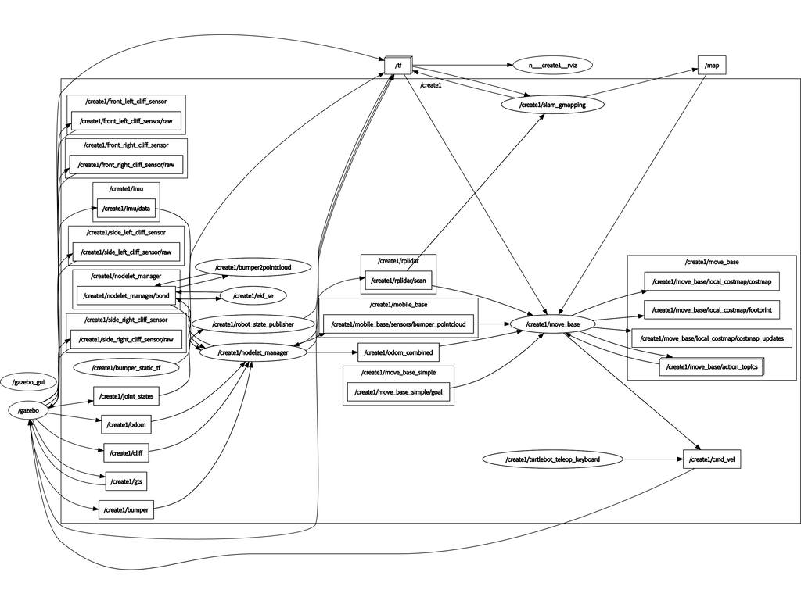
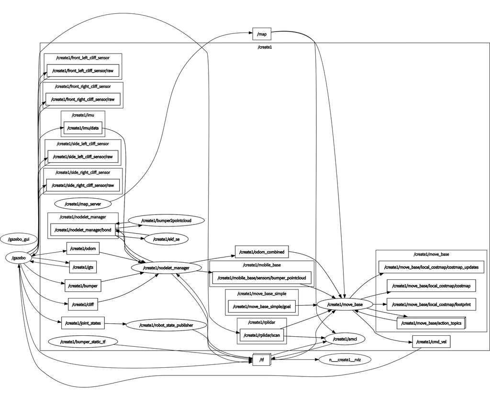

[前回](https://kanpapa.com/2022/03/Roomba-robot-ros-part9-map2gazebo.html "ルンバで地図をつくってみました　その４（Gazebo worldを作る）")まではルンバでSLAMを行い環境地図を作成し、その環境地図からGazebo Worldを作成しました。

今回は作成したGazebo Worldの上でシミュレーションしてみます。


ルンバのROSパッケージは以下のものを使用しています。

- [https://github.com/RoboticaUtnFrba/create\_autonomy](https://github.com/RoboticaUtnFrba/create_autonomy "RoboticaUtnFrba/create_autonomy")
- [https://github.com/RoboticaUtnFrba/libcreate](https://github.com/RoboticaUtnFrba/libcreate "RoboticaUtnFrba/libcreate")

<!--more-->

### 作成したworldモデルでgmapping-SLAMを行う

１．map2worldで生成されたWorldモデルをgazebo環境にコピーする。

```
cp -p ~/catkin_ws/src/map2gazebo/worlds/map.sdf ~/catkin_ws/src/create_autonomy/ca_gazebo/worlds/map.world
cp -rp ~/catkin_ws/src/map2gazebo/models/map ~/catkin_ws/src/create_gazebo_models/models/
```

２．launchファイルを作成する。

```
cd ~/catkin_ws/src/create_autonomy/ca_gazebo/launch
vi create_otafab1.launch

  
    

    
    
    

    
    
    
  

```

３．SLAMモードでgazeboを起動する。

```
export LOCALIZATION=slam
export RVIZ=true
export NUM_ROBOTS=1
export LASER=rplidar
roslaunch ca_gazebo create_otafab1.launch
```

これで取り込んだWorldモデルでSLAMができる状態になります。

SLAM実行中のrqt\_graphです。



### 作成したworldモデルでNavigation（自律走行）を行う

1\. Navigationを行う場合は以下のディレクトリにmap.pgm、map.yamlをコピーします。

```
~/catkin_ws/src/create_autonomy/navigaton/ca_move_base/maps/
```

2\. Navigationモードでgazeboを起動します。

```
export LOCALIZATION=amcl
export RVIZ=true
export LASER=rplidar
roslaunch ca_gazebo create_otafab1.launch
```

### Navigationの様子

Navigationを行っている様子をYouTubeにアップしておきました。

Navigation実行中のrqt\_graphです。



次はルンバ実機で試してみます。
