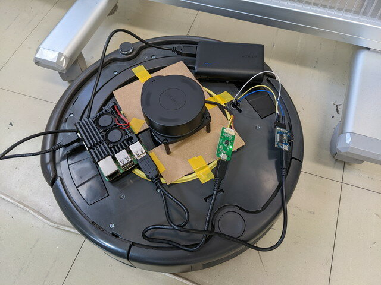
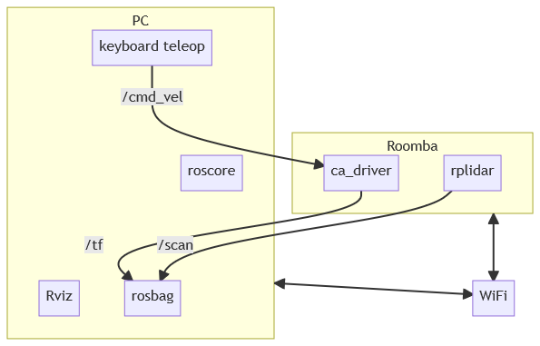

[おおたfab](https://ot-fb.com/ "おおたfab")さんでは、「[素人でもロボットをつくりたい](https://ot-fb.com/iot/6353/ "素人でもロボットをつくりたい")」という勉強会を定期的に行っています。[前回](https://kanpapa.com/2021/11/Roomba-robot-ros-part7-otafab50.html "ルンバで地図をつくってみました　その２ （おおたfab 第50回 素人でもロボットをつくりたい）")は[LiDAR](https://ja.wikipedia.org/wiki/LIDAR "LiDAR")を使って地図の作成を行いましたが、はっきりとした地図はできませんでした。もう一度地図作成にチャレンジします。

### ルンバにLiDARを固定

前回はLiDARをルンバに載せただけだったので、動いているうちに位置がずれてしまっていました。今回は図面から穴をあけた段ボールにLiDARをねじ止めし、それをビニールテープで固定しました。これで位置がずれることはなくなりました。



### ROSノードの構成を変更

これまではRaspberry Pi 4ですべてのノードを動かしていましたが、turtlebot3と同様にRaspberry Piでは最低限のドライバだけ動かして、データの収集や可視化はPCで行うように変更しました。



### Roombaドライバを変更

これまではGazeboも動作する[RoboticaUtnFrba/create\_autonomy](https://github.com/RoboticaUtnFrba/create_autonomy)を使用していましたが、以下の記事で実機動作が確認されているgoodfield55さん改良版のRoombaドライバを使用してみました。

- [RaspberryPi + ROS で　ルンバを制御](https://goodfield55.blog.fc2.com/blog-entry-16.html "RaspberryPi + ROS で　ルンバを制御") （楽しい ものづくり）
- [GoodField55/libcreate](https://github.com/GoodField55/libcreate/tree/goodfield "GoodField55/libcreate")
- [GoodField55/create\_autonomy](https://github.com/GoodField55/create_autonomy/tree/goodfield "GoodField55/create_autonomy")

### 地図を取得してみる

テスト環境のIPアドレスは以下のようになっています。

- Ubuntu PC　192.168.0.34
- Raspberry Pi 192.168.0.63

#### 準備

1\. Ubuntu PCにログイン

2\. Ubuntu PCの環境変数の確認

```
export ROS_MASTER_URI=http://192.168.0.34:11311
export ROS_HOSTNAME=192.168.0.34
```

3\. Raspberry Piにモバイルバッテリをつないで起動

4\. Ubuntu PCからRaspberry Piにログイン

```
ssh ubuntu@192.168.0.63
```

5\. Raspberry Piの環境変数の設定

```
export ROS_MASTER_URI=http://192.168.0.34:11311
export ROS_HOSTNAME=192.168.0.63
```

#### トピックの記録

1\. Raspberry Piの設定

2\. rplidarのlaunchファイルでlaserとbase\_footprintのリンクをpublishする設定を追加する。

~/catkin\_ws/src/rplidar\_ros/launch/rplidar.launch に以下の行を追加

3\. Ubuntu PCでroscoreを起動する。

```
roscore
```

4\. Ubuntu PCでrosbagで記録する。

```
rosbag record -a
```

5\. RaspberryPiにsshでログインしルンバのドライバを起動する

```
roslaunch ca_driver create_2.launch
```

6\. RaspberryPiにsshでログインしRPLiDARのノードを起動する。

```
roslaunch rplidar_ros rplidar.launch
```

7\. Ubuntu PCでキーボードでルンバを動かして、地図情報を取得する。(/create1/cmd\_velを/cmd\_velに変更したもの）

```
roslaunch ca_tools keyboard_teleop2.launch
```

8\. Ubuntu PCでbagデータを記録しているターミナルでCtrl-Cを入力し記録を停止する。

#### 取得したbagデータでのSLAMの確認

1\. すべてのROSのノードを停止（roscoreも）し、不要なtopicが流れない状態にする。

2\. Ubuntu PCでroscoreを起動する。

```
roscore
```

3\. Ubuntu PCでgmappingを起動する。

```
rosparam set use_sim_time true
rosrun gmapping slam_gmapping
```

4\. Ubuntu PCでRvizを起動する

```
rosrun rviz rviz
```

※RvizのUIでMap(/map), LaserScan(/scan), TFをaddする。

5\. Ubuntu PCで取得したbugデータを再生する。

```
rosbag play --clock 2022-03-06-12-20-16.bag
```

6\. Ubuntu PCで再生が終わったらmap情報を取得する。

```
rosrun map_server map_saver -f my_map3
```

7\. gmappingをctrl-cで停止する。

### 今回生成できた地図

まずまずの出来ではないかと思います。


### 生成した地図の確認

地図のデータをmap\_serverで配信します。

```
$ rosrun map_server map_server my_map3.yaml
[ INFO] [1646556115.623077211]: Loading map from image "my_map3.pgm"
[ INFO] [1646556115.685095565]: Read a 4000 X 4000 map @ 0.050 m/cell
```

この状態でRvizでmapが表示されることを確認しました。

次回はナビゲーションにチャレンジです。
