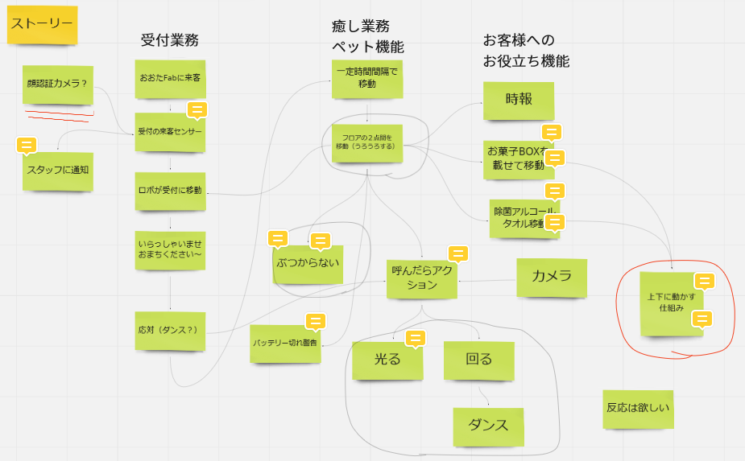
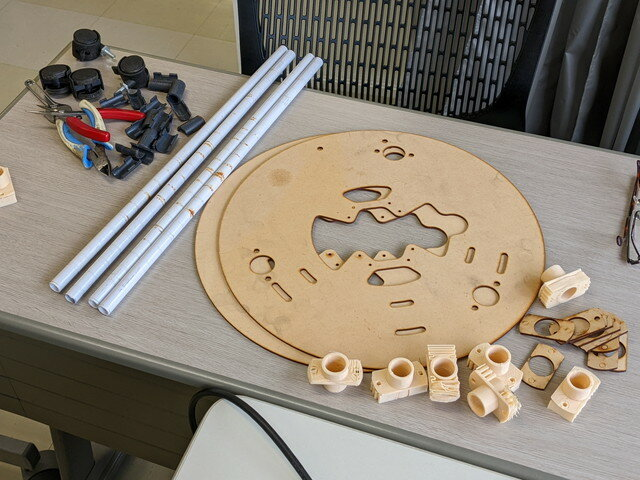
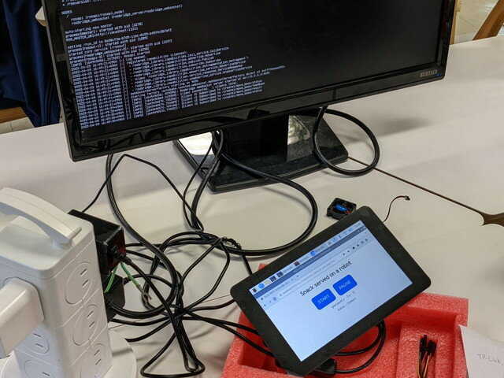
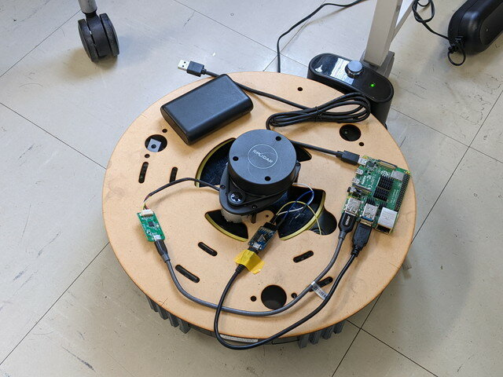

[おおたfab](https://ot-fb.com/ "おおたfab")さんでは、「[素人でもロボットをつくりたい](https://ot-fb.com/iot/6353/ "素人でもロボットをつくりたい")」という勉強会を定期的に行っています。前回は[Navigation（自律走行）](https://kanpapa.com/2022/03/Roomba-robot-ros-part11-otafab57.html "ルンバで自律走行を行ってみました （おおたfab 第57回 素人でもロボットをつくりたい）")を行い、指定した位置に正しく移動できることを確認しました。今回はこのルンバを役立つロボットにできないかアイデアを持ち寄り実際に動くものを目指します。

### ルンバを役立てたい

おおたfabのみなさんに役立つようなロボットにしたいという意見がありました。いわゆるアシストロボットです。とはいってもルンバですので、ものを運んだりするのが良いのかなとストーリーをまとめてました。

 <!--more-->

### アシストロボットのデザイン

このストーリーをもとにアシストロボットのデザインを起こしました。

ロボット自体にはモノを届けてくれたり、ゴミを回収したりなど、お役立ちができることを考えました。昇降機能があると楽しいかもしれません。またマスコットが乗っているのもいいかなと。

このロボットがおおたfab内を巡回していて、受付のボタンが押されたらそこに移動してお出迎えができればさらに役立ちそうです。

### 機能を分解して進捗管理

これらの機能を構成する要素に分解して、担当を決めて進めることにしました。

- ルンバに取り付ける基台（ベース）
- 基台に取り付ける可動部
- ルンバのナビゲーション（自律走行）
- 受付呼び出し機能

### 現在の進捗状況

ベースを構成するパーツが出来上がってきました。

可動部も段ボールでの試作品で動くものができています。

ブラウザでボタンを押すと移動先のトピックが流れる受付機能のプロトタイプもできました。

ルンバの自律走行はさらなる動作確認が続いています。

### 今後の予定

今後各機能の結合を進めていきます。目指すは[Maker Faire Tokyo 2022](https://makezine.jp/event/mft2022/ "Maker Faire Tokyo 2022")の出展です。ハードルは高いですが、初めての出展承認に向けて参加メンバーで取り組んでいきます。
