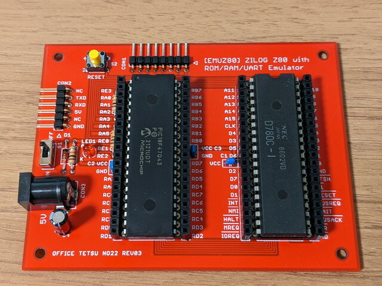
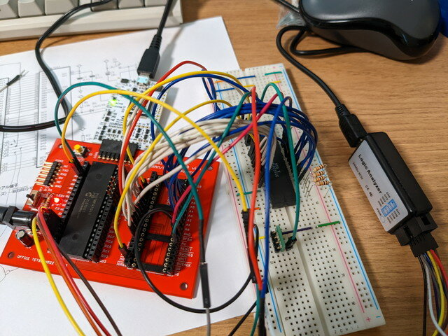
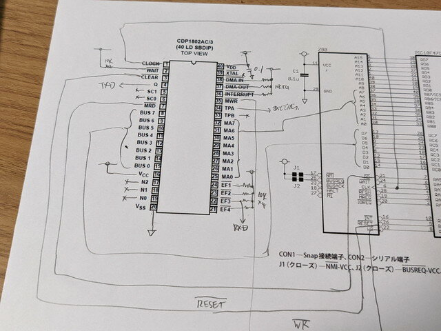
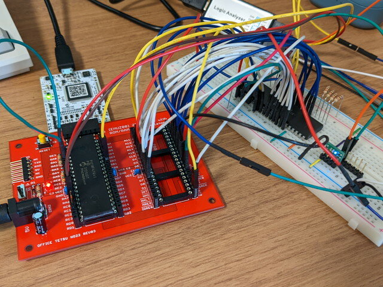
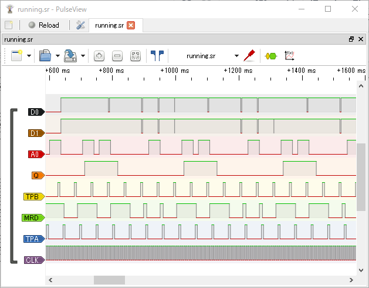
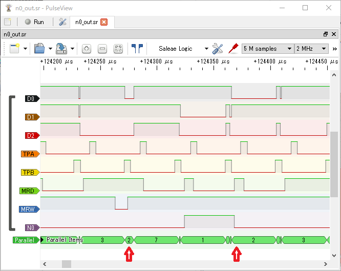

最近話題のマイコンボードとして電脳伝説さんの[EMUZ80](https://vintagechips.wordpress.com/2022/03/05/emuz80_reference/ "EMUZ80が完成")が人気です。Z80CPUとPIC18F47Q43を組み合わせ最小限のパーツでZ80マイコンボードを作ろうという試みです。

私も早速組み立てました。部品の少なさに圧倒されます。


<!--more-->

ものの１時間程度で実装、動作確認まで行えました。



普通ですとPICのファームに組み込まれているZ80のアプリケーションプログラムを入れ替えることで様々な用途に応用していくのですが、私はこのCPUを[COSMAC CDP1802](https://kanpapa.com/cosmac/cosmac-cpu.html "COSMAC CPUとは")に置き換えてみました。

### COSMACをEMUZ80基板に接続してみる

EMUZ80の基板では親切なことに全ピンが引き出せるように基板にはピンソケットが実装できます。Z80CPUを取り外して、ここからCOSMAC CPUに接続します。



アドレスバスとデータバスはZ80と同様に接続しますが、メモリ読み書き信号（MRW/MWR）のR/Wとタイミング信号（TPB/TPA）をどう処理するかを考えなければなりません。



まずはROMを128バイト、RAMを128バイトとし、256バイトで納めてみます。これでHIGH Addressの処理を行わなくて済みます。

PICのファームウェアのソースプログラムを確認したところ、Z80のMREQとRFSHをCLCのFF-D,CLKに接続し、割り込みハンドラでRD/RWをみてメモリの読み書きをしているようです。PICは初心者なのでまずはファームには極力手を加えずにTPBをFF-Dに、CLKをFF-CLKに接続することで割り込みハンドラを呼び出してみることにしました。

### ROMだけでLチカのプログラムを動かす

COSMACのプログラムも最低限の４バイトとします。Q出力のHI-LOWを繰り返すものです。

```
0000-7B       START   SEQ             ;Q <- 10001-7A               REQ             ;Q <- 00002-30 00            BR      START   ;Branch to START
```

通常のCPUのスピードでは点滅がわかりませんので、システムクロックを超低速にすることでLチカを目で確認することができました。



ロジアナで確認するとQがHI-LOWを繰り返しているのがわかります。



これでROM上の動作は確認できました。

### RAMの読み書きの確認

次はRAMに書き込めるかの確認を行います。以前トグルスイッチマイコンで動かしていたカウンタプログラムを使います。このプログラムはR4に1を加算した結果をRAMの81番地に書き込み、その値をOUT命令でバスに出力するプログラムです。

```
0000-F8 81    START   LDI     $81     ;D <- $810002-A3               PLO     3       ;R(3).0 <- D0003-E3               SEX     3       ;X <- 30004-84       LOOP1   GLO     4       ;D <- R(4).00005-53               STR     3       ;M(R(3)) <- D0006-61               OUT     1       ;BUS <- M(R(3)); R(3)++0007-23               DEC     3       ;R(3)--0008-14               INC     4       ;R(4)++0009-30 04            BR      LOOP1   ;Branch to LOOP1
```

バスに出力されるデータをロジックアナライザで確認し、無事RAM上のデータの値が加算されてバスに出力される様子が確認できました。



これで256バイトの範囲内であればプログラムを動かすことはできそうです。ただし、COSMACのモニタプログラムは256バイトでは収まりませんので、次はHIGH Addressのメモリ空間にアクセスできるようにTPAの処理を加えていきます。

[基板改造編](https://kanpapa.com/cosmac/blog/2022/06/emuz80-cosmac-modified-pcb.html "EMUZ80でCOSMACを動かしてみました 2（基板改造編）")に続く
