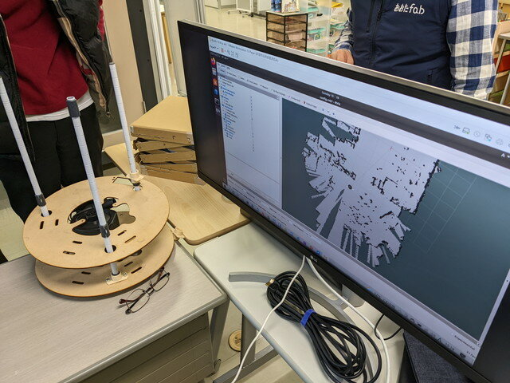
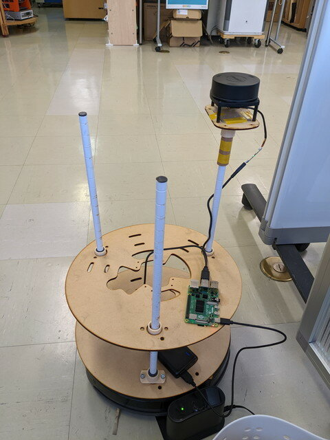

[おおたfab](https://ot-fb.com/ "おおたfab")さんでは、「[素人でもロボットをつくりたい](https://ot-fb.com/iot/6353/ "素人でもロボットをつくりたい")」という勉強会を定期的に行っています。前回はNavigation（自律走行）が行えるようになった[ルンバをどう活用するか](https://kanpapa.com/2022/04/Roomba-robot-ros-part12-otafab59.html "ルンバに載せるものを作り始めました （おおたfab 第59回 素人でもロボットをつくりたい）")を考えましたが、今回はアイデアに基づいてフレームを実装してみます。

今回は2通りの実装方法を試してみることにしました。いずれも自律走行に必要なLiDARのレーザーを遮らないように実装することを考えました。

<!--more-->

### TYPE Aの実装

まずはLiDARを中央に置く方式です。

こちらの実装で動かしてみました。まだ完全に固定していないので少しゆらゆらします。

LiDARが高くなったため、足元の障害物に注意が必要です。動画で写っている斜めの看板などは近づきすぎると足元がぶつかってしまいます。

### TYPE Bの実装

次は少し端にLiDARを取り付ける方式です。こうすると中央にモノが置けるのではないかと考えています。

こちらの実装でも動かしてみました。まだ完全に固定していないので少しゆらゆらします。

この場合LiDARの位置が中央ではなくなりますので、少し端になるようにTFを調整しRVizで確認しました。

### フレームを取り付けた結果

いずれも自律走行は行える状態ではありますが、ルンバにLiDARを置いていたときよりもやや不安定になったように思えます。自分の位置を見失ってグルグル回ることが多くなりましたが、今後フレームを固定することで安定するのでは考えています。
