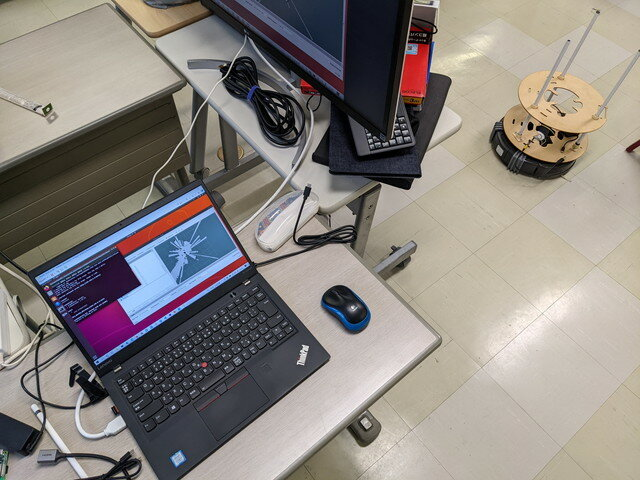
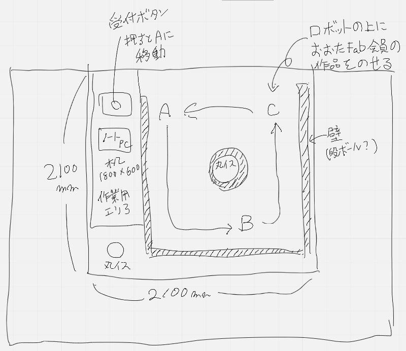

[おおたfab](https://ot-fb.com/ "おおたfab")さんでは、「[素人でもロボットをつくりたい](https://ot-fb.com/iot/6353/ "素人でもロボットをつくりたい")」という勉強会を定期的に行っています。前回はルンバロボットの[すべての機能を結合し試運転](https://kanpapa.com/2022/05/Roomba-robot-ros-part14-otafab61.html "ルンバロボットの試運転を行いました （おおたfab 第61回 素人でもロボットをつくりたい）")を行いました。今回はいよいよ[Maker Faire Tokyo 2022](https://makezine.jp/event/mft2022/ "Maker Faire Tokyo 2022")の出展申し込みです。

### Maker Faireとは

[Maker Faire（メイカーフェア）](https://makezine.jp/event/mft2022/for_thefirst/ "はじめての方へ")は、ものづくりを行っている個人、団体、学校、企業が一堂に集まって作った作品を展示しあうお祭りです。始まった当初は[Make Tokyo Meeting](https://makezine.jp/blog/category/make-tokyo-meeting "Make Tokyo Meeting")といわれていましたが、2012年から現在のMaker Faireという名前に変わっています。私自身はMake Tokyo Meetingで1回、Maker Faire Tokyoで2回の出展経験があります。いずれも電子工作というカテゴリでしたが、今回はおおたfabのみなさんとロボティクスというカテゴリで出展にチャレンジします。

<!--more-->

### 何を見せるかを考える

これまでの取り組みから以下のような内容を考えました。

- その場にいる人のお助けができるロボット
- あらかじめ定められた場所を順番にまわってモノを届ける。
- たまに光ったり音を出したりして、その場にいる人を和ませる。
- また受付の呼び出しボタンを押すと、お客様のお出迎えもできる

この内容にそってアイデアを練っていきます。

### どう見せるかを考える

Maker Faire Tokyoでは割り当てられるスペースに限りがあります。今回は2100mm×2100mmというスペースで申請しました。この中をルンバロボットが動き回ることになります。イメージとしては以下のようになりました。（今後変更する可能性もあります）

### 出展内容を整理する

あとは細かい点を確認して、出展申し込みに必要な項目をGoogleスプレッドシートにまとめます。ウェブページや参考写真や参考動画などは、これまで記録してきたものを少し編集して使いました。写真はWebページに載せることもあるので、解像度の高いものをそのままダウンロードできるようにしています。（実際に私の作品が[Maker Faire Tokyo 2019 ─ 出展者情報公開！](https://makezine.jp/blog/2019/07/maker-faire-tokyo-2019-makers.html "Maker Faire Tokyo 2019 ─ 出展者情報公開！")という記事に掲載されました。）

おおたfabのみなさんにも内容を確認いただき確定しました。

### Maker Faire Tokyo出展申込み

あとは決定した内容をフォームに記入して事務局に提出です。

今回はコロナの影響もあり、昨年出展できなかったかたが優先して採用されるとのことでハードルはかなり高いと考えています。しかし、ここまで作ってきたので何とか形として残せるように引き続き取り組んでいきます。
