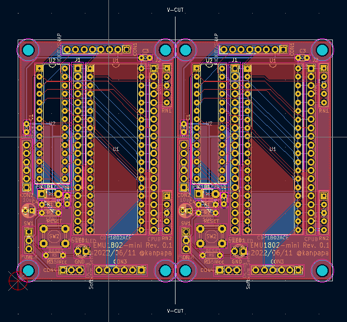
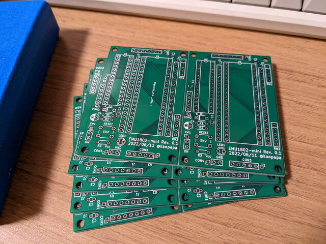
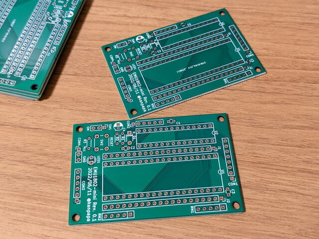
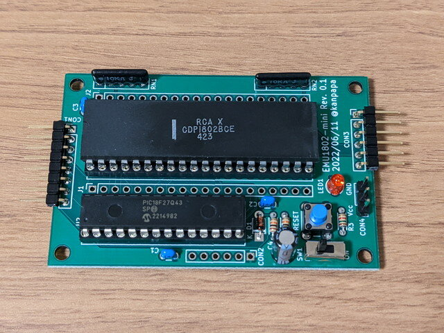

[EMUZ80](https://vintagechips.wordpress.com/2022/03/05/emuz80_reference/ "EMUZ80が完成")のCPUを[COSMAC](https://kanpapa.com/cosmac/cosmac-cpu.html "COSMAC CPUとは")に置き換えた[EMU1802](https://kanpapa.com/cosmac/blog/2022/06/emuz80-cosmac-emu1802-fixed.html "EMUZ80でCOSMACを動かしてみました 5（仕上げ編）")を製作しましたが、心臓部である[PIC18F47Q43](https://akizukidenshi.com/catalog/g/gI-16591/ "PIC18F47Q43")が品薄となり入手が困難になってしまいました。我が家ではPIC18F47Q43は1個しかなく、EMUZ80の基板とEMU1802の基板をPICが行ったり来たりの状態です。

これでは困るので代替手段がないかと確認したところ、ピン数の少ない[PIC18F27Q43](https://akizukidenshi.com/catalog/g/gI-16593/ "PIC18F27Q43")がわずかながら在庫があるようです。

COSMACの場合アドレスバスが8本しかないためEMU1802のPIC18F47Q43のPORTDは全く使っていない状態です。信号線の数を確認したところ、PIC18F27Q43のピン数で足りそうです。

<!--more-->

回路図はGitHubに載せておきました。

- [emu1802\_mini\_sch.pdf](https://github.com/kanpapa/emu1802/blob/devel/kicad/emu1802_mini_sch.pdf "emu1802_mini_sch.pdf")（回路図）
- [emu1802\_mini\_bom.pdf](https://github.com/kanpapa/emu1802/blob/main/kicad/emu1802_mini_bom.pdf "emu1802_mini_bom.pdf")（部品表）

せっかくですのでコンパクトにまとめてみようと思い久しぶりに基板を発注しました。

初期のアイデアスケッチです。製作した基板とはだいぶ違います。（ピン数が違ったりとか・・）

初期イメージからいろいろ調整を行いました。基板サイズも小さいので面付をしてみました。

発注から約一週間で基板が到着しました。基板のサイズは秋月電子のユニバーサル基板Cタイプに合わせています。

指定通りV-CUTされていましたので、パキンと２枚に分かれます。

早速組み立てです。

当然ながらパーツ数が少ないのであっという間に完成です。

手配線で試作したEMU1802とはCOSMACとの接続ピンが違いますので、ファームウェアをEMU1802-mini用に書き換えました。

書き換えたファームウェアもGitHubに登録しておきました。

- [emu1802mini.X](https://github.com/kanpapa/emu1802/tree/main/emu1802mini.X "emu1802mini.X")

SNAPを接続して、ファームウェアを書き込み、ソフトウェアシリアルのコネクタにUSB-シリアルを介し、PCと300bps/7bit/Mark/1bitで接続します。

Enterキーを押すと無事IDIOTモニタが起動しました。

まだPIC本体のUARTはファームウェアでは未サポートですので、この部分を今後実装してみます。

追記：EF3のシリアル入力のところにダイオードを入れたほうがよさそうです。次回改版することがあれば修正します。
