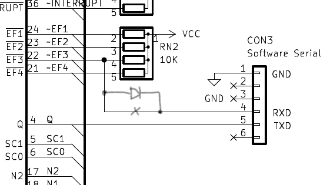
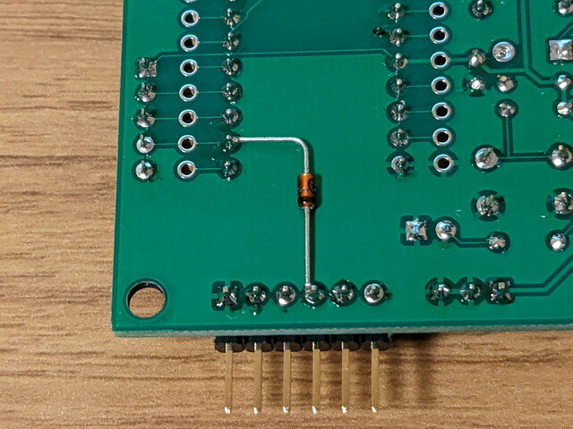

EMU1802-miniで実験していると、USBシリアルをつないだだけでPOWER LEDが点灯してしまいます。このため逆流防止のためダイオード 1N4148を追加しました。

回路図では以下のような修正となります。

<!--more-->

Rev0.1の基板では以下のように修正してください。表面で一か所パターンカット、裏面にダイオードを実装します。比較的簡単に修正できます。

表面

裏面

回路図は後ほど修正しておきます。基板はもし改版する機会があれば修正します。
