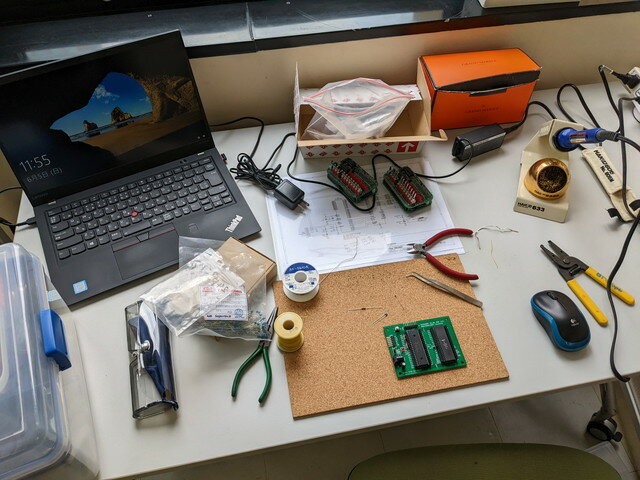
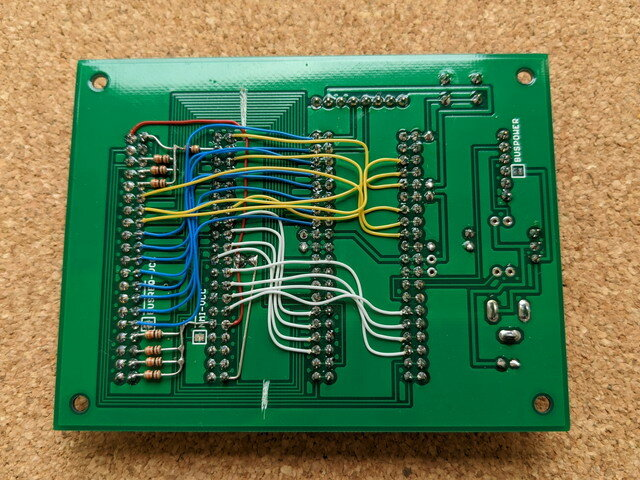
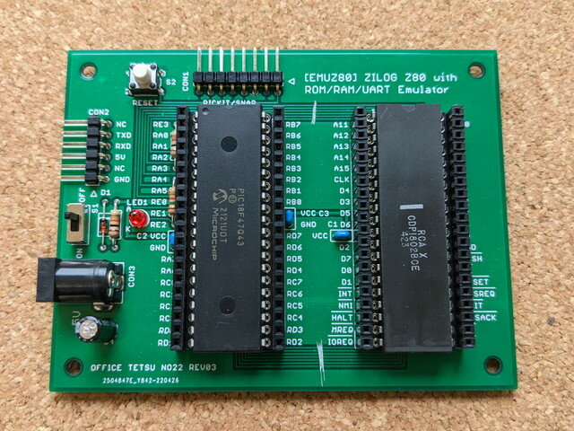
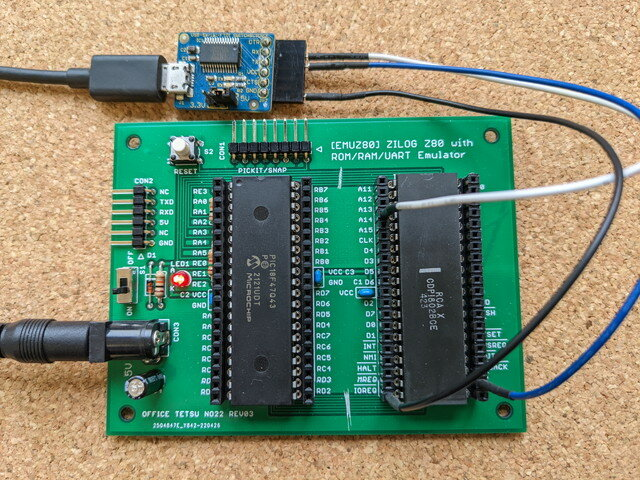

[EMU1802でIDIOTモニタまで動作](https://kanpapa.com/cosmac/blog/2022/06/emuz80-cosmac-idiot-monitor.html "EMUZ80でCOSMACを動かしてみました 4（モニタ動作編）")するようになりましたので、ハードウェアはこれでFIXとし、ジャンパー線をはずして基板上で配線することにします。今日は[おおたfab](https://ot-fb.com/ "おおたfab")さんで作業しました。

<!--more-->

### 制御信号を配線する

これまではデータバスとアドレスバスだけ配線していました。白いワイヤーがデータバスで、青いワイヤーがアドレスバスです。

これにCLOCK, TPA, TPB, MWR, MRD、CLEARといった制御系の信号を同様に配線しました。黄色いラッピング用のワイヤーを使いました。

これでジャンパー線は不要になりました。動作確認を行ってみます。

現在はソフトウェアシリアルを使っているので、COSMACのQ端子、EF3端子をUSBシリアルに接続してIDIOTモニタを使います。

あとはファームウェアをブラッシュアップしていくことになります。IDIOTモニタで動くアプリケーションも試してみます。

### GitHubリポジトリ

GitHubにリポジトリを作りましたので、ハードウェアやソフトウェアについてはこちらにまとめていきます。

- [https://github.com/kanpapa/emu1802](https://github.com/kanpapa/emu1802 "emu1802")

### 謝辞

[EMUZ80](https://vintagechips.wordpress.com/2022/03/05/emuz80_reference/ "EMUZ80が完成")という挑戦的なマイコンボードを開発いただいた電脳伝説さん、こんな形で楽しませていただいています。ありがとうございます。
