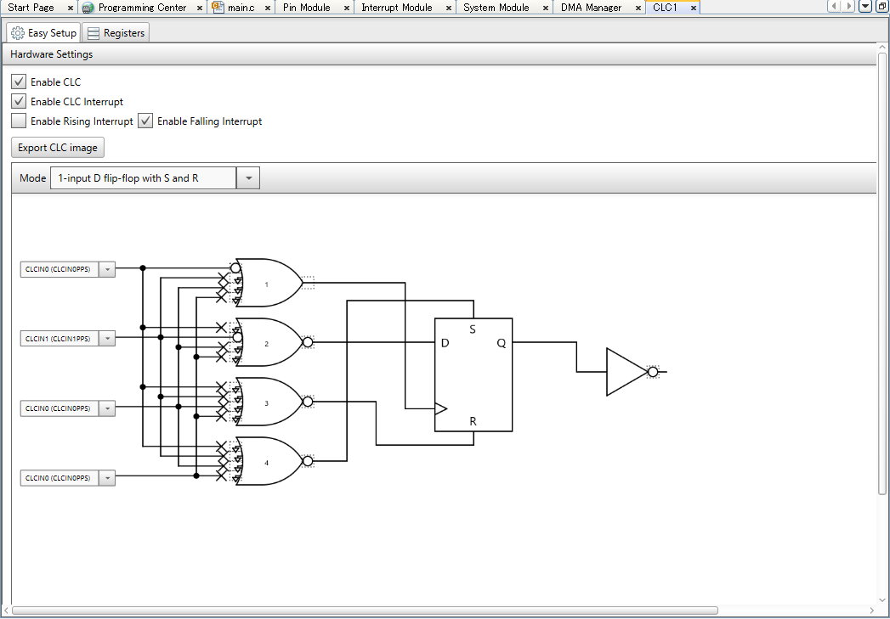
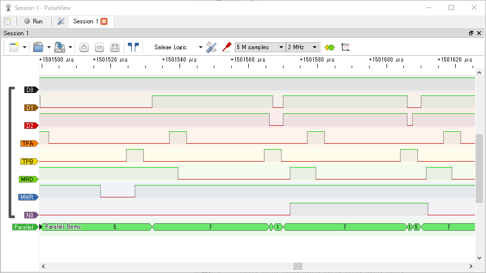
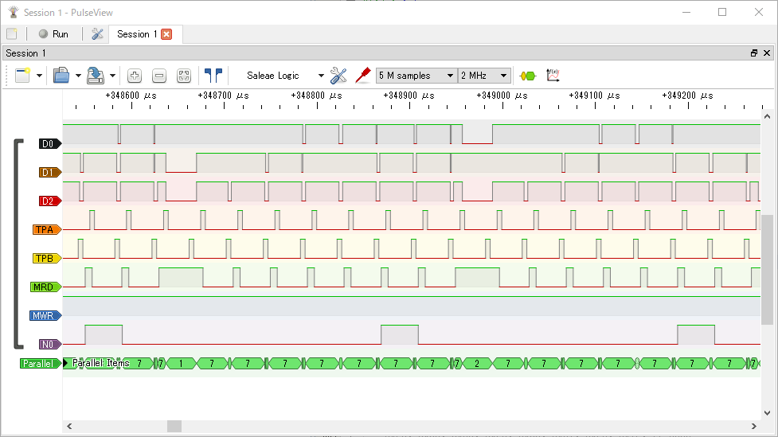

[これまでの実験](https://kanpapa.com/cosmac/blog/2022/06/emuz80-cosmac-modified-pcb.html "EMUZ80でCOSMACを動かしてみました（基板改造編）")ではTPB信号だけを使い、HIGHアドレスのラッチタイミングを示すTPA信号は使っていません。このためLOWアドレスしか使えずアドレス空間は$00-$FFの256byteだけでした。今回はTPA信号も使いアドレス空間を$0000-$FFFFに拡張します。

### EMUZ80のソースを確認

EMUZ80ではPICのCLC(Configurable Logic Cell)機能を使うことで、Z80のMREQ, RFSHを組み合わせたタイミングで割り込みを発生させているようです。その後にRD/WR信号をみてメモリの読み書きを制御しています。CLCの設定まわりはPICの開発環境であるMPLAB X IDEのプラグイン [MPLAB Code Configurator(MCC)](https://www.microchip.com/en-us/tools-resources/configure/mplab-code-configurator "MPLAB Code Configurator")でレジスタの値をみながら確認しました。



このCLCをうまく使えばTPA信号も拾えるかなとも思ったのですが、COSMACはタイミング信号がシンプルすぎるので、このCLC機能は使わずにTPA信号、TPB信号から直接割り込みを発生させるようにしてみました。

<!--more-->

### EMUZ80のファームウェアを書き換える

PICは本格的に使ったことはなくお作法がわからなかったので、MPLAB X IDEのMCCプラグインを使って空のプロジェクトを作成し、生成された割り込み処理のコードをEMUZ80のソースに組み込むといった手順をとりました。PICには大量のレジスタがありますが、その中から必要なものだけをピックアップして正しく設定すればある程度動きそうという感触がつかめました。

PICとCOSMACの制御信号の配線は最終的には以下のようになりました。


この接続に沿って割り込みハンドラを書き直しました。割り込みハンドラでは、TPAの立ち上がり時にHIGHアドレスの読み込み、TPBの立ち上がり時にメモリの読み書き、TPBの立ち下り時にデータバスを入力に設定としています。

以下のテストプログラムを実行して、HIGHアドレスにアクセスできるかを確認します。

```
// Counter program 3  (High RAM $8008 R/W)0000 F8 80   START   LDI     $80     ;D <- $800002 B3              PHI     3       ;R(3).1 <- D0003 F8 08           LDI     $08     ;D <- $080005 A3              PLO     3       ;R(3).0 <- D0006 E3              SEX     3       ;X <- 30007 84      LOOP1   GLO     4       ;D <- R(4).00008 53              STR     3       ;M(R(3)) <- D0009 61              OUT     1       ;BUS <- M(R(3)); R(3)++000A 23              DEC     3       ;R(3)--000B 14              INC     4       ;R(4)++000C 30 07           BR      LOOP1   ;Branch to LOOP1
```

このプログラムは$0000-$000Dに配置されます。R4の値をカウントアップしながら$8008番地に書き込み、その値をOUT命令でバスに出力することを繰り返します。もし、HIGHアドレスがうまく設定できずに0となっていた場合はこのプログラム自体が壊れて暴走するはずです。

確認はロジアナで行います。



この例ですと、メモリの書き込み（MWRがLOWでTPBの立ち上がり時）は5になっており、OUT命令でバスに書き出した値（N0がHIGHでTPBの立ち下り時）も5です。HIGHアドレスに配置しているRAMエリアの読み書きができていると思われます。

### メモリのコピーを試してみる

念のため連続したメモリ空間の読み書きテストを行ってみます。$0000-0030までのROMデータを$8000-8030のRAMエリアにコピーしたあとに、$8000-$8030の内容をOUT命令でバスに出力するものです。

```
// memory move program 4// $0000-$0030 -> $8000-$8030 + OUT 10000-                 SOURCE  .EQ     $00000030-                 MAXADD  .EQ     $00308000-                 DESTIN  .EQ     $80008030-                 MAXDUMP .EQ     $80300000-F8 00            START:  LDI     /BEG0002-B9                       PHI     R90003-F8 07                    LDI     #BEG0005-A9                       PLO     R90006-D9                       SEP     R90007-0007-F8 00            BEG:    LDI     /SOURCE0009-BA                       PHI     RA000A-F8 00                    LDI     #SOURCE000C-AA                       PLO     RA000D-000D-F8 80                    LDI     /DESTIN000F-BB                       PHI     RB0010-F8 00                    LDI     #DESTIN0012-AB                       PLO     RB0013-0013-4A               REPEAT: LDA     RA0014-5B                       STR     RB0015-1B                       INC     RB0016-8A                       GLO     RA0017-FB 31                    XRI     #MAXADD+10019-3A 13                    BNZ     REPEAT001B-                 001B-F8 80            DUMP:   LDI     /DESTIN001D-BB                       PHI     RB001E-F8 00                    LDI     #DESTIN0020-AB                       PLO     RB0021-EB                       SEX     RB0022-61               REPEAT2: OUT    10023-8B                       GLO     RB0024-FB 31                    XRI     #MAXDUMP+10026-3A 22                    BNZ     REPEAT20028-0028-30 28            ENDLOOP: BR ENDLOOP
```

ロジアナで動作を確認してみます。

RAMエリアへの書き込みの様子です。MWRがLOWとなっているところでRAMエリアへの書き込みが発生しています。


RAMエリアから読み出しの様子です。N0がHIGHでTPBの立下り時にバスにメモリの内容が出力されています。この表示では小さくて見えませんが、拡大すると、RAMエリアに書き込んだ順番で同じ値が出力されているのがわかります。



書き込み時と読み出し時は同じ値になっており問題なく動いているようです。

これで一通りの動作確認がおわりましたので、いよいよモニタプログラムをこの環境で動かしてみます。

[モニタ動作編](https://kanpapa.com/cosmac/blog/2022/06/emuz80-cosmac-idiot-monitor.html "EMUZ80でCOSMACを動かしてみました 4（モニタ動作編）")に続く
