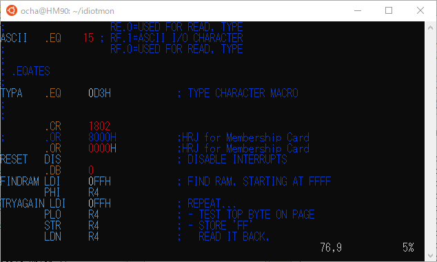
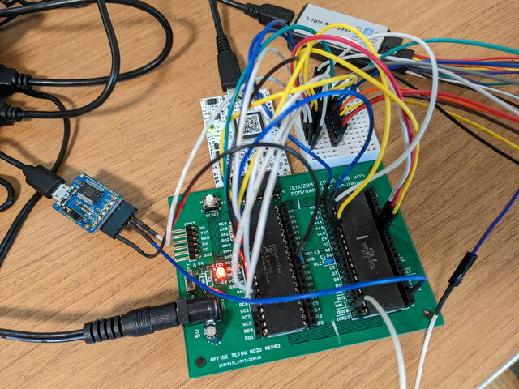
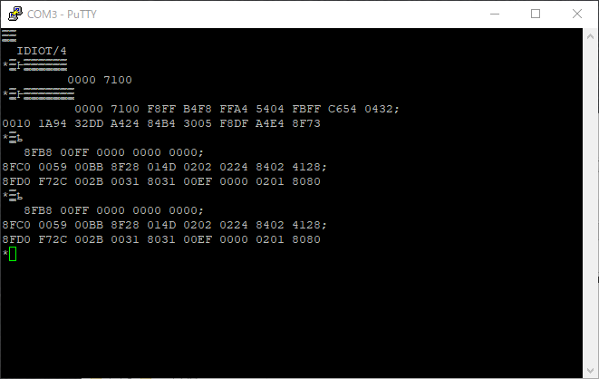
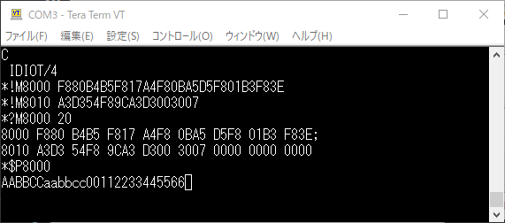

[前回までの実験](https://kanpapa.com/cosmac/blog/2022/06/emuz80-cosmac-high-address.html "EMUZ80でCOSMACを動かしてみました 3（アドレス拡張編）")でHIGHアドレスも使えるようになったので、EMUZ80のCOSMAC環境でモニタプログラムを動かしてみます。以降は紛らわしくならないようにEMU1802と呼ぶことにします。

### IDIOTモニタをファームウェアに組み込む

COSMACコミュニティでは超有名な[IDIOTモニタプログラム](https://www.retrotechnology.com/memship/mship_idiot.html "COSMAC 1802 ")をEMU1802で動かしてみます。このモニタプログラムの大きさは1Kバイトです。ソフトウェアでシリアル通信を実装しており、COSMAC CPUのQ出力とEF3入力がシリアルポートになります。

オリジナル版は$8000からのアドレスに配置されていますので、これを$0000に配置しなおします。まずはIDIOTのアセンブラソースをいつも使っている[SB-Assembler](https://www.sbprojects.net/sbasm/ "SB-Assembler")でアセンブルできるように修正しました。



COSMAC CPUのクロックは2MHzぐらいにしたいのですが、現状のファームウェアだと2MHzにするとタイミングの関係かうまく動きません。そのため10分の１のクロック0.2MHzとしています。これでも300bps程度の通信速度は出せるはずです。

<!--more-->

SB-Assemblerではバイナリ形式での出力ができるので、そのバイナリを[簡単なPythonプログラム](https://github.com/kanpapa/emu1802/blob/main/tools/bin2hexsrc.py "bin2hexsrc.py")でCのソース形式に変換して、EMU1802のファームウェアのソースに組みこみました。


ファームウェアをコンパイルしてEMU1802に書き込み、Q出力とEF3入力にシリアルUSBを接続して準備完了です。



### IDIOTモニタの起動確認

PCでシリアルターミナルを起動して、通信速度を300bps, 7bitデータ, stop 1bit, パリティ無しに設定して、リセットスイッチを押して、Enterキーを押したところ、


無事プロンプトが表示されました。モニタコマンドを入力したところ、動いてはいるようですがなぜか入力した文字が化けています。



おかしいなとターミナルプログラムを変えたり、ロジアナでQ出力やEF3出力を確認してみましたが、シリアルデータ自体は届いているようにみえます。

昔の記録をひっくり返して、パリティをMarkにしないといけないことを思いだしました。ターミナルでその設定を行い再びEnterキーを押したところ、無事動作するようになりました。


モニタプログラムの基本機能は動作しているようです。メモリダンプやRAMエリアの書き込み、読み出しも正常です。

### IDIOTモニタプログラムを使ってみる

IDIOTでは以下のコマンドが使えます。これらのコマンドをためしていきます。

- !M　メモリへの書き込み
- ?M　メモリダンプ
- ?R レジスタの内容表示
- $P 指定したアドレスからのプログラムの実行（P=X=0の状態で実行）
- $R 指定したレジスタの内容でプログラムを実行（XとPを指定して実行）

IDIOTモニタプログラムの機能を使ってエコーバックのプログラムを動かしてみます。ソースコードは以下になります。

```
0000-                         .CR     18028000-                         .OR     $80008000-                 8000-F8 80            INIT:   LDI     /INIT8002-B4                       PHI     48003-B5                       PHI     58004-F8 17                    LDI     #TMPBUF8006-A4                       PLO     4       ; TMPBUF -> R4 to the TYPE immeiate location.8007-F8 0B            LOOP:   LDI     #MAIN   ; MAIN -> R5 .. Main program address8009-A5                       PLO     5800A-D5                       SEP     5       ; Change program counter800B-                 800B-F8 01            MAIN:   LDI     $01800D-B3                       PHI     3800E-F8 3E                    LDI     $3E8010-A3                       PLO     3       ; $013E -> R3 .. IDIOT READ entry address8011-D3                       SEP     3       ; Call READ8012-                 8012-54                       STR     48013-F8 9C                    LDI     $9C8015-A3                       PLO     3       ; $019C -> R3 .. IDIOT TYPE entry address8016-D3                       SEP     3       ; Call TYPE8017-                 TMPBUF: .BS     1       ; TYPE imm. strage location.8018-30 07                    BR      LOOP801A-                 801A-                         .EN
```

SB-Assemblerで生成されたHEXファイルを使い、モニタプログラムでメモリの$8000番地に書き込み、実行してみます。



キーボードから文字を入力すると、エコーバックされることを確認しました。問題なく動作しているようです。

機能的には正しく動いてはいますが、シリアル通信速度の300bpsが遅く感じます。EMUZ80ではPICのUARTを使用できますので、これをIDIOTモニタでサポートできるようにプログラムを修正してみます。

[仕上げ編](https://kanpapa.com/cosmac/blog/2022/06/emuz80-cosmac-emu1802-fixed.html "EMUZ80でCOSMACを動かしてみました 5（仕上げ編）")に続く
