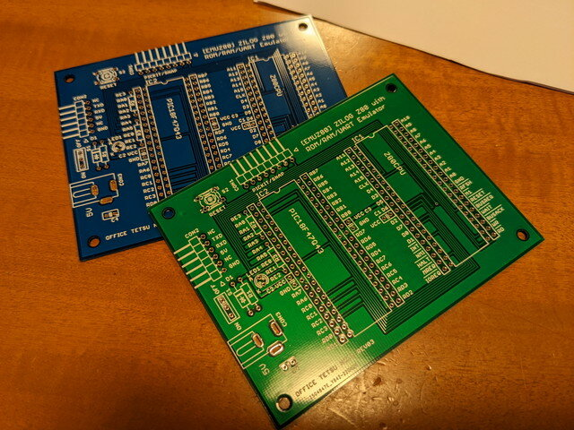
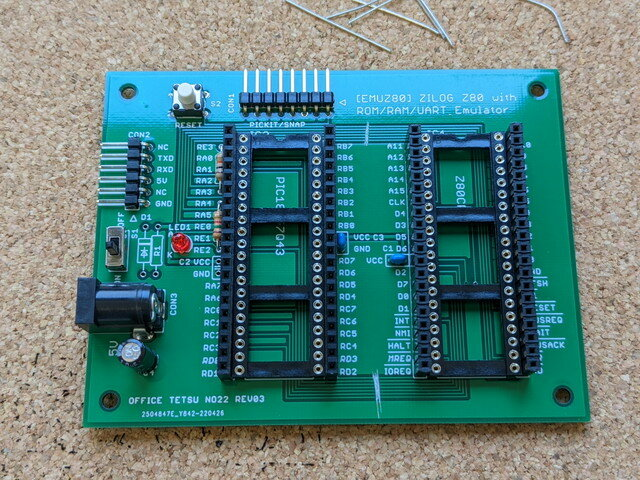
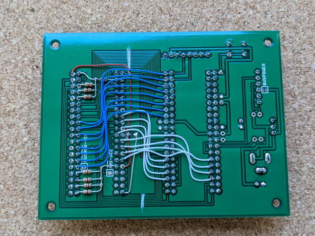

[前回の実験でLチカ](https://kanpapa.com/cosmac/blog/2022/05/emuz80-cosmac-blink-led.html "EMUZ80でCOSMACを動かしてみました（Lチカ編）")まで動かすことができたので、今後の実験を行いやすくするためにEMUZ80の基板を[COSMAC CDP1802 CPU](https://kanpapa.com/cosmac/cosmac-cpu.html "COSMAC CPUとは")を実装できるように改造してみます。もちろんZ80もEMUZ80で動かしたいので、COSMAC専用に追加で基板を注文しました。

どちらの色を使おうかなと思ったのですが、今回はスタンダードな緑色の基板を使うことにしました。

<!--more-->

EMUZ80の基板を傷付けるのは申し訳ないですが、パターンをみると改造しやすくできているようです。データバス、アドレスバスは容易に切断できました。残りの電源ライン、制御信号も切り離しました。

まずは通常のEMUZ80の製作と同じくパーツを実装しました。まだどう使うか決まっていないシリアル接続の部分はパーツは実装しませんでした。

電源ラインとプルアップ抵抗を接続します。やや空中配線になりますが大丈夫でしょう。

あとは残りのデータバスとアドレスバスを１本１本配線しました。

テスターで導通確認し配線に間違いはなかったので、COSMAC CPUをブレッドボードからとりはずし、改造したEMUZ80基板に取り付けます。

制御信号はまだ変更するかもしれないので、ジャンパーのままにしておきましたが、バスを接続していたジャンパー線が無くなったのでかなりすっきりしました。このあとに電源を投入し、Lチカができることを確認しました。

このCOSMAC専用EMUZ80基板をベースとして今後の実験を進めます。

[アドレス拡張編](https://kanpapa.com/cosmac/blog/2022/06/emuz80-cosmac-high-address.html "EMUZ80でCOSMACを動かしてみました 3（アドレス拡張編）")に続く
