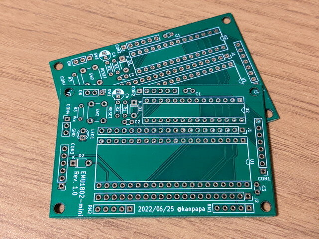

EMU1802-miniの回路図および基板のガーバーデータは[GitHub](https://github.com/kanpapa/emu1802 "emu1802")に無償で公開しておりますので誰でも製作できますが、このデータを使い、オレンジピコショップさんで[EMU1802-mini専用基板](https://store.shopping.yahoo.co.jp/orangepicoshop/pico-A-057.html "EMU1802-mini専用基板")の販売が開始されました。

<!--more-->

さらにオレンジピコショップさんでは主要パーツも取り扱っていますので、こちらを利用すればお手軽にEMU1802-miniが製作できます。

- [EMU1802-mini専用プリント基板 :PICO-A-057:オレンジピコショップ - 通販 - Yahoo!ショッピング](https://store.shopping.yahoo.co.jp/orangepicoshop/pico-A-057.html)
- [CDP1802BCE :PICO-I-140:オレンジピコショップ - 通販 - Yahoo!ショッピング](https://store.shopping.yahoo.co.jp/orangepicoshop/pico-i-140.html)
- [PIC18F27Q43 :PICO-I-177:オレンジピコショップ - 通販 - Yahoo!ショッピング](https://store.shopping.yahoo.co.jp/orangepicoshop/pico-i-177.html)
- [集合抵抗（4素子) :PICO-R-004:オレンジピコショップ - 通販 - Yahoo!ショッピング](https://store.shopping.yahoo.co.jp/orangepicoshop/pico-r-004.html)
- [1N4148(5本セット) :PICO-I-044:オレンジピコショップ - 通販 - Yahoo!ショッピング](https://store.shopping.yahoo.co.jp/orangepicoshop/pico-i-044.html)
- [小型タクトスイッチ :PICO-X-055:オレンジピコショップ - 通販 - Yahoo!ショッピング](https://store.shopping.yahoo.co.jp/orangepicoshop/pico-x-055.html)
- [L型ピンヘッダー 1×40 (40P) :PICO-X-067:オレンジピコショップ - 通販 - Yahoo!ショッピング](https://store.shopping.yahoo.co.jp/orangepicoshop/pico-x-067.html)

これに伴ってセットアップマニュアルをさらに修正して、EMU1802-mini専用基板を利用する際の注意点も追記いたしました。

- [EMU1802-mini セットアップマニュアル](https://github.com/kanpapa/emu1802/blob/main/EMU1802mini_Setup_ja.md "EMU1802-mini セットアップマニュアル")

やや独特なアーキテクチャで、日本ではマイナーですが、海外では根強いマニアが活発に活動されています。

- [COSMAC ELF - RCA CDP1802 Computing](http://www.cosmacelf.com "COSMAC ELF - RCA CDP1802 Computing")
- [The 1802 Membership Card](http://www.sunrise-ev.com/1802.htm "The 1802 Membership Card")

個性のあるCOSMACをぜひ試していただければと思います。

