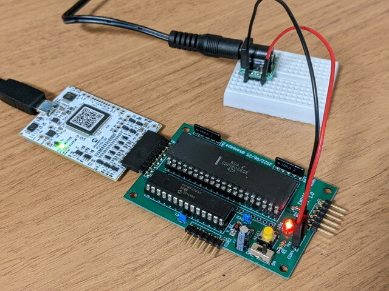
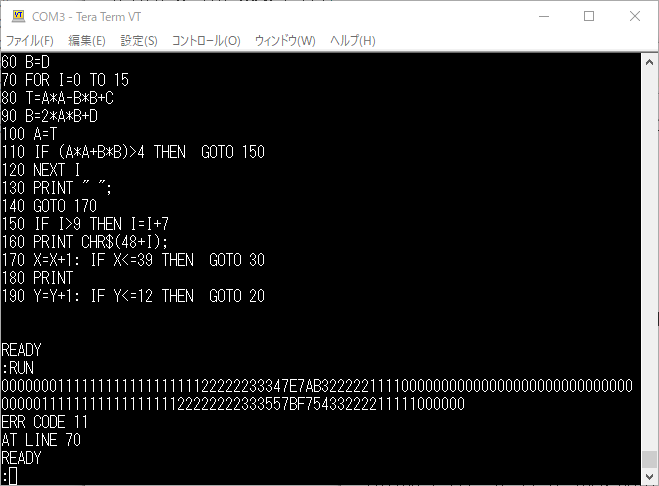

### 200KHzだったシステムクロックが1.79MHzに！

GazelleさんよりEMU1802-miniの高速版ファームウェアをご提供いただきました。ソースコードの開発および公開に感謝いたします。これをV2.1GとしてGitHubの[emu1802のソース](https://github.com/kanpapa/emu1802 "kanpapa/emu1802")にマージしました。これでCOSMAC CPUクロックが1.79MHzまで高速化できました。

<!--more-->

V2.1GはV1.x系とは処理方式が大きく変更されています。これまではTPBの立ち上がりで割り込みを行いメモリーを読んでいましたが、V2.1Gでは割り込みを使わずにポーリングを使ってTPAの立下り直後のCLOCK立ち上がりで アドレスを確定しています。これでメモリ読み込みの時間に余裕ができ、さらにコンパイラの最適化レベルを2にすることでさらに高速化しています。

TPAやTPBによるタイミング信号をトリガとして割り込みで処理しなければという思い込みがあり、ポーリングで各信号を追いながら処理すれば良いことに気づきませんでした。コンパイラでの最適化も全く試していなかったので、目からうろこというのはまさにこのことです。CPUクロックの高速化ができた上、ソースコードも非常にシンプルになります。一番重要なのは、ソフトウェアシリアルでも9600bpsに対応できるようになったので、ソフトウェアシリアルを使用している膨大な1802の資産が動くことです。V2.1Gファームウェアでは割り込み処理が不要となったので無駄なコードが残っていますが、動作速度には影響なく実験用のソースコードなのでまだ残しています。

### ASCIIART.BASを実行してみる

クロックが高速化したところでお約束のASCIIART.BASを実行してみました。[The 1802 Membership Card](http://www.sunrise-ev.com/1802.htm)用のRCA 1802 BASIC3 V1.1がそのまま動作します。ターミナル速度も9600bpsで使えます。

今回はSBC1802データパックに含まれているASCIIART.BASを使用しました。プログラムを入力し、RUNすると最初は問題なく動いていたのですが途中でエラーが表示されました。

ERR CODE 11 と表示されています。調べたところ「FOR/NEXT stack overflow, or FOR/NEXT executed directly」とのことでした。ソースをみると110行目でFOR-NEXTループから脱出する処理があります。この影響でスタックが開放されずにメモリリークが起こっているのではと考えました。SBC1802はメモリが32Kバイトありますが、このEMU1802-miniではメモリは4Kバイトしかありません。この影響と思われます。

そこでFOR-NEXTを使用しないプログラムに修正して実行しました。修正したプログラムは[GitHub](https://github.com/kanpapa/emu1802/blob/main/test_programs/asciiart/asciiart.bas "asciiart.bas")に置きました。

このプログラムで実行し、問題なく最後まで動作することを確認しました。

気になる実行時間は51分15秒でした。以前のファームウェアはクロックが200KHzでしたので実行する気にもなりませんでしたが、これだけの速度が出せるようになって感激です。

### 謝辞

Gazelleさんありがとうございました。今後はEMU1802-miniで他のソフトウェアも試していきたいと思います。
