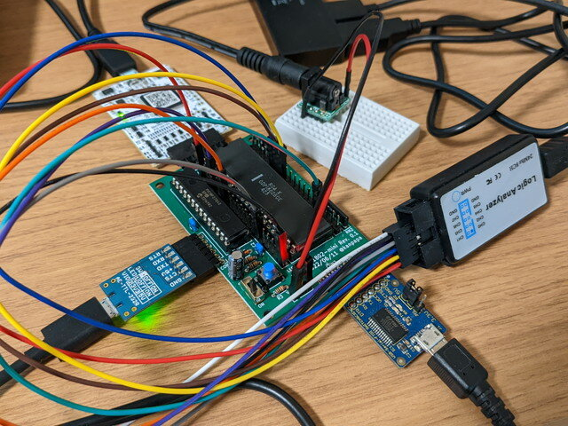
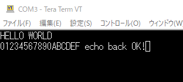

原型となった[EMUZ80](https://vintagechips.wordpress.com/2022/03/05/emuz80_reference/ "EMUZ80が完成")では、PIC18F47Q43でROM, RAM, UARTをエミュレーションしています。EMU1802-miniではPICのUARTの機能は使わずCOSMAC CPUのQ出力とEF3入力を利用したソフトウェアシリアルを使っていました。これは既存のCOSMACのソフトウェアではソフトウェアシリアルが利用されていてハードウェアの互換性があるからです。

しかし、今回製作しているEMU1802-miniでは一般的な速度のCPUクロックにできないため、どうしてもソフトウェアシリアルの速度が低速になってしまい、使い勝手がよくありません。IDOITモニタだけでもUART対応にできれば用途が広がるのではと思われます。

### PICのUARTをファームウェアに組み込む

これまでのファームウェアではUART機能をコメントアウトしていましたので、まずはこれをもとに戻しました。これでEMUZ80と同様にE000H、E001HをアクセスすることでPICのUARTにアクセスできるはずです。

動作確認を行うために、写真のようにPICのUARTにつながっているCON2にもUSBシリアルを9600bpsで接続します。



IDIOTモニタでUARTのレジスタのメモリアドレスを確認します。?MコマンドでE000H付近をダンプしてみると、このアドレスだけ何らかの値が設定されていることが確認できます。さらに!MコマンドでUARTのデータレジスタのアドレスであるE001にデータを書き込むと、CON2のUSBシリアルにそのデータがリアルタイムに出力されることを確認しました。


ファームウェアとハードウェアは正常に動作しているようです。

<!--more-->

### COSMACのプログラムからUARTにアクセスしてみる

次にテストプログラムを作って、プログラムからUARTにアクセスできるかを確認します。EMUZ80の雑誌投稿記事「[EMUZ80の設計と製作](https://vintagechips.files.wordpress.com/2022/06/emuz80designdetails.pdf)」にEMUZ80での端末インターフェースのテストプログラムが掲載されています。これのCOSMAC版を書いてみます。EMUZ80でのプログラムは再利用できるように機能がサブルーチンに分かれていますが、COSMACではとりあえず動くものにしています。（アーキテクチャ的にきちんと設計しないとサブルーチン化できないので・・・）

- [/emu1802/test\_programs/uart\_echo/](https://github.com/kanpapa/emu1802/blob/main/test_programs/uart_echo/uart_echo.asm "uart_echo.asm")

これをSB-Assemblerでアセンブルして、ファームウェアのROMエリアに組みこみます。

```
// Program 7: HELLO WORLD and ECHO BACK Using UART of PIC18F27Q43 ($0000-$003F)0xF8,0x00,0xB1,0xF8,0x2C,0xA1,0xE1,0xF8,0xE0,0xB2,0xB3,0xF8,0x00,0xA2,0xF8,0x01,0xA3,0x03,0xFA,0x02,0x32,0x11,0x72,0x32,0x1C,0x52,0x30,0x11,0x03,0xFA,0x01,0x32,0x1C,0x02,0xA4,0x03,0xFA,0x02,0x32,0x23,0x84,0x52,0x30,0x1C,0x48,0x45,0x4C,0x4C,0x4F,0x20,0x57,0x4F,0x52,0x4C,0x44,0x0D,0x0A,0x00,0xFF,0xFF,0xFF,0xFF,0xFF,0xFF
```

EMU1802-miniの電源をいれると、EMUZ80の確認プログラムと同様な動作が確認できました。



### IDIOTモニタをUART対応にする

実はすでにIDIOTモニタのUART版は存在します。COSMACのペリフェラルである[CDP1854 UART](http://www.cosmacelf.com/publications/data-sheets/cdp1854.pdf "CDP1854A, CDP1854AC Programmable Universal Asynchronous Receiver/Transmitter (UART)")を使ったものです。このソースを参考にしてPICのUART用に書き換えました。作成したソースはGitHubに置きました。

- [/emu1802/idiotmon/idiot\_uart](https://github.com/kanpapa/emu1802/tree/main/idiotmon/idiot_uart "idiot_uart")

これをファームウェアのROMエリアに組み込んだ状態でリセットをしたところ、IDIOTモニタのプロンプトがPICのUARTに出力されました。通信速度は9600bpsです。プログラムを読み込んで、実行できることを確認しました。


CPUクロックが遅いためかテキストアップロードを行うと取りこぼしがあるようです。このため10ms/文字、50ms/改行の待ち時間をターミナルで設定していますが、300bpsしか出せないソフトウェアシリアルに比べて格段に使いやすくなりました。

GitHubに置いてあるソースやドキュメントもこれにあわせてアップデートしました。ついでにRCA BASICの動かしかたを含む「EMU1802-miniでのCOSMAC CPUの楽しみ方」も追記しておきましたのでぜひご覧ください。

- [/emu1802/EMU1802mini\_Setup\_ja.md](https://github.com/kanpapa/emu1802/blob/main/EMU1802mini_Setup_ja.md "EMU1802mini_Setup_ja.md")
