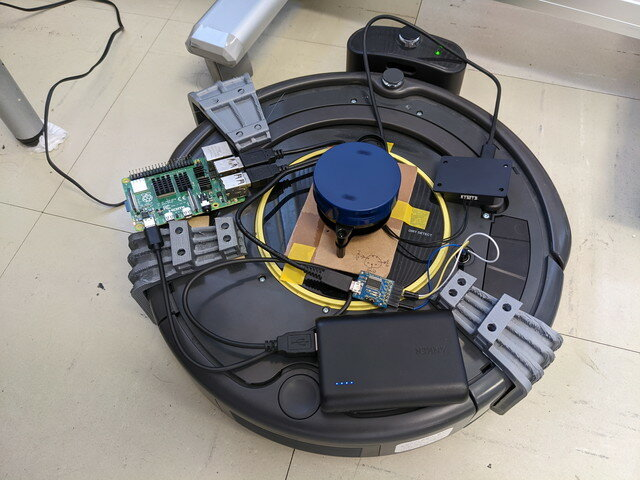
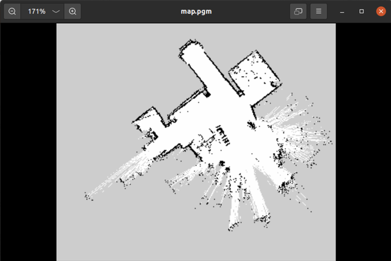
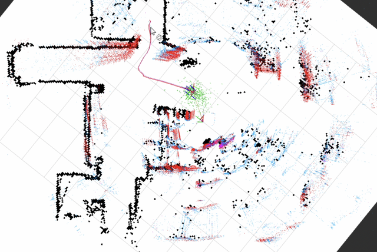

[おおたfab](https://ot-fb.com/ "おおたfab")さんでは、「[素人でもロボットをつくりたい](https://ot-fb.com/iot/6353/ "素人でもロボットをつくりたい")」という勉強会を定期的に行っています。おおたfabさんのルンバロボットの[LiDARが壊れてしまった](https://kanpapa.com/2022/07/slamtec-rplidar-stopped.html "LiDARが壊れました")ので、その交換とROS2化を行いました。

### ROS2のセットアップ

おおたfabの勉強会ではROS1 Melodicで実験を行ってきました。ROS2 Foxyでも問題なくルンバが動くことがわかったので、ROS2環境で再セットアップを行います。

手順はこれまでにまとめたものをGitHubにアップしていますので、これを見ながら進めました。

- [Roomba実機をROS2 foxyで動かす環境のセットアップ](https://github.com/docofab/RoombaControlls/blob/main/ROS2/instructions/setup-real-roomba-foxy.md "Roomba実機をROS2 foxyで動かす環境のセットアップ") (GitHub)

まずは机上でRaspberry PiとルンバとLiDARを接続して動作確認を行いました。

動作確認ができたところで、ルンバに機材を載せて電源をモバイルバッテリに切り替えます。

### SLAMを試してみる

おおたfabさんの事務所は広いので実験環境としては最適です。まずはSLAMを行ってみました。

思ったよりも良い精度でmapを作ることができました。

SLAM中の動画をYouTubeにアップしておきました。



### Nav2を試してみる

SLAMで作成したmapをつかってナビゲーションを行ってみました。これもうまく動きます。ROS1にくらべて精度が良くなっているように思えます。

調子にのってあちこちに移動させていたところ、急に事務所の出口に向かって走り始めました。Rviz2を確認したところ、なんと出口から事務所の外側を回って目的地に向かおうとしていたのです。

時間をかけて正確な地図を作っておかないといけないことがわかりました。

こちらもNav2中の動画をYouTubeにアップしておきました。



### 今後の取り組み

LiDARが変更になったのでベースのLiDAR取り付け部の修正が必要です。これまで製作していた受付システムや可動部のモーター制御などをROS2で動くようにしていきます。
