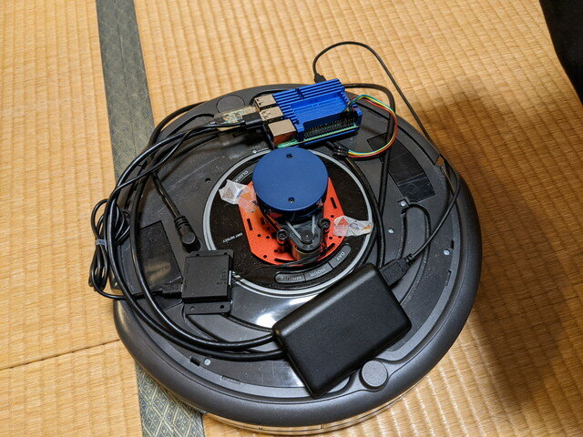

残念ながら[Maker Faire Tokyo 2022には出展許可はいただけませんでした](https://kanpapa.com/2022/05/Roomba-robot-ros-part15-otafab62.html "Maker Faire Tokyo 2022の出展申し込みを行いました （おおたfab 第62回 素人でもロボットをつくりたい）")。また来年ということになりますが、来年であればROS2でルンバを動かしておきたいものです。

ROS1でルンバを動かしたという記事は見かけますが、ROS2はあまり見かけませんので、調査から始めることにしました。

### ハードウェアの準備

以下のハードウェアを使用します。

- iRobot ルンバ 600シリーズ
- [Raspberry Pi 4 Model B / 4GB](https://www.switch-science.com/catalog/5680/ "Raspberry Pi 4 Model B / 4GB")
- [YDLiDAR X2](https://www.switch-science.com/catalog/5930/ "YDLiDAR X2")
- [FTDI USBシリアル変換アダプター](https://www.switch-science.com/catalog/1032/ "FTDI USBシリアル変換アダプター（5V/3.3V切り替え機能付き）")（ルンバとRaspberry Pi 4の接続用）
- モバイルバッテリー（Raspberry Pi 4の電源はUSB-Cなのでそのケーブルも必要）

これらを組み合わせるとこのようになります。

 <!--more-->

### どのROS2を使うか

ROS2で現在サポートされているのは以下の３つです。

| **Distro** | **Release date** | **EOL date** | **Plathome (Ubuntu)** |
| --- | --- | --- | --- |
| [Humble Hawksbill](https://docs.ros.org/en/humble/ "Humble Hawksbill") | May 23rd, 2022 | May 2027 | 22.04 LTS (Jammy) |
| [Galactic Geochelone](https://docs.ros.org/en/galactic/ "Galactic Geochelone") | May 23rd, 2021 | November 2022 | 20.04 LTS (Focal) |
| [Foxy Fitzroy](https://docs.ros.org/en/foxy/ "Foxy Fitzroy") | June 5th, 2020 | May 2023 | 20.04 LTS (Focal) |

[Humble](https://docs.ros.org/en/humble/)は登場したばかりでもう少し様子を見たいことと、[Galactic](https://docs.ros.org/en/galactic/ "Galactic")は[Foxy](https://docs.ros.org/en/foxy/ "Foxy")よりもEOLが早いので、今回はFoxyを選択しました。

### ROS2の何が良いのか

ROS1の場合はroscoreというプロセスがシステムのどこかに存在している必要がありましたが、ROS2はお互いのノードが通信できるためroscoreのようなものは不要です。またセキュリティ的にも改善されているそうです。今後新しいOSに対応していくので保守面でも安心です。

### ROS2の実行環境

ROS2の実行環境はUbuntu 20.04 LTSになります。ROS1 Melodicの場合はUbuntu 18.04 LTSだったため、M1 MacのParallel Desktopは使えなかったのですが、Ubuntu 20.04 LTSなら使えます。これでM1の高速性が活かせそうです。Raspberry PiもUbuntu 20.04 Serverが使えますので、当面OSサポートの心配は不要です。

ルンバのドライバはROS1の時は[RoboticaUtnFrba/create\_autonomy](https://github.com/RoboticaUtnFrba/create_autonomy "RoboticaUtnFrba/create_autonomy")を使用しましたが、こちらはROS2には対応していないようなので、Foxyをサポートしている [AutonomyLab/create\_robot](https://github.com/AutonomyLab/create_robot "AutonomyLab/create_robot") を使用してみます。このfoxyブランチを使用すれば良さそうです。

### ROS2の環境構築

まずは、Ubuntu 20.04 LTSをインストールします。PCにはデスクトップ版を、Raspberry Piにはサーバー版をインストールしました。

次にROS2 Foxyのインストールです。これもパッケージインストールなので[公式サイトの手順](https://docs.ros.org/en/foxy/Installation/Ubuntu-Install-Debians.html "Ubuntu-Install-Debians")通りでインストールできます。今回はRaspberry PiもPCと同じDesktop installを行いました。Raspberry Piではディスプレイに接続しないのですが、ROS-Base Installだとデモプログラムなども入っておらず通信の確認などで不便だったので同じ環境にしました。

さらに[ルンバのドライバ](https://github.com/AutonomyLab/create_robot "AutonomyLab/create_robot")と[LiDARのドライバ](https://github.com/YDLIDAR/ydlidar_ros2_driver " YDLIDAR/ydlidar_ros2_driver")をRaspberry PiのROS2 Foxy環境にインストールします。こちらはROS1の時と同様にGitHubからクローンしてビルドすることになります。手順は各ドライバのGitHubにありますが、ROS1のときはcatkin buildでしたが、ROS2ではcolcon buildになります。

### Raspberry PiとルンバとLIDARを接続

ここはROS1の時と同じです。Raspberry PiのUSBポートにUSBシリアルを介してルンバ本体に接続します。udevの設定ファイルを作成し、ルンバのUSBシリアルが接続されたら/dev/roombaのデバイスが割り当てられるようにします。

LiDARもRaspberry PiのUSBポートに接続します。販売元から提供されているLiDARドライバをインストールすることで、LiDARが接続されたら/dev/ydlidarに割り当てられます。

### ルンバの動作確認

ルンバに接続しているRaspberry Piにログインします。

ターミナルを２つ接続してルンバのドライバとLiDARのドライバを動かします。

```
ros2 launch create_bringup create_2.launch
ros2 launch ydlidar_ros2_driver ydlidar_launch.py
```

この状態でRaspberry Piでのノードとトピックを確認します。

```
$ ros2 topic list 
/battery/capacity
/battery/charge
/battery/charge_ratio
/battery/charging_state
/battery/current
/battery/temperature
/battery/voltage
/bumper
/check_led
/clean_button
/cliff
/cmd_vel
/day_button
/debris_led
/define_song
/diagnostics
/dock
/dock_button
/dock_led
/hour_button
/ir_omni
/joint_states
/main_brush_motor
/minute_button
/mode
/odom
/parameter_events
/play_song
/power_led
/robot_description
/rosout
/scan
/set_ascii
/side_brush_motor
/spot_button
/spot_led
/tf
/tf_static
/undock
/vacuum_motor
/wheeldrop
/ydlidar_ros2_driver_node/transition_event

$ ros2 node list 
/create_driver
/launch_ros_1199
/robot_state_publisher
/static_tf_pub_laser
/ydlidar_ros2_driver_node
$
```

この例のように正常にノードとトピックが見えればOKです。

LiDARのトピックである/scanはLiDARのスキャン情報が大量に流れているのが見えると思います。

```
$ ros2 topic echo /scan
header:
  stamp:
    sec: 1658643741
    nanosec: 375200000
  frame_id: laser_frame
angle_min: -3.1415927410125732
angle_max: 3.1415927410125732
angle_increment: 0.025541404262185097
time_increment: 0.0003351300838403404
scan_time: 0.08244200050830841
range_min: 0.009999999776482582
range_max: 8.0
ranges:
- 0.0
- 1.1610000133514404
- 1.1670000553131104
- 1.1729999780654907
- 1.1790000200271606
- 1.190500020980835
- 1.2960000038146973
- 1.2480000257492065
- 1.2979999780654907
　　　　　:
```

もう一つターミナルを立ち上げて/cmd\_velのトピックを投げてみます。

```
ros2 topic pub /cmd_vel geometry_msgs/Twist '{linear: {x: 0.1}, angular: {z: 0.3}}'
```

これでルンバが少しずつ動くはずです。うまく動けばルンバ側の環境設定は完了です。

次は[PCの環境を使ってSLAMに挑戦](https://kanpapa.com/2022/07/ros2-foxy-roomba-slam.html "ROS2 Foxy環境のルンバでSLAMを動かしてみました")してみます。
