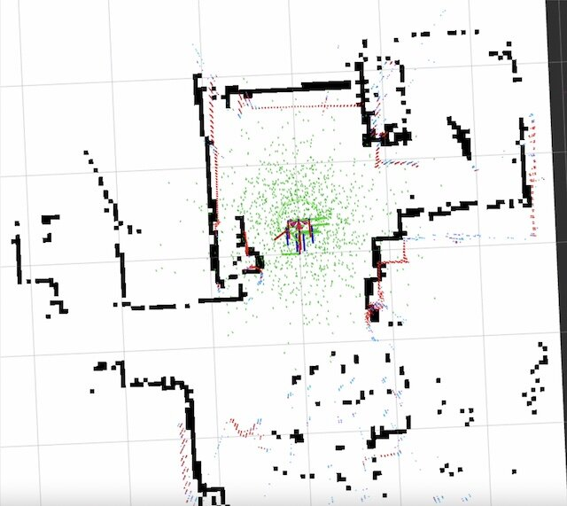
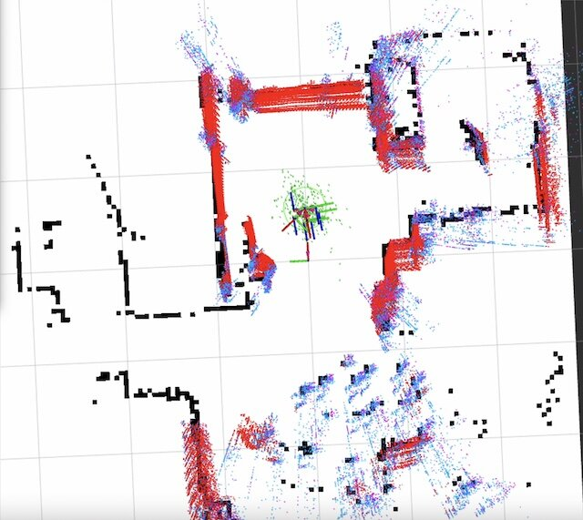
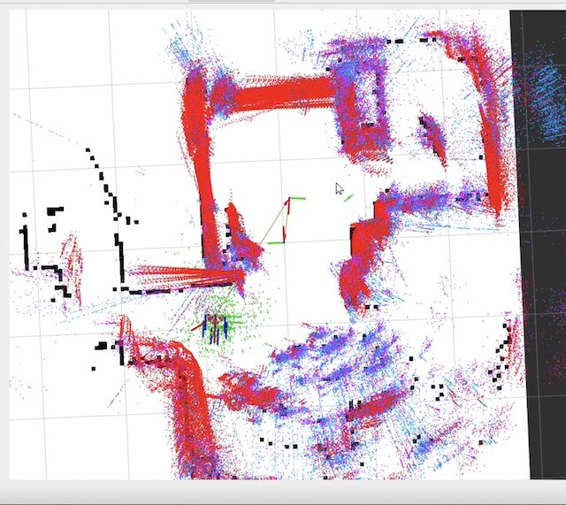

[前回はSLAMで環境地図を作成](https://kanpapa.com/2022/07/ros2-foxy-roomba-slam.html "ROS2 Foxyでルンバを動かしてみました(2) SLAM編")しました。今回はこの環境地図の情報を使って自律走行を行います。ROS2ではNavigation 2と呼んでいます。今回はTurtlebot3用のNavigation 2パッケージを使用します。

### 環境地図を用意する

前回SLAMで作成した地図です。


この地図はmap.pgmとmap.yamlという２つのファイルでできています。このファイルをホームディレクトリに用意します。

<!--more-->

### 自律走行を行ってみる

自律走行（ナビゲーション）は以下の手順で行います。

1\. ルンバをBringupしておきます。 2. 以下のコマンドでNavigation2を動かします

```
export TURTLEBOT3_MODEL=burger
ros2 launch turtlebot3_navigation2 navigation2.launch.py use_sim_time:=True map:=$HOME/map.yaml
```

3\. Rviz2が起動するので、2D Pose Estimateで現在のルンバの位置と向きを設定します。読み込んだ地図とレーザースキャンのマークがなるべく近くなるように調整してください。


4\. ルンバの周りの緑色の小さい矢印が表示されます。



5\. 以下のコマンドを実行し、キーボード操作でルンバを少し動かします。ゆっくり回転すると良いかもしれません。緑色の小さい矢印がルンバ周辺に集束してきます。

```
export TURTLEBOT3_MODEL=burger
ros2 run turtlebot3_teleop teleop_keyboard
```



6\. 緑色の小さい矢印がある程度集束したところで、2D Goal Poseでルンバの目的地と向きを設定します。


7\. 目的地までの経路計画が表示されます。


8\. 経路計画に沿ってルンバが目的地まで走行します。



### 自律走行の様子

実際の自律走行の様子をYouTubeにアップしておきました。

これで一通りの動作が確認できました。

今回は狭い部屋の中での実験でしたので、もう少し広い場所（例えば、おおたFabさん）で自律走行を試して、各種パラメタをチューニングしていきたいです。
