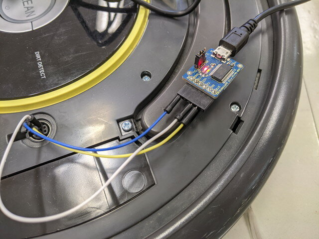
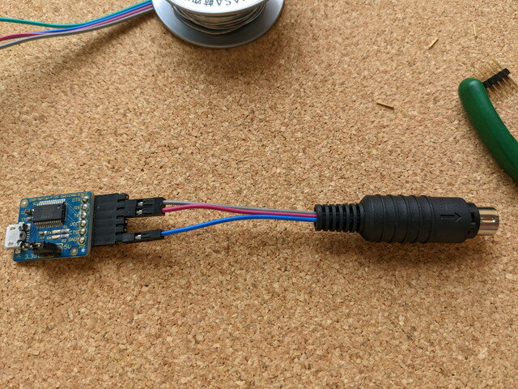
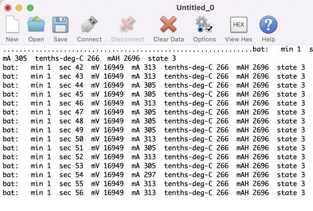

これまでルンバのシリアル接続は、USBシリアル変換ボードのコネクタとルンバのシリアルコネクタにブレッドボード用のワイヤーを刺して行っていました。

先日このワイヤーが切れてしまったので、もう少し使い勝手の良いものを作ってみました。これまでは単純にワイヤーを刺しているだけなので、抜けやすかったり、取り外したときにTX-RXがどっちだっけと悩むことも多かったのです。

USBシリアル変換ボードはそのまま使うとして、しっかりしたコネクタで接続するようにしてみました。秋月電子にある[FTDI USBシリアル変換ケーブル(5V)](https://akizukidenshi.com/catalog/g/gM-05841/ "FTDI USBシリアル変換ケーブル(5V)")を流用するとかっこよくできるのですが、やや高いですし、実験用なのでこのくらいで十分かと。

材料はシンプルです。ルンバのシリアルコネクタに適合する[ミニDINプラグ 7P](https://www.marutsu.co.jp/pc/i/41258/ "ミニDINプラグ 7P")はマルツさんで買いました。

これを組み合わせてUSB変換コネクタができました。

ルンバのシリアルコネクタに取り付けます。

PCでターミナルソフトを動かして、ルンバの電源をいれると無事情報が出力されました。

これで安定したシリアル接続ができそうです。
