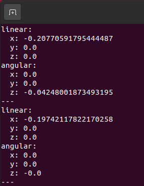
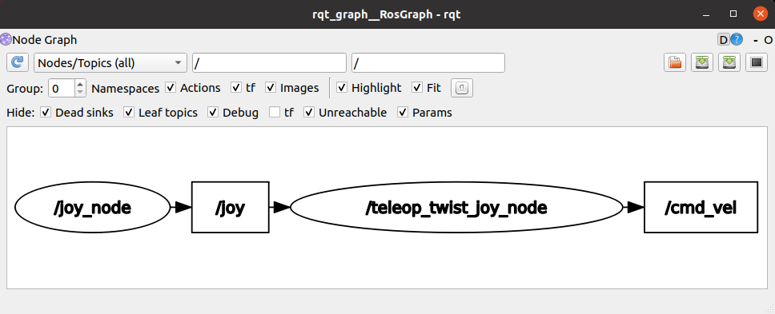
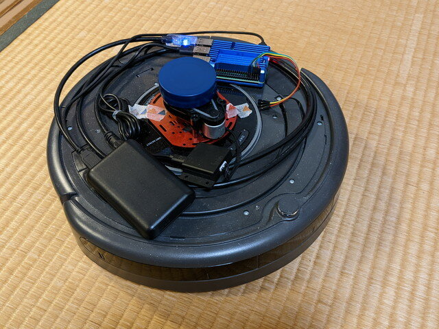

手元にあるPS4用のジョイスティック（DualShock4）をROS2 Foxyで使ってみました。動作環境はWindows10のVMWareで動かしているUbuntu20.04 LTS です。

DualShock4はBluetoothをサポートしているのですが、今回は有線でのUSB接続です。

 <!--more-->

### DualShock4をLinuxに認識させる

ホストPC(Windows10)のUSBにDualShock4を接続し、VMWareの取り外し可能デバイスのメニューでゲストOS(Ubuntu 20.04)に接続します。

接続が完了したら /dev/input/js0 が登録されているか確認します。

```
ls -l /dev/input/js0
```

次にジョイスティックのパッケージをインストールし、テストアプリケーションを実行します。

```
sudo apt install joystick
jstest /dev/input/js0
```


ジョイスティックの状態が表示され、スティックやボタンを触ると状態が変わることが確認できます。

テストアプリケーションにはGUI版もあります。こちらのほうが視覚的にわかりやすいです。（カッコいいです。）

```
sudo apt install jstest-gtk
jstest-gtk
```

 

### ROS2の環境設定を行う

ROS2 foxyではジョイスティックのパッケージが準備されていますので、インストールします。

```
sudo apt install ros-foxy-joy*
```

以下のコマンドでノードを動かすと /dev/input/js0 の状態を読み取って /joy トピックが流れてきます。

```
ros2 run joy_linux joy_linux_node
```

以下のコマンドで/joyトピックを見ながら、ジョイスティックを操作して、値が変化することを確認します。

```
ros2 topic echo /joy
```


流れてくる /joy トピックを確認したところ、PS4のDualShock4の場合は以下のようなマッピングになっているようです。

**axes**（方向操作系のスティックやボタン）

| **Index** | **コントローラーとの対応** | **値** |
| --- | --- | --- |
| 0 | 左側スティック（左右方向） | 左方向の最大値１、右方向の最大値-1、センター０ |
| 1 | 左側スティック（上下方向） | 上方向の最大値１、下方向の最大値-1、センター０ |
| 2 | L2 | 押していない時は1、押し込むと最大値-1 |
| 3 | 右側スティック（左右方向） | 左方向の最大値１、右方向の最大値-1、センター０ |
| 4 | 右側スティック（上下方向） | 上方向の最大値１、下方向の最大値-1、センター０ |
| 5 | R2 | 押していない時は1、押し込むと最大値-1 |
| 6 | 十字方向ボタン（左右方向） | 左方向ボタンを押すと１、右方向ボタンを押すと-1 |
| 7 | 十字方向ボタン（上下方向） | 上方向ボタンを押すと１、下方向ボタンを押すと-1 |

**buttons**（ボタンスイッチ　押すと１、離すと０）

| **Index** | **コントローラーとの対応** |
| --- | --- |
| 0 | ×ボタン |
| 1 | 〇ボタン |
| 2 | △ボタン |
| 3 | □ボタン |
| 4 | L1ボタン |
| 5 | R1ボタン |
| 6 | L2ボタン |
| 7 | R2ボタン |
| 8 | SHAREボタン |
| 9 | OPTIONSボタン |
| 10 | PSボタン |

ここで、先ほど/joyトピックの確認のために起動したノードを停止します。

次にジョイスティックの操作が/cmd\_velのトピックになるような、launchファイルが準備されていますので、以下のコマンドを実行します。

```
ros2 launch teleop_twist_joy teleop-launch.py
```

意図しない誤操作を防ぐために、/cmd\_velを発生させるためには、以下のボタンを押しながら左側のスティックで操作する必要があります。

- OPTIONSボタン ・・通常モード（/cmd\_velの範囲はXは±0.7、Zは±0.4）
- PSボタン・・・・・・ブーストモード（/cmd\_velの範囲はXは±1.5、Zは±1.0）

ジョイスティックを操作して、/cmd\_velのトピックに正常な値が流れてくることを確認します。

```
ros2 topic echo /cmd_vel
```



これをrqt\_graphで見ると以下のようになっています。



### ジョイスティックでルンバを動かす

ここまで動作すればあとはルンバと接続するだけです。ルンバのRaspberry Pi 4にログインしてbringupします。

```
ros2 launch create_bringup create_2.launch
```

OPTIONSボタンを押しながらジョイスティックを操作すれば通常モードでルンバが動いてくれますが、SLAMを行う場合はさらに慎重にゆっくり操作するのが良いです。

速く走らせるだけならPSボタンを押しながら操作するブーストモードがダイナミックな動きをします。


