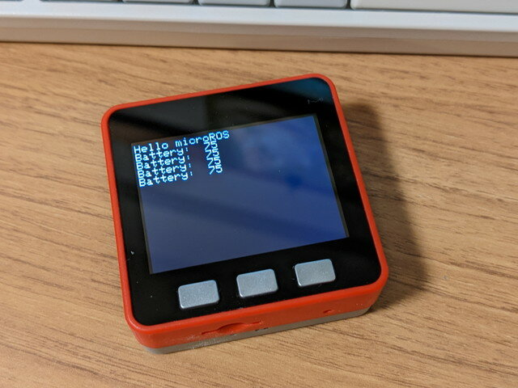
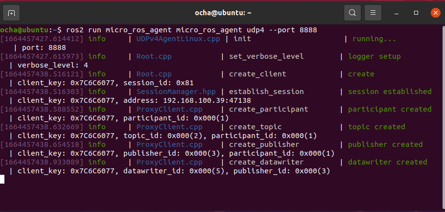

ESP32をつかってmicro-ROS for ArduinoでROS2と通信できるという記事を見かけました。

- [\[ROS2 foxy\] ESP32を使ってmicro-ROS for Arduinoで遊ぼう](https://qiita.com/ousagi_sama/items/b4eb3d9c6b337cbe1b05 "[ROS2 foxy] ESP32を使ってmicro-ROS for Arduinoで遊ぼう")

ESP32でできるならM5Stackでも同じことができそうだと試してみました。

手順は先ほどのQiitaの記事を参考にしています。



今回はM5Stack Fireを使いました。ROS2 Foxyの環境はVMWare Workstaion Player上のUbuntu 20.04 LTSです。

<!--more-->

### マイコン(M5Stack）側の設定

M5StackにおけるArduinoIDEの使い方は一般的なので簡単にまとめます。検索すれば詳細に説明されているホームページが多数見つかりますのでそれらも参考にしてください。

#### 1\. ArduinoIDEにM5Stackの開発環境を導入

これは[M5Stack公式マニュアル](https://docs.m5stack.com/en/arduino/arduino_development "M5Stack Arduino IDE Development")通りにすすめます。すでにM5Stackの開発環境がセットアップされていれば不要です。

1. 「ファイル」→「環境設定」→「追加のボードマネージャーのURLを設定」で https://m5stack.oss-cn-shenzhen.aliyuncs.com/resource/arduino/package\_m5stack\_index.json を指定。
2. 「ツール」→「ボード」→「ボードマネージャー」→「M5Stack」を検索してインストール
3. 「スケッチ」→「ライブラリをインクルード」→「ライブラリを管理...」から「M5Stack」ライブラリをインストール

これでM5Stackの開発環境ができました。「ファイル」→「スケッチ例」→「M5Stack」にM5Stackのサンプルプログラムがあるので適当なものをM5Stackに書き込んで動作することを確認してください。

#### 2\. ArduinoIDEにmicro-ROS for Arduinoのライブラリを導入

GitHubにある[micro-ROS for Arduino公式マニュアル](https://github.com/micro-ROS/micro_ros_arduino "micro-ROS library for Arduino ")の通りにすすめます。今回はROS2 foxyですので、[v2.0.5-foxyリリース](https://github.com/micro-ROS/micro_ros_arduino/releases/tag/v2.0.5-foxy "v2.0.5-foxy")を使用しました。

GitHubに登録されているZIPファイルをダウンロードし、Arduino IDEの「ライブラリの管理...」の「.Zip形式のライブラリをインストール」で読み込みます。

正常に読み込めればライブラリの一覧に「micro\_ros\_arduino」が追加されます。

#### 3\. micro-ROSのサンプルプログラムのビルドとM5Stackへの書き込み

micro-ROSのサンプルプログラム([micro-ros\_publisher\_wifi.ino](https://github.com/micro-ROS/micro_ros_arduino/blob/foxy/examples/micro-ros_publisher_wifi/micro-ros_publisher_wifi.ino "micro-ros_publisher_wifi.ino"))をM5Stack用に修正したものを使います。

今回はM5Stackのバッテリーレベルをtopicとして配信するようにしました。WiFiの設定のところはWiFiのSSIDとパスフレーズとmicro-ROS-Agentが動作するPCのIPアドレスに書き換える必要があります。

ソースコードは[GitHub](https://github.com/kanpapa/micro_ros_arduino/blob/main/micro-ros_m5stack_publisher_wifi/micro-ros_m5stack_publisher_wifi.ino "micro-ros_m5stack_publisher_wifi.ino")に登録しておきました。

```
#include #include #include #include #include #include #include #include #if !defined(ESP32) && !defined(TARGET_PORTENTA_H7_M7) && !defined(ARDUINO_NANO_RP2040_CONNECT)#error This example is only avaible for Arduino Portenta, Arduino Nano RP2040 Connect and ESP32 Dev module#endifrcl_publisher_t publisher;std_msgs__msg__Int32 msg;rclc_support_t support;rcl_allocator_t allocator;rcl_node_t node;#define LED_PIN 13#define RCCHECK(fn) { rcl_ret_t temp_rc = fn; if((temp_rc != RCL_RET_OK)){error_loop();}}#define RCSOFTCHECK(fn) { rcl_ret_t temp_rc = fn; if((temp_rc != RCL_RET_OK)){}}void error_loop(){  while(1){    digitalWrite(LED_PIN, !digitalRead(LED_PIN));    delay(100);  }}void timer_callback(rcl_timer_t * timer, int64_t last_call_time){  RCLC_UNUSED(last_call_time);  if (timer != NULL) {    RCSOFTCHECK(rcl_publish(&publisher, &msg, NULL));    msg.data++;  }}void setup() {  M5.begin();  M5.Power.begin();  M5.Lcd.setTextSize(2);   M5.Lcd.print("Hello microROS\n");    //古いM5STACKハードウェアの場合、バッテリーレベルが取得できないです。  if(!M5.Power.canControl()) {    M5.Lcd.print("can't power control\n");  }    set_microros_wifi_transports("SSID", "PASS", "192.168.xxx.xxx", 8888);  pinMode(LED_PIN, OUTPUT);  digitalWrite(LED_PIN, HIGH);  delay(2000);  allocator = rcl_get_default_allocator();  //create init_options  RCCHECK(rclc_support_init(&support, 0, NULL, &allocator));  // create node  RCCHECK(rclc_node_init_default(&node, "micro_ros_arduino_wifi_node", "", &support));  // create publisher  RCCHECK(rclc_publisher_init_best_effort(    &publisher,    &node,    ROSIDL_GET_MSG_TYPE_SUPPORT(std_msgs, msg, Int32),    "battery_level"));  msg.data = 0;}void loop() {    int BatteryLevel = M5.Power.getBatteryLevel();     // バッテリー残量取得 100/75/50/25    M5.Lcd.printf("Battery: %3d \%\n", BatteryLevel);        msg.data = BatteryLevel;    RCSOFTCHECK(rcl_publish(&publisher, &msg, NULL));       sleep(1);}
```

### PC側の設定

これも[micro-ROS-Agentの公式マニュアル](https://github.com/micro-ROS/micro_ros_setup "micro_ros_setup")に沿って設定します。なお、環境変数 ROS\_DOMAIN\_IDを設定していると動作しませんので、unset ROS\_DOMAIN\_ID で環境変数を削除してください。

#### 1.micro-ROS-Agentのセットアップ

```
source /opt/ros/$ROS_DISTRO/setup.bash
mkdir uros_ws && cd uros_ws
git clone -b $ROS_DISTRO https://github.com/micro-ROS/micro_ros_setup.git src/micro_ros_setup
rosdep update && rosdep install --from-paths src --ignore-src -y
colcon build
source install/local_setup.bash
```

#### 2.micro-ROS-Agentをビルドして実行します。

cd ~/uros\_ws  
`ros2 run micro_ros_setup create_agent_ws.sh ros2 run micro_ros_setup build_agent.sh source install/local_setup.sh ros2 run micro_ros_agent micro_ros_agent udp4 --port 8888`

micro-ROSが動いているM5StackとAgentがつながると以下のような画面になります。



#### 3.トピックの確認

この状態で正常に動いていればtopicが流れてくるはずです。

```
ros2 topic listros2 topic echo /battery_level
```


### 今後の応用

M5Stackには表示画面と操作ボタンがついていてそれらを制御するための豊富なM5Stackライブラリが使えます。

うまく応用できれば簡単なコントローラーとしてROS2のトピックを流して、ロボット本体に指示を与えることもできそうです。

続いて、subscriberも試してみました。

- [ROS2とM5Stackをmicro-ROSで通信してみました (2) subscriber編](https://kanpapa.com/2022/10/ros2-m5stack-microros-subscriber.html "ROS2とM5Stackをmicro-ROSで通信してみました (2) subscriber編")
