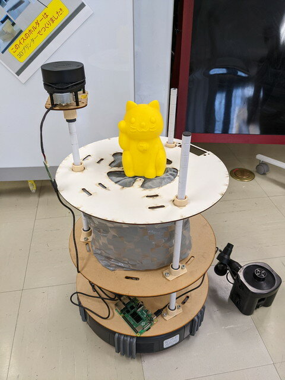
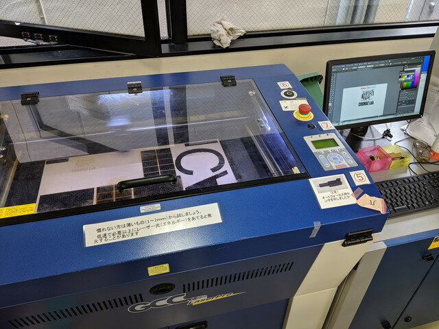
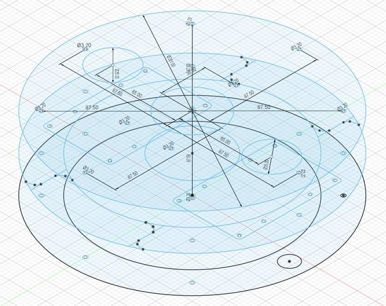
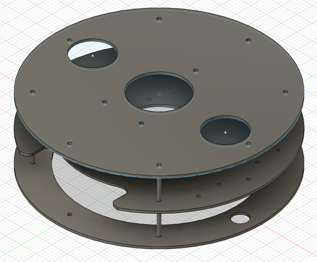
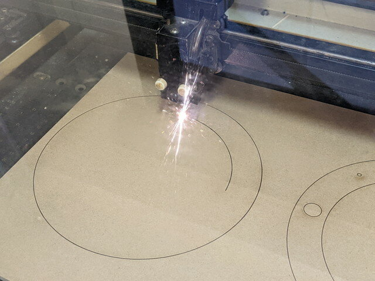
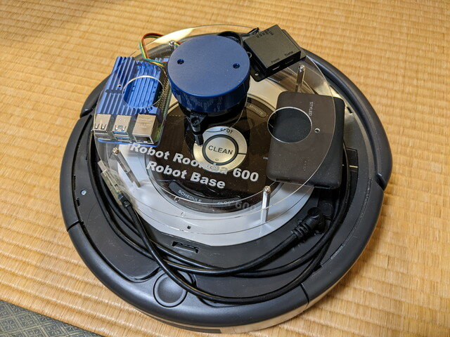

[おおたfab](https://ot-fb.com/ "おおたfab")さんでは、「[素人でもロボットをつくりたい](https://ot-fb.com/iot/6353/ "素人でもロボットをつくりたい")」という勉強会を定期的に行っています。10月30日に予定されているオープンハウスに向けてルンバに載せる新しいフレームを製作中です。

### 新しいフレームの製作  

新しいフレームはMDFを使い二重構造になっています。移動時の揺れをすこしでも抑えるために試行錯誤中です。

写真のような板を２枚用意してパイプでつなぎ２段重ねにする予定です。

<!--more-->

参考までにこれまで製作したフレームの全景です。

### 簡易フレームの製作

大掛かりなフレームとは別にテスト用のシンプルなものも製作しておくことにしました。こちらはモノを載せることは考えておらず、ROS2の動作確認用です。

これまでは機材をルンバの上に並べて動かしていたので揺れでLiDARの位置がずれたり、移動中にバッテリーが床に落ちたりなどやや不安定な状態で実験していました。

おおたfabさんには会員が利用できるレーザーカッター LaserPro SPIRIT (40W)があります。以前少し使ったことがありましたが、久しぶりに利用することにしました。

### 簡易フレームの図面作成

今回のような加工を行う場合は[FUSION 360](https://www.autodesk.co.jp/products/fusion-360/overview "FUSION 360")で図面を起こし、作成したDXFファイルを[Illustrator](https://www.adobe.com/jp/products/illustrator.html "Illustrator")で読み込んだのちにレーザーカッターに出力して素材を切断します。プロ用の機材ですので正確な加工ができます。

今回FUSION 360で起こした図面はこのようなものです。

レーザーカッターを使う上では2Dの図面だけあれば良いのですが、FUSION 360で押し出しで3Dボディを作ると実際の製作物のイメージの確認ができます。一番上の段にはLiDARを取り付けます。同時にLiDARのネジ用の穴も開けてしまいます。中段にはRaspberry Pi 4とバッテリを載せます。ここはまだ仮設計です。下段はルンバの丸い溝にぴったり収まるように大きな穴が開いています。

### レーザーカッターで加工

図面データをレーザーカッターに出力し素材を加工します。切断中の光が眩しいです。

最初にMDFで試してみたのですが、やや厚めだったようで一回で切断できませんでした、そのため今回はアクリル板を使いました。

このようにきれいに加工できました。切断時よりも弱いパワーにすることで文字入れもできます。

保護シートを剥いだところです。文字もくっきり加工できました。

### 製作物の仮組

まだ2段めの設計が終わっていないのですが、イメージを確認するために仮組をしてみました。板の間には30mmの金属スペーサーでねじ止めしています。

いい感じでLiDARは固定できました。これをもとにRaspberry Pi 4とバッテリを載せる予定の２段目の板の設計と試作を進めます。このように試作しながら設計を進めることができるのは便利ですね。
