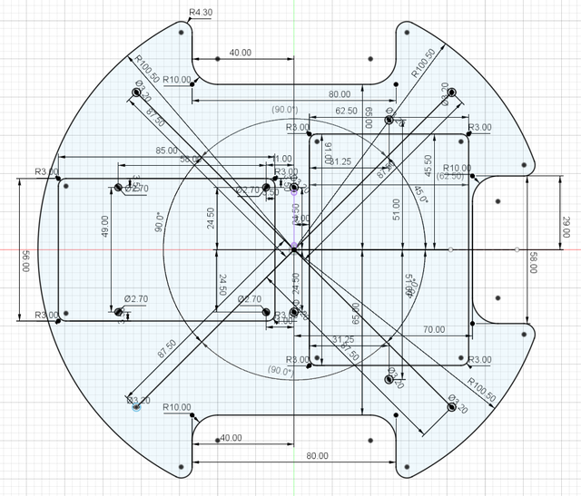
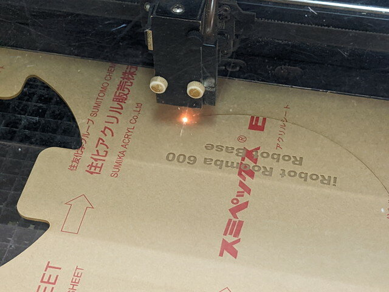
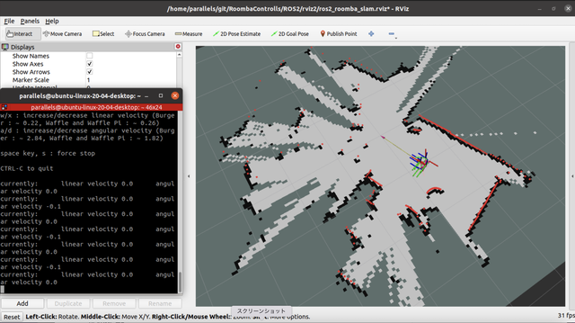

ルンバにLiDARやRaspberry Pi 4を載せるための簡易フレームを製作中です。[前回はルンバに載せる下段と、LiDARを取り付ける上段のプレートを製作](https://kanpapa.com/2022/10/Roomba-robot-otafab69.html "新しいフレームを製作中です （おおたfab 第69回 素人でもロボットをつくりたい）")しました。

中段はRaspberry Pi 4とモバイルバッテリーを取り付けるプレートとなります。シンプルな上段と下段とは違い、このプレートは様々なデザインが考えられます。

<!--more-->

要件としては、

- LiDARやルンバと接続するためUSB端子をふさがない
- Raspberry Pi 4の電源入力となるUSB-Cの位置をふさがない
- バッテリーはすぐ交換できるように外しやすく
- ルンバのLED表示が見えるように
- ルンバの電源ボタンや操作ボタンが押しやすいように
- Raspberry Pi 4が高温になるので風通し良く
- ルンバのコネクタの抜き差しがしやすく、コネクタがプレートにあたらないように

これらを考えながらFUSION 360でレイアウトを考え、最終的には以下のようなレイアウトとしました。

作成したデータはGitHubに登録しておきました。

- [kanpapa/roomba\_600\_simple\_base](https://github.com/kanpapa/roomba_600_simple_base "roomba_600_simple_base")

このデータを使いアクリル板をレーザーカッターで加工します。

完成したプレートです。いつもながら正確な加工でレーザーカッターは素晴らしいです。

前回作ったLiDARを載せたプレートと組み合わせ、新たにRaspberry Pi 4とモバイルバッテリーを取り付けて完成しました。

早速テスト走行です。

SLAMも問題なくできました。

一度作ると、ここはこうすればよかったとか思うところもあるのですが、まずはこれで安定して動作するのではないかと思います。

