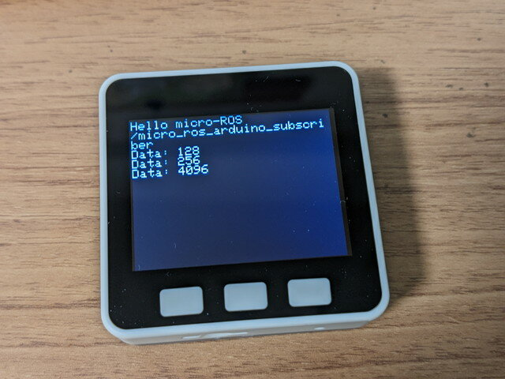
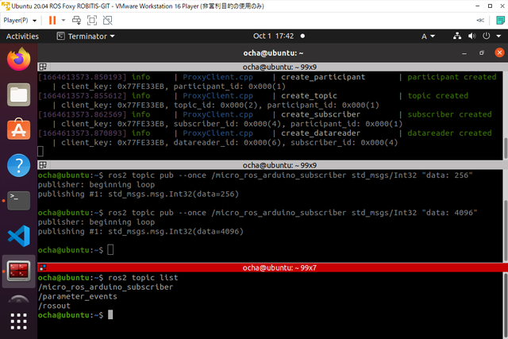
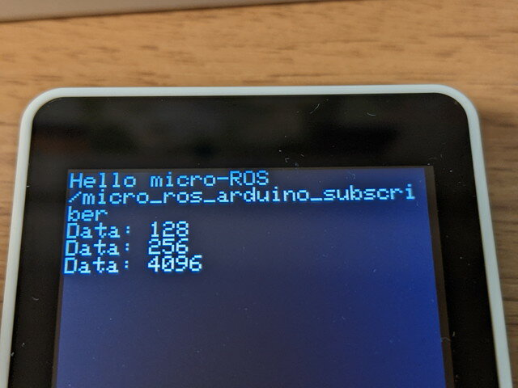

[前回は簡単なpublisher](https://kanpapa.com/2022/09/ros2-m5stack-microros.html "ROS2とM5Stackをmicro-ROSで通信してみました (1) publisher編")を試してみましたが、今回はsubscriberをM5Stackで動かしてみます。環境は前回構築したものを使います。



今回はM5Stack Goを使いました。ROS2 Foxyの環境はVMWare Workstaion Player上のUbuntu 20.04 LTSです。

<!--more-->

### マイコン（M5Stack）側の設定

micro-ROSのサンプルプログラム([micro-ros\_subscriber.ino](https://github.com/micro-ROS/micro_ros_arduino/blob/humble/examples/micro-ros_subscriber/micro-ros_subscriber.ino "micro-ros_subscriber.ino"))をM5Stack用に修正したものを使います。

サンプルプログラムではmicro\_ros\_arduino\_subscriberというトピックを購読するようになっています。データの内容はInt32です。WiFiの設定のところは前回同様にWiFiのSSIDとパスフレーズとmicro-ROS-Agentが動作するPCのIPアドレスに書き換える必要があります。

作成したソースコードは[GitHub](https://github.com/kanpapa/micro_ros_arduino/blob/main/micro-ros_m5stack_subscriber_wifi/micro-ros_m5stack_subscriber_wifi.ino "micro-ros_m5stack_subscriber_wifi.ino")に登録しておきました。

```
//// micro-ROS subscriber sample program// for M5Stack//#include #include #include #include #include #include #include #include rcl_subscription_t subscriber;std_msgs__msg__Int32 msg;rclc_executor_t executor;rclc_support_t support;rcl_allocator_t allocator;rcl_node_t node;rcl_timer_t timer;//#define LED_PIN 13#define RCCHECK(fn) { rcl_ret_t temp_rc = fn; if((temp_rc != RCL_RET_OK)){error_loop();}}#define RCSOFTCHECK(fn) { rcl_ret_t temp_rc = fn; if((temp_rc != RCL_RET_OK)){}}void error_loop(){  M5.Lcd.print("Error!!\n");    //while(1){  //  digitalWrite(LED_PIN, !digitalRead(LED_PIN));  //  delay(1000);  //}}void subscription_callback(const void * msgin){    const std_msgs__msg__Int32 * msg = (const std_msgs__msg__Int32 *)msgin;  //digitalWrite(LED_PIN, (msg->data == 0) ? LOW : HIGH);  M5.Lcd.printf("Data: %d\n", msg->data);  }void setup() {  M5.begin();  M5.Power.begin();  M5.Lcd.setTextSize(2);   M5.Lcd.print("Hello micro-ROS\n");  M5.Lcd.print("/micro_ros_arduino_subscriber\n");    // for WiFi  set_microros_wifi_transports("SSID", "PASS", "192.168.xxx.xxx", 8888);  // for USB  //set_microros_transports();    //pinMode(LED_PIN, OUTPUT);  //digitalWrite(LED_PIN, HIGH);      delay(2000);  allocator = rcl_get_default_allocator();  //create init_options  RCCHECK(rclc_support_init(&support, 0, NULL, &allocator));  // create node  RCCHECK(rclc_node_init_default(&node, "micro_ros_arduino_node", "", &support));  // create subscriber  RCCHECK(rclc_subscription_init_default(    &subscriber,    &node,    ROSIDL_GET_MSG_TYPE_SUPPORT(std_msgs, msg, Int32),    "micro_ros_arduino_subscriber"));  // create executor  RCCHECK(rclc_executor_init(&executor, &support.context, 1, &allocator));  RCCHECK(rclc_executor_add_subscription(&executor, &subscriber, &msg, &subscription_callback, ON_NEW_DATA));}void loop() {  delay(100);  RCCHECK(rclc_executor_spin_some(&executor, RCL_MS_TO_NS(100)));}
```

### PC(ROS2 Foxy)側の設定

#### 1.micro-ROS-Agentを実行する。

すでにAgentはビルドされていますので、Agentの実行のみを行います。なお、環境変数 ROS\_DOMAIN\_IDを設定していると動作しませんので、unset ROS\_DOMAIN\_ID で環境変数を削除してください。

```
ros2 run micro_ros_agent micro_ros_agent udp4 --port 8888
```

#### 2.トピックを発行します。

ROS2の標準ツールでトピックを発行します。

```
ros2 topic pub --once /micro_ros_arduino_subscriber std_msgs/Int32 "data: 256"
```



### 動作確認

発行したトピックの値がM5Stackの画面に表示されました。



これで基本的なpub/subの動作は確認できました。
