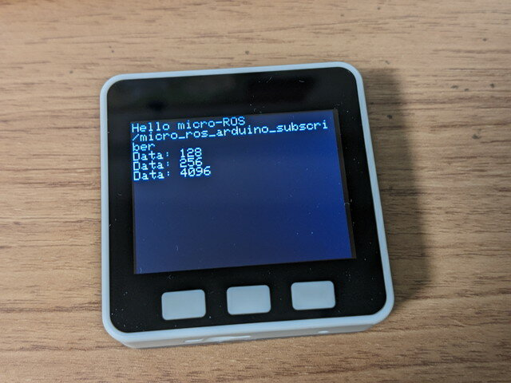
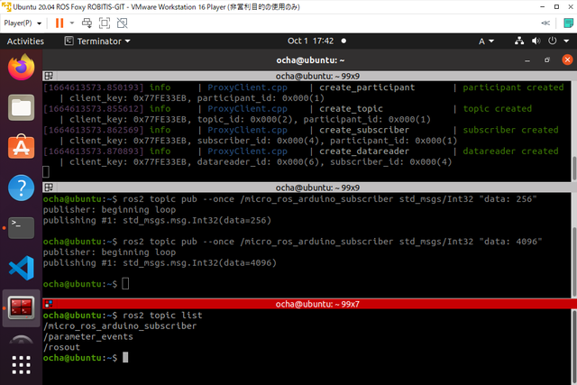
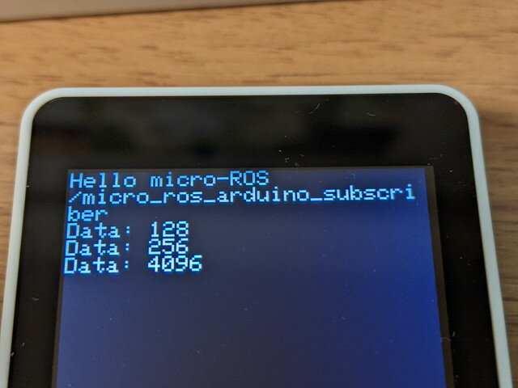

[前回は簡単なpublisher](https://kanpapa.com/2022/09/ros2-m5stack-microros.html "ROS2とM5Stackをmicro-ROSで通信してみました (1) publisher編")を試してみましたが、今回はsubscriberをM5Stackで動かしてみます。環境は前回構築したものを使います。



今回はM5Stack Goを使いました。ROS2 Foxyの環境はVMWare Workstaion Player上のUbuntu 20.04 LTSです。


## マイコン（M5Stack）側の設定

micro-ROSのサンプルプログラム([micro-ros_subscriber.ino](https://github.com/micro-ROS/micro_ros_arduino/blob/humble/examples/micro-ros_subscriber/micro-ros_subscriber.ino "micro-ros_subscriber.ino"))をM5Stack用に修正したものを使います。

サンプルプログラムではmicro_ros_arduino_subscriberというトピックを購読するようになっています。データの内容はInt32です。WiFiの設定のところは前回同様にWiFiのSSIDとパスフレーズとmicro-ROS-Agentが動作するPCのIPアドレスに書き換える必要があります。

作成したソースコード[micro-ros_m5stack_subscriber_wifi.ino](https://github.com/kanpapa/micro_ros_arduino/blob/main/micro-ros_m5stack_subscriber_wifi/micro-ros_m5stack_subscriber_wifi.ino)はGitHubに登録しておきました。

## PC(ROS2 Foxy)側の設定

### 1.micro-ROS-Agentを実行する。

すでにAgentはビルドされていますので、Agentの実行のみを行います。なお、環境変数 ROS_DOMAIN_IDを設定していると動作しませんので、unset ROS_DOMAIN_ID で環境変数を削除してください。

```
ros2 run micro_ros_agent micro_ros_agent udp4 --port 8888
```

### 2.トピックを発行します。

ROS2の標準ツールでトピックを発行します。

```
ros2 topic pub --once /micro_ros_arduino_subscriber std_msgs/Int32 "data: 256"
```



## 動作確認

発行したトピックの値がM5Stackの画面に表示されました。



これで基本的なpub/subの動作は確認できました。
