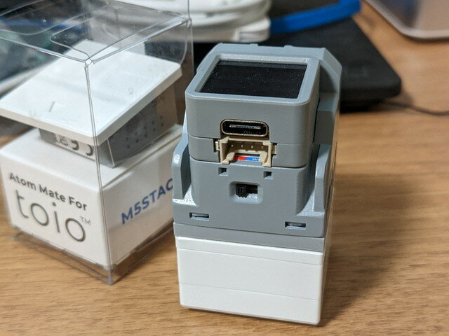

[スイッチサイエンス](https://www.switch-science.com/ "スイッチサイエンス")さんからAtom Mate for toioの発売開始ということでメールが届きました。

- [ATOM Mate for toio](https://www.switch-science.com/products/8500 "Atom Mate For toio")

toioって何というかたは[Sonyのtoioを買ってみました](https://kanpapa.com/2022/06/toio-helloworld.html "Sonyのtoioを買ってみました")の記事をご覧ください。

### Atom Mate For toioとは

SONYの[toioコアキューブ](https://www.switch-science.com/products/6300 "toioコアキューブ")とM5StackのATOMシリーズを組み合わせて、Atom Mate for toio内蔵の距離センサーを使うことで自律走行などができるようです。

私は[toio](https://www.switch-science.com/products/6300 "toio")と[ATOM Matrix](https://www.switch-science.com/products/6260 "M5 ATOM matrix")は持っており、ATOM Mate for toioを購入するだけで遊べそうなので、発売日にオーダーしてしまいました。

翌日に到着しました。おまけにtoio消しゴムが入っていました。

 <!--more-->

### ATOM Mate for toioを観察する

ATOM Mate for toioはtoioの上に載せているだけです。

なんだか顔みたいに見えますが、口のようにみえるところがToF距離センサーです。取り付ける方向を間違えると逆走したりしますので注意してください。

反対側をみると、小さなスライドスイッチがあります。

左側にスライドすると電源OFFとなり、この状態でATOMにUSBケーブルを接続すると、ATOM Mate for toioに充電ができます。満充電になると赤いLEDが消え、緑のLEDが点灯します。右側にスライドすると電源ONとなりtoioの電源が入っていれば無線で接続されます。

### サンプルプログラムを動かしてみる

サンプルプログラムはUiFlowで動くとのことなので、早速ATOM MatrixでUiFlowを動かしたところtoioの機能が追加されていました。

簡単なデモプログラムが登録されていましたので、まずは試してみます。

toioとの接続が切れている場合はATOM Matrixのボタン（マトリクスLEDの部分）を押すとtoioと接続されます。

実にシンプルなUiFlowプログラムですが、これだけで動画のような動きができます。

### まとめ

[ATOM](https://www.switch-science.com/products/8500 "Atom Mate For toio") [Mate for toio](https://www.switch-science.com/products/8500 "Atom Mate For toio")はtoioの上に載っているだけです。何かの電線やコネクタでATOM matrixとつながっているわけではありません。

すべて無線での接続となっているにもかかわらずサクッとtoioが接続されて、UiFlowでtoioがコントロールできてしまうというのはすごくお手軽に感じました。

UiFlow以外でも動かせると思うので試してみたいと思います。いずれmicroROSとかでも連携してみたいですね。
