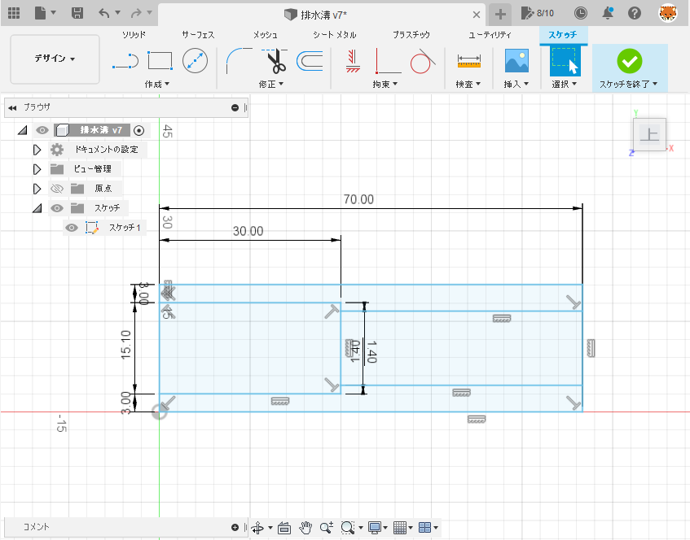
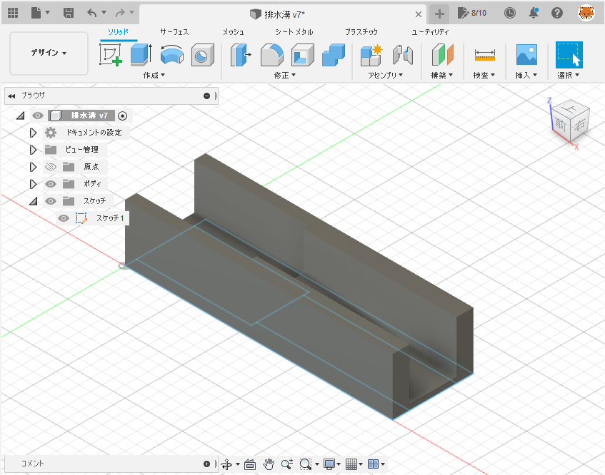
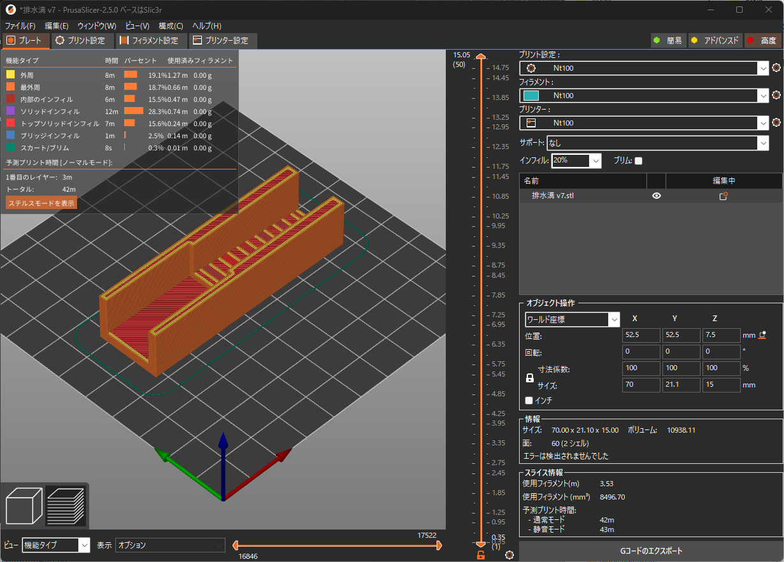
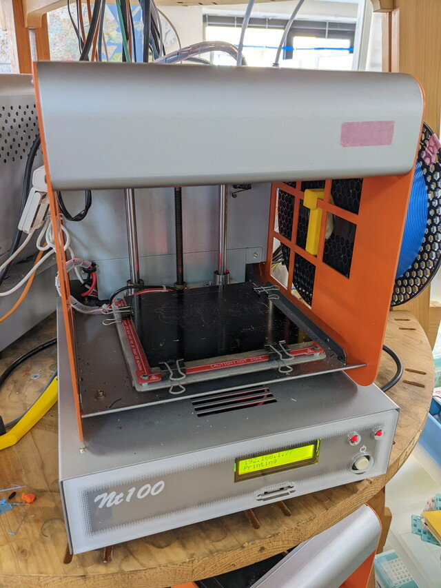
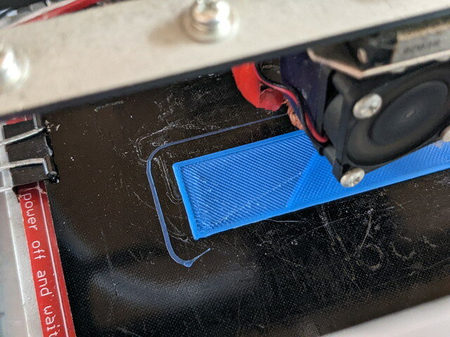
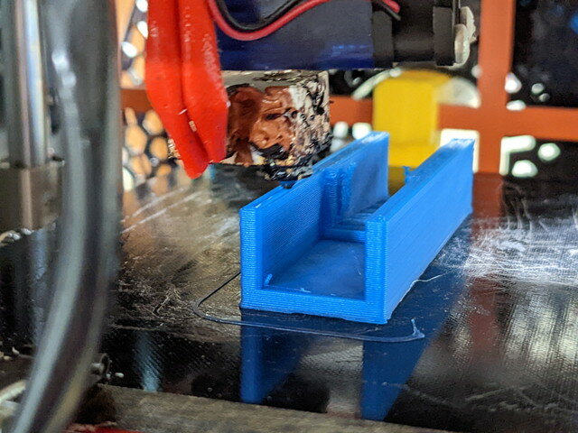

久しぶりに3Dプリンタを使ってモノづくりをしてみました。今回作りたいものは台所の食器棚の排水溝を延長する部品です。

### 3Dデータを作る

FUSION360で3Dモデルを作ります。台所の食器棚の排水溝をノギスで測り、スケッチを起こしました。このあたりはルンバ用ベースの製作でレーザーカッターの図面を作った経験が役立ちました。

<!--more-->

これをもとに押し出しで3Dモデルを作ります。ここは試行錯誤の連続で、何回かやり直して納得できる形にできました。

ここまでできたらSTLデータとしてexportします。

作成したSTLデータは[GitHub](https://github.com/kanpapa/3DModels/blob/main/drain/drain_v7.stl "drain_v7.stl")に置きました。

### Gコードデータを作る

次はスライサです。今回はPrusaSlicerを使ってみました。STLデータを読み込んでスライスを行い、3Dプリンタのノズルの動きに問題がないかを確認します。

問題無ければスライス後にGcodeデータをexportします。

### 3Dプリンタでの出力

いよいよ3Dプリンタで出力です。おおたfabさんのNt100を使いました。フィラメントはPLAです。ノズル温度は200℃、ベッドは60℃です。GコードデータはWebブラウザでアップロードします。

いい感じで出力されていきます。

半分ぐらいまでできました。

ほぼ完成です。

### パーツが完成

完成した排水溝の延長パーツです。

実際に食器棚にとりつけてみます。

いい感じで取り付けることができ、水が流れていきます。これで長年の悩みを解決できました。

### まとめ

最近は全く3Dプリンタを使っておらず、使いかたをほぼ忘れていましたが、今回の作業を通して一通りの手順を思い出すことができました。いろいろ作ってみたいものもあり、3Dプリンタの価格も安くなってきたので、思い切って買ってみようかなと考えています。
