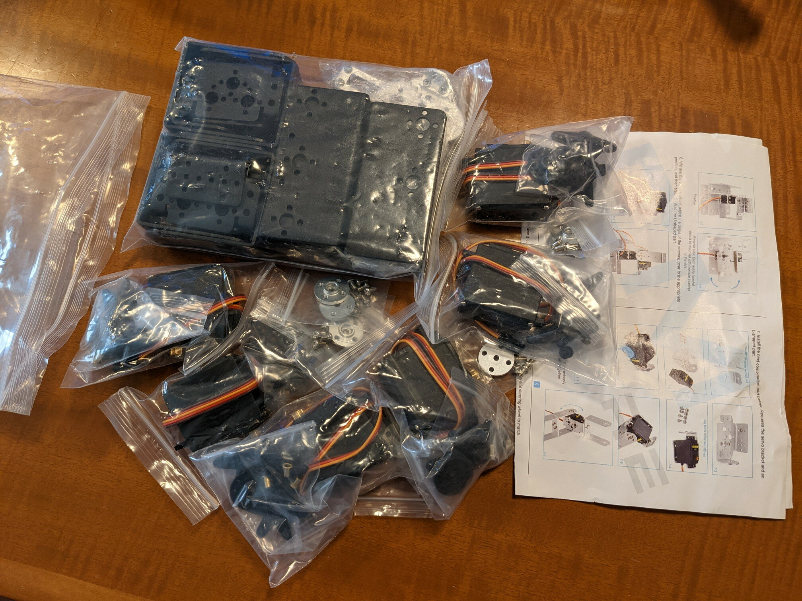

書籍「[AIロボット入門](https://www.kspub.co.jp/book/detail/5289563.html "ROS2 と Python で作って学ぶ AI ロボット入門")」を読みながらマニュピレーターをシミュレーションで試しましたが、実際にマニュピレーターを動かしてみたくなりました。探してみたところキットがありました。

- [DiyStudio 6自由度ロボットアームDIYキット](https://www.amazon.co.jp/DIY-MORE-DiyStudio-6%E8%87%AA%E7%94%B1%E5%BA%A6%E3%83%AD%E3%83%9C%E3%83%83%E3%83%88%E3%82%A2%E3%83%BC%E3%83%A0DIY%E3%82%AD%E3%83%83%E3%83%88%E3%82%A2%E3%83%AB%E3%83%9F%E3%83%A1%E3%82%AB%E3%83%8B%E3%82%AB%E3%83%AB%E3%82%A2%E3%83%BC%E3%83%A0%E3%82%B8%E3%83%A7%E3%83%BCArduinor-MG995%E3%82%B5%E3%83%BC%E3%83%9C%E3%83%89%E3%83%A9%E3%82%A4%E3%83%96%E3%83%90%E3%83%AB%E3%82%AF%EF%BC%88%E7%B5%90%E5%90%88%E3%81%99%E3%82%8B%E5%BF%85%E8%A6%81%E3%81%8C%E3%81%82%E3%82%8A%E3%81%BE%E3%81%99%EF%BC%89%E3%81%AF%E6%97%A5%E6%9C%AC%E8%AA%9E%E3%81%AE%E7%B5%84%E3%81%BF%E7%AB%8B%E3%81%A6%E8%AA%AC%E6%98%8E%E6%9B%B8%E3%82%92%E9%80%81%E3%82%8B%E3%81%93%E3%81%A8%E3%81%8C%E3%81%A7%E3%81%8D%E3%81%BE%E3%81%99/dp/B07M7TK6KR/ "DiyStudio 6自由度ロボットアームDIYキット")

Webを検索したところ、実際に動作させているかたもいるようでしたので、購入して試してみることにしました。念のためですが、ROSをサポートしているものではありません。そこは自分で作る必要があります。

### ロボットアームDIYキットの入手

到着したDiyStudio 6自由度ロボットアームDIYキットです。

袋詰めのパーツだけという簡易包装ですが、これで十分です。組み立てマニュアルは紙１枚だけでやや不安がありましたが、必要なことは書いてありそうでした。

<!--more-->

### コントローラーの製作

本体を組み立てる前にまずはロボットアームを制御するための基板を製作することにしました。[ESP32-DEVKITC](https://akizukidenshi.com/catalog/g/gM-11819/ "ESP32-DEVKITC")を使用します。簡単な回路でブレッドボードでも大丈夫だとは思うのですが、サーボモーターをいくつも同時に動かすことになり、それなりの電流が流れると思われるためユニバーサル基板で製作しました。

キットに入っているサーボモーターを１つ使用して動作確認を行いました。

YouTubeに動画をアップしておきました。

問題なく動作するようです。これでキットの６個のサーボモーターを制御することができそうです。

次回はロボットアーム本体の組み立てを行います。
