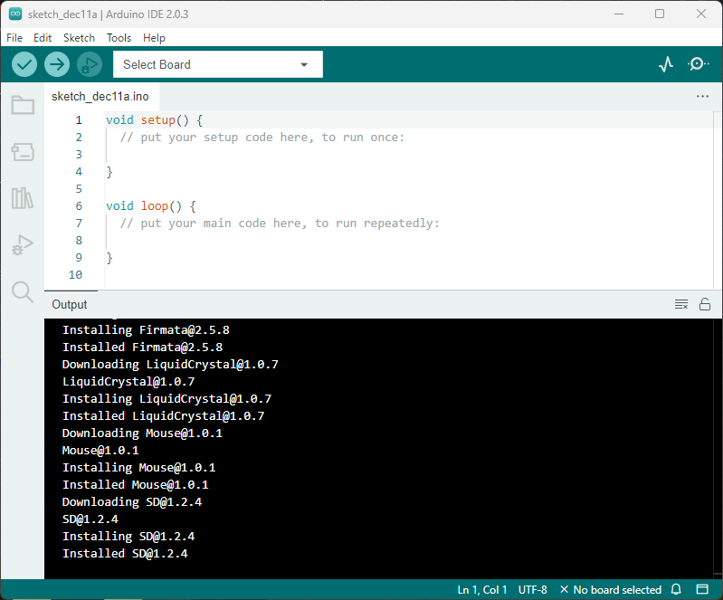
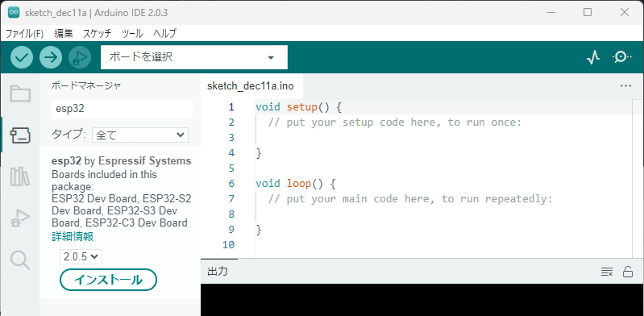
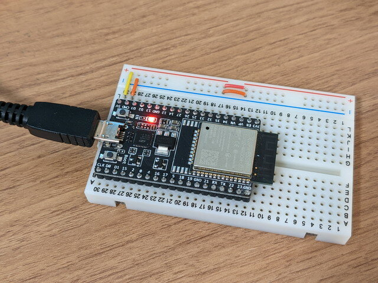
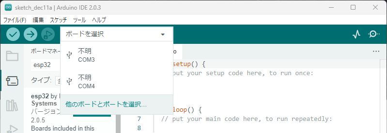
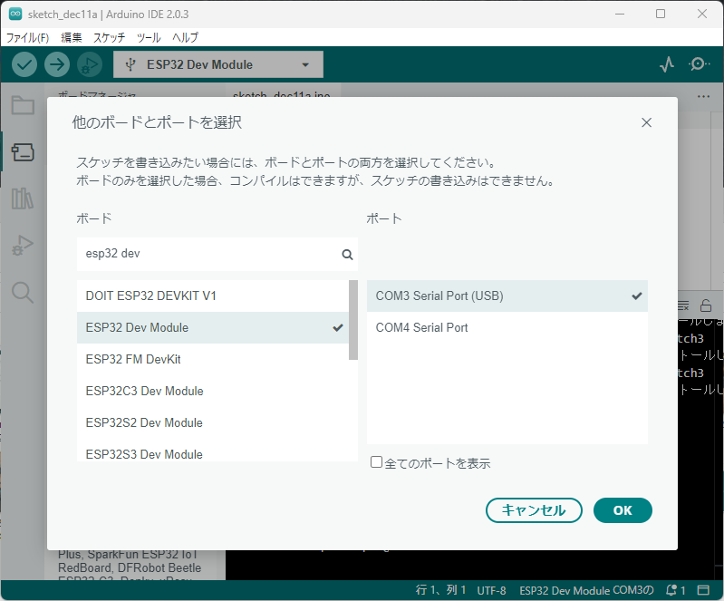
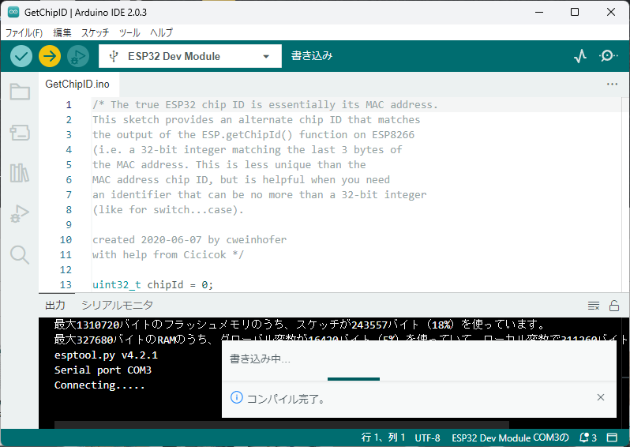
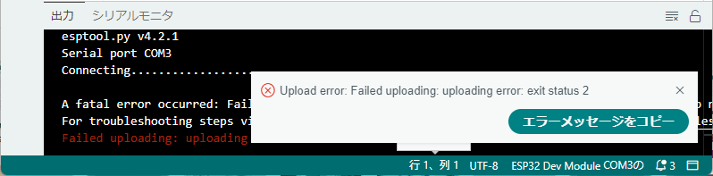

[おおたfab](https://ot-fb.com/event "おおたfabのイベント案内")さんでは電子工作初心者勉強会を開催しています。以前から開催されていたものですが、今回から私も参加してみることにしました。

今回はESP32のArduino開発環境を作ります。最新版のArduino IDE 2.x系を使ってみました。通常のArduino(AVRマイコン)であればあまり初期設定も必要ないのですが、ESP32マイコンを使う場合は環境設定が難しいと思われているようなのでまとめておきました。

### Arduino IDEのインストール

以下のサイトからArduino IDEをダウンロードしてインストールします。

https://www.arduino.cc/en/software

この記事を書いた時点では、Arduino IDE 2.0.3でした。Windows用、Mac用、Linux用が準備されていますので、お使いの環境に合わせて選んでください。

Arduino IDEを起動するとこのような画面になります。

最初は英語表示になっていますので、

File → Preferences... → Launguage: English を 日本語 に変更して OKを押します。

OKを押すと日本語表示に切り替わります。もし変化がない場合は一度Arduino IDEを終了して、再び起動してください。

### 追加のボードマネージャーのURL設定

最近のArduino IDEでは、ESP32の追加のボードマネージャーのURL設定は不要です。もし、ESP32ボードマネージャーのインストールでesp32 by Espressif Systemが表示されない場合は以下の追加のボードマネージャーのURL設定を行ってください。

追加のボードマネージャーのURL設定

ファイル(F)　→　基本設定... → 追加のボードマネージャーのURL　に以下のURLを設定します。  
`https://raw.githubusercontent.com/espressif/arduino-esp32/gh-pages/package_esp32_index.json`  
  
設定が終わったらOKを押します。

### ESP32ボードマネージャーのインストール

Arduino IDEでESP32マイコンが使えるようにします。

左側に並んでいるアイコンの上から２つめがボードマネージャですので、これをクリックします。

ボードマネージャが表示されますので、検索窓に esp32 と入力するとesp32 by Espressif Systemが表示されますので、インストールを押してインストールしてください。

このインストールは少し時間がかかります。

### ESP32ボードを接続する

ESP32-DEVKITCボードをUSBケーブルでPCに接続します。

ボードを選択とかかれているプルダウンメニューをクリックし、他のボードとポートを選択...を選びます。

ボードの検索窓にesp32 devと入力すると、ESP32 Dev Moduleと表示されますので選択します。

次にどのシリアルポートを使うかも指定します。この例ではもともとCOM4はPCに内蔵されているものでしたので、COM3を選択しました。

複数表示されてどれかわからない場合は、一度ESP32 DEVKITを取り外せば、該当のCOMxが消えますので、消えたものがESP32 DEVKITであることが確認ができます。

### サンプルプログラムを書きこんでみる

ファイル(F) → スケッチ例 → ESP32 → ChipID → GetChipIDを選択してください。

新しいウィンドウが開いてプログラムが表示されます。このプログラムはESP32マイコンの情報をシリアルポートに出力するものです。

横に並んでいるアイコンの→をクリックするとESP32に書き込まれます。

もし以下のようなエラーがでた場合は、ESP32-DEVKITCにあるBootと書かれたプッシュスイッチを押したまま、もう１つのENとかかれたプッシュスイッチを押して離すと書き込み待ちの状態になりますので、もう一度書き込んでください。

一番右のアイコンをクリックすると下部の画面がシリアルモニタに切り替わります。シリアルモニタに「ESP32 Chip model = ESP32... 」のような表示が出続ければ開発環境は問題なく動作しています。

### まとめ

これでArduino IDEでESP32にプログラムを書き込めるようになりました。今後はESP32に様々なものを接続してプログラムで動かしてみます。
