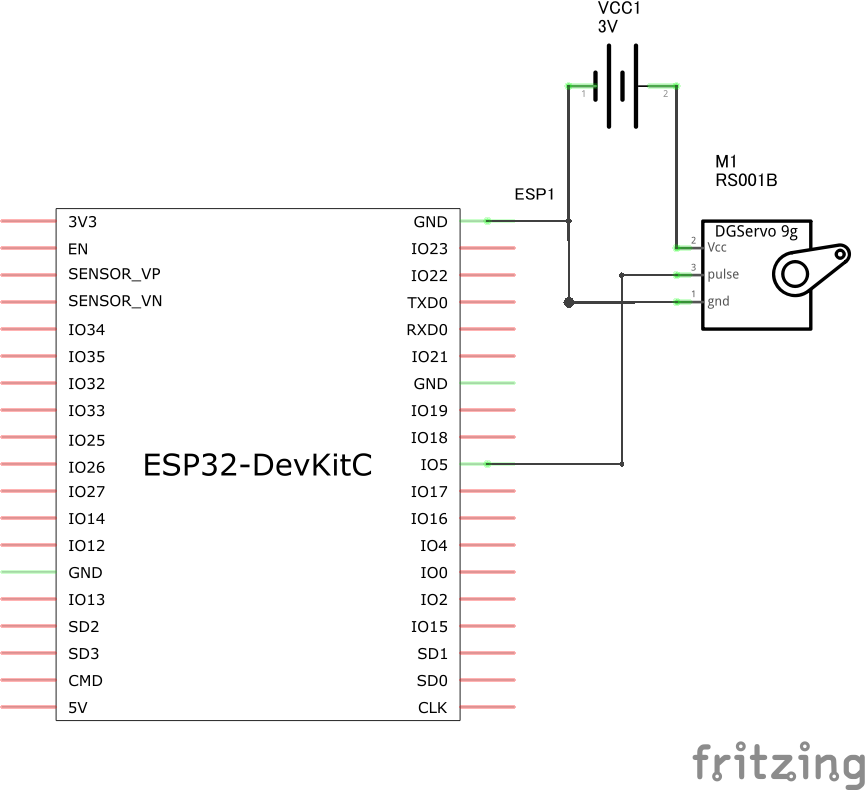
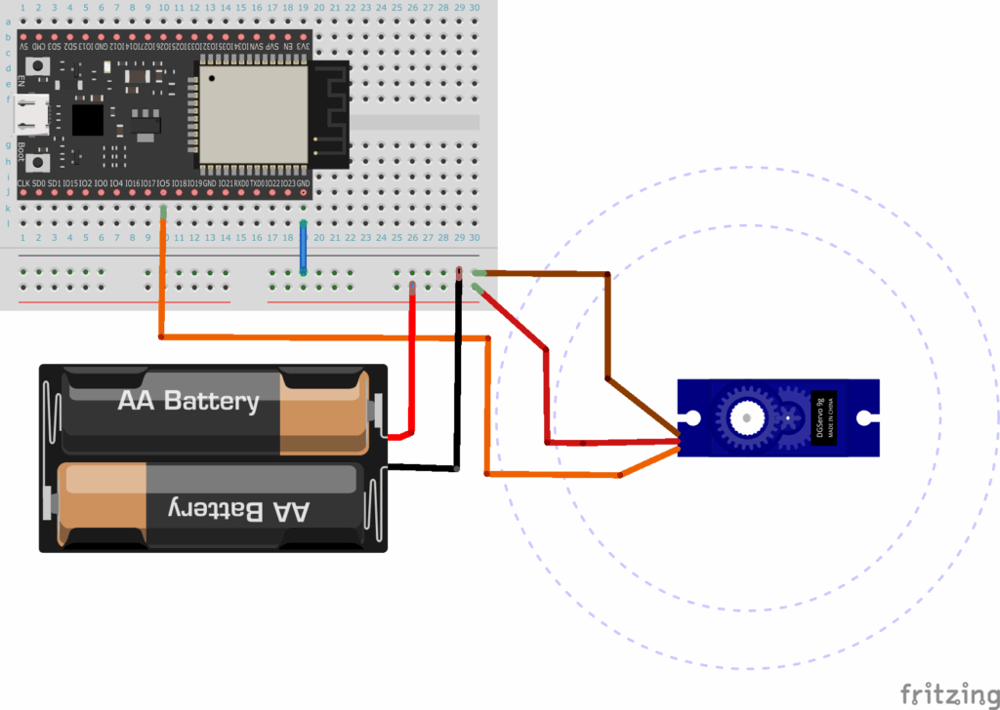
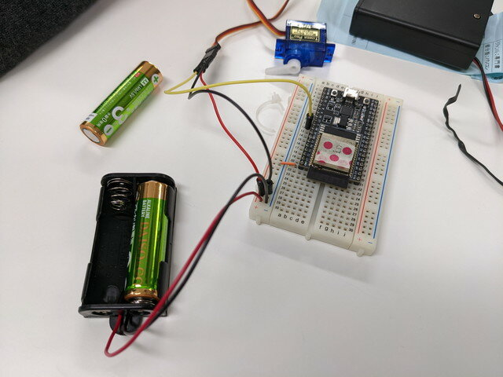
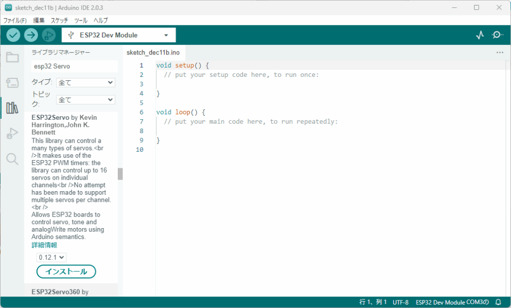
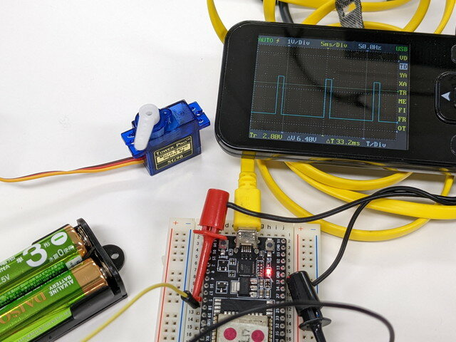

[おおたfab](https://ot-fb.com/event "おおたfab")さんでは電子工作初心者勉強会を定期的に開催しています。

今回はESP32でサーボモーターを動かしてみます。サーボモーターは安価なSG90を使用しました。


### 材料

- [ブレッドボード 6穴版](https://akizukidenshi.com/catalog/g/gP-12366/ "ブレッドボード　６穴版　ＥＩＣ－３９０１")

- [ESP32-DEVKITC](https://akizukidenshi.com/catalog/g/gM-11819/ "ＥＳＰ３２－ＤｅｖＫｉｔＣ　ＥＳＰ－ＷＲＯＯＭ－３２開発ボード")

- [サーボモーター　SG90](https://akizukidenshi.com/catalog/g/gM-08761/ "マイクロサーボ９ｇ　ＳＧ－９０")

- [ブレッドボード用ワイヤー](https://akizukidenshi.com/catalog/g/gC-05159/ "ブレッドボード・ジャンパーワイヤ（オス－オス）セット　各種　合計６０本以上")

- [単3×２本電池ボックス](https://akizukidenshi.com/catalog/g/gP-10196/ "電池ボックス　単３×２本　リード線・間仕切りあり")

- [USBケーブル](https://akizukidenshi.com/catalog/g/gC-09313/ "ＵＳＢケーブル　ＵＳＢ２．０　Ａオス－マイクロＢオス　０．３ｍ　Ａ－ｍｉｃｒｏＢ")

- [Arduino IDE ESP32がインストールされたPC](https://kanpapa.com/2022/12/esp32-otafab-study-arduino.html "ESP32のArduino開発環境をつくりました（おおたfab 電子工作初心者勉強会）")

### サーボモーターの接続

ESP32-DEVKITCとサーボモーターの回路図は以下のようにしました。IO5の信号でモーターの回転角を制御します。



これをブレッドボードで配線した例です。



実際に配線するときは以下の点に注意します。

- サーボモーターは大きな電流が流れるので電源単３電池を使います。

- サーボモーターのケーブルの先にはピンソケットがついています。これはそのまま使うことにして、ブレッドボード用ワイヤーを刺しこんで接続します。

- サーボモーターの仕様書を確認して接続を間違えないようにしてください。

- 配線は色分けして間違えないようにします。

実物ではこのような配線にしました。実際に動かすまでは単三電池は片方抜いておきます。



### プログラムの書き込み

サーボモーター用のライブラリが用意されているのでこれを使います。何種類かありますが、今回はESP32Servoを使います。

まずはライブラリの読み込みを行います。左側の縦に並んでいるアイコンの上から３番目がライブラリマネージャーです。これをクリックして検索窓に「esp32 servo」と入力してください。いくつかライブラリが表示されるので「ESP32Servo by Kevin Harrington,John K.Bennett」を探してください。もしインストールされていなかったら、インストールボタンを押してください。



次にプログラムを書いていきましょう。

```
#include #define SERVO_PIN 5Servo myServo;void setup() {  myServo.attach(SERVO_PIN);}void loop() {  myServo.write(0);  delay(1000);  myServo.write(90);  delay(1000);  myServo.write(180);  delay(1000);  myServo.write(90);  delay(1000);}
```

うまくESP32に書き込めれば、サーボモーターが90°ごとに動くことがわかります。

myServo.writeの関数に渡している値を変更したり、myServo.writeの関数を増やしたり、減らしたりしてどのように動きが変わるかを確認するのも良いでしょう。

### サーボモータをどのように制御しているのか

サーボモーターに接続している制御信号をオシロスコープで見てみます。



動画で見ると良くわかりますが、信号の幅が変わることでモーターの位置が変化することがわかります。これをPWM制御といいます。



サーボモーターのライブラリではこのような信号を出力して、サーボモーターを制御することができます。

### まとめ

サーボモーターのライブラリを使うことで簡単なプログラムでサーボモーターを制御することができました。複数のサーボモーターを制御することでロボットのようなものも制御できるでしょう。
