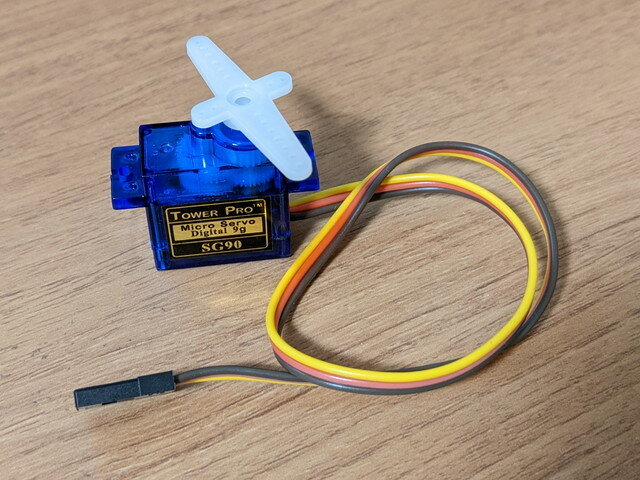
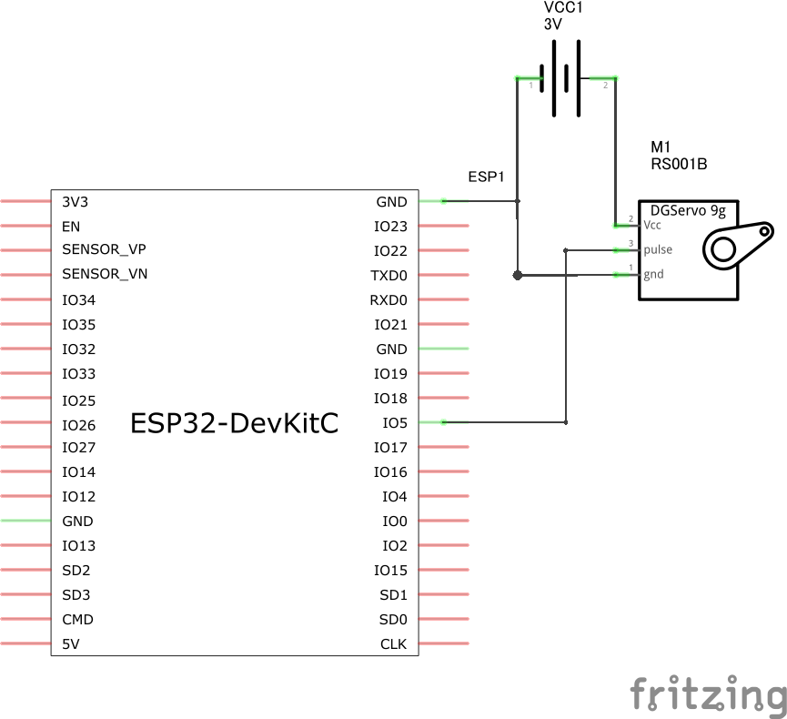
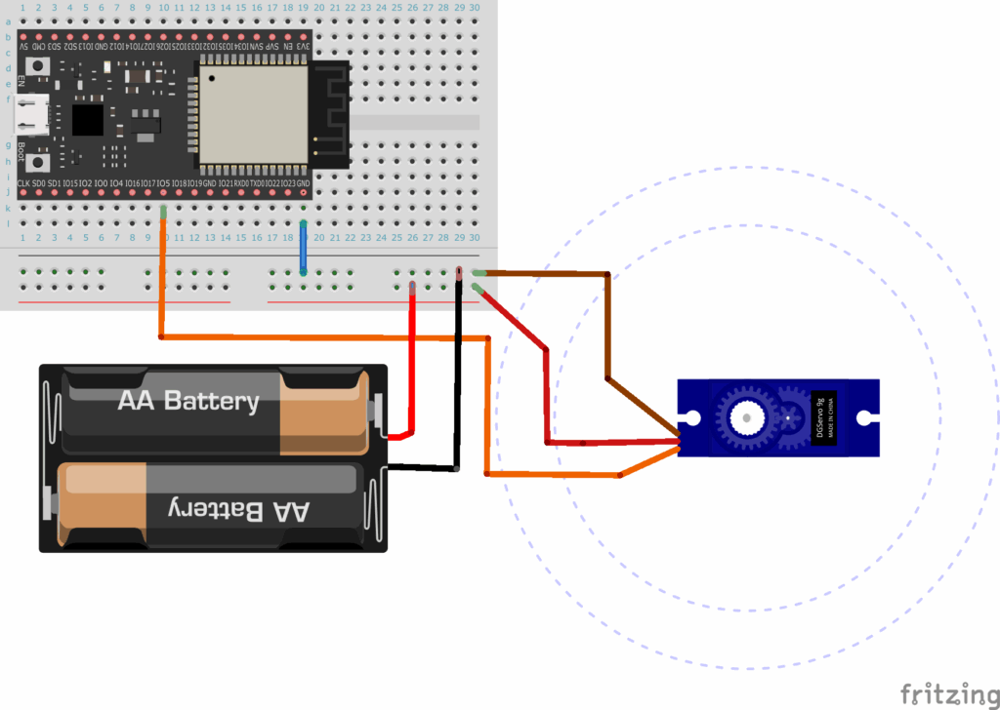
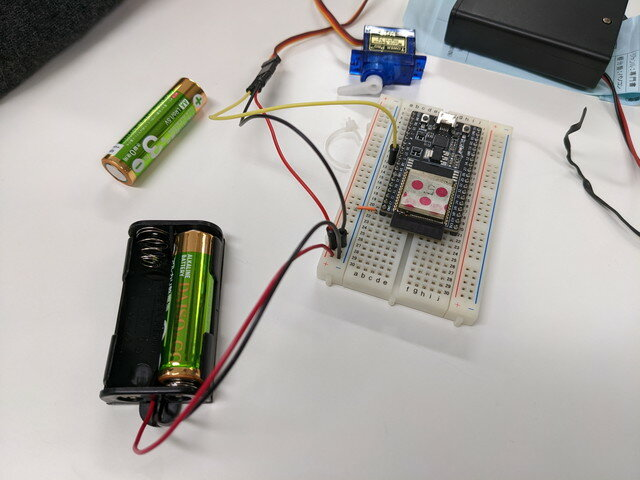
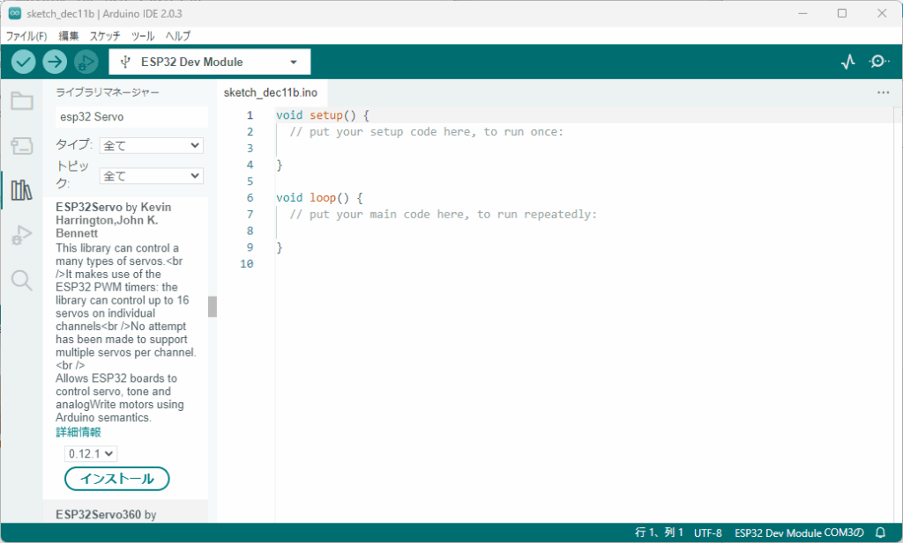
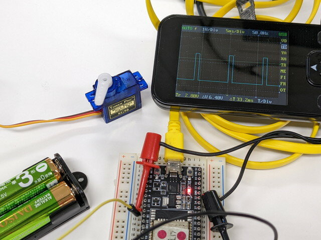

[おおたfab](https://ot-fb.com/event "おおたfab")さんでは電子工作初心者勉強会を定期的に開催しています。

今回はESP32でサーボモーターを動かしてみます。サーボモーターは安価なSG90を使用しました。



## 材料
材料は秋月電子で揃えました。
|販売コード|商品名|価格|数量|
|:--|:--|:--|:--|
|115673|[ESP32-DevKitC-32E ESP32-WROOM-32E開発ボード 4MB](https://akizukidenshi.com/catalog/g/g115673/)|1800|1|
|112366|[ブレッドボード 6穴版 EIC-3901](https://akizukidenshi.com/catalog/g/g112366/)|520|1|
|108761|[マイクロサーボ9g SG90](https://akizukidenshi.com/catalog/g/g108761/)|650|1|
|110196|[電池ボックス 単3×2本 リード線・間仕切りあり](https://akizukidenshi.com/catalog/g/g110196/)|50|1|
|109313|[USBケーブル USB2.0 Aオス-マイクロBオス 0.3m A-microB](https://akizukidenshi.com/catalog/g/g109313/)|140|1|
|130088|[ブレッドボード・ジャンパーワイヤセット(60本以上)](https://akizukidenshi.com/catalog/g/g130088/)|300|1|

これに加えて[Arduino IDE ESP32がインストールされたPC](https://kanpapa.com/2022/12/esp32-otafab-study-arduino.html "ESP32のArduino開発環境をつくりました（おおたfab 電子工作初心者勉強会）")が必要です。

## サーボモーターの接続

ESP32-DEVKITCとサーボモーターの回路図は以下のようにしました。IO5の信号でモーターの回転角を制御します。



これをブレッドボードで配線した例です。



実際に配線するときは以下の点に注意します。

- サーボモーターは大きな電流が流れるので電源は単３電池を使います。
- サーボモーターのケーブルの先にピンソケットがついてるので、ピンソケットにブレッドボード用ワイヤーを刺しこんで接続します。
- サーボモーターの仕様書を確認して接続を間違えないようにしてください。
- 配線は色分けして間違えないようにします。

実物ではこのような配線にしました。実際に動かすまでは単三電池は片方抜いておきます。



## プログラムの書き込み

サーボモーター用のライブラリが用意されているのでこれを使います。何種類かありますが、今回はESP32Servoを使います。

まずはライブラリの読み込みを行います。左側の縦に並んでいるアイコンの上から３番目がライブラリマネージャーです。これをクリックして検索窓に「esp32 servo」と入力してください。いくつかライブラリが表示されるので「ESP32Servo by Kevin Harrington,John K.Bennett」を探してください。もしインストールされていなかったら、インストールボタンを押してください。



次にプログラムを書いていきましょう。

```C
// ESP32 サーボモータテスト
#include <ESP32Servo.h>

// サーボ赤線=3V サーボ茶線=GNDに接続
// ESP32 5番ピンにサーボ制御線（オレンジ）を接続
#define SERVO_PIN 5

Servo myServo;

void setup() {
  myServo.attach(SERVO_PIN);
}

void loop() {
  myServo.write(0);
  delay(1000);
  myServo.write(90);
  delay(1000);
  myServo.write(180);
  delay(1000);
  myServo.write(90);
  delay(1000);
}
```

うまくESP32に書き込めれば、サーボモーターが90°ごとに動くことがわかります。

myServo.writeの関数に渡している値を変更したり、myServo.writeの関数を増やしたり、減らしたりしてどのように動きが変わるかを確認するのも良いでしょう。

## サーボモータをどのように制御しているのか

サーボモーターに接続している制御信号をオシロスコープで見てみます。



動画で見ると良くわかりますが、信号の幅が変わることでモーターの位置が変化することがわかります。これをPWM（パルス幅変調：Pulse Width Modulation）制御といいます。



サーボモーターのライブラリではこのようなPWM信号を出力して、サーボモーターを制御しています。

## まとめ

サーボモーターのライブラリを使うことで簡単なプログラムでサーボモーターを制御することができました。複数のサーボモーターを制御することでロボットのようなものも制御できるでしょう。
