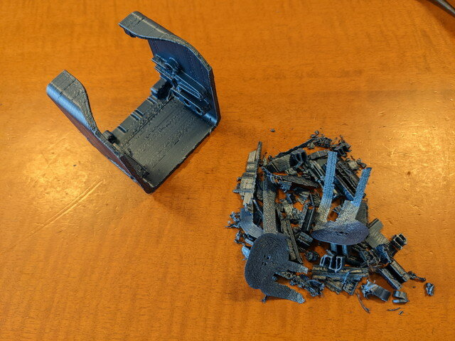
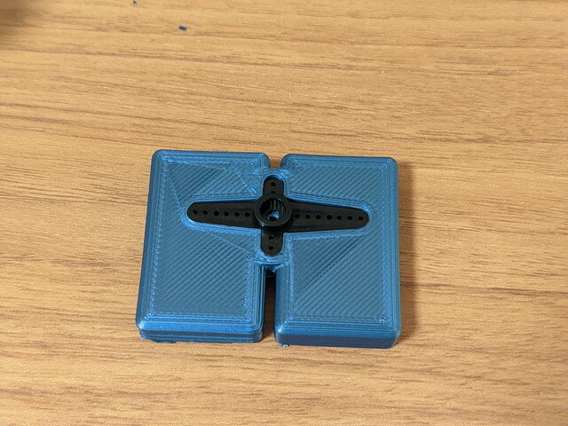
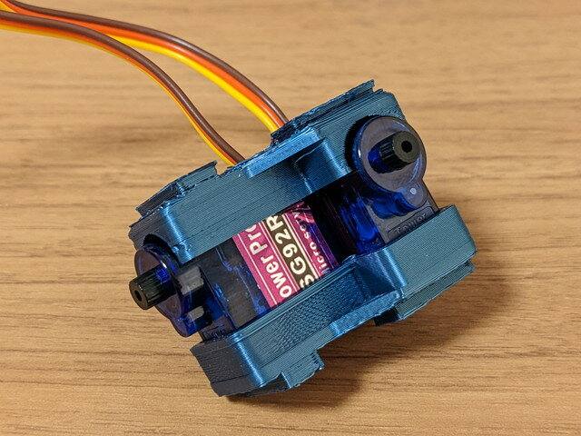
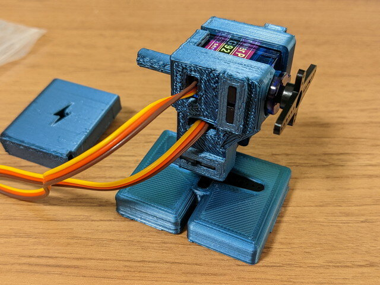
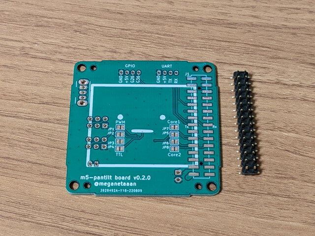
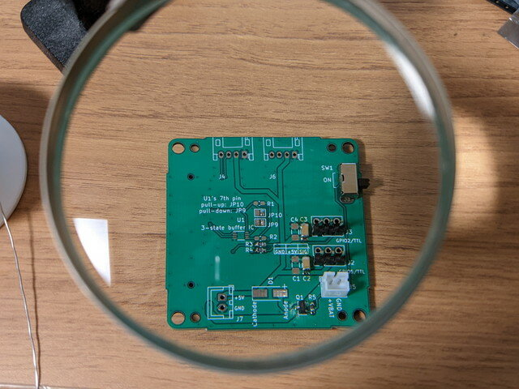
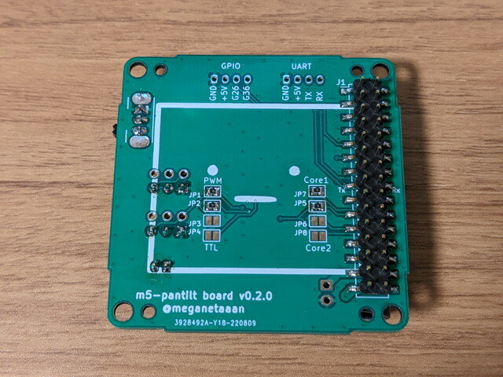
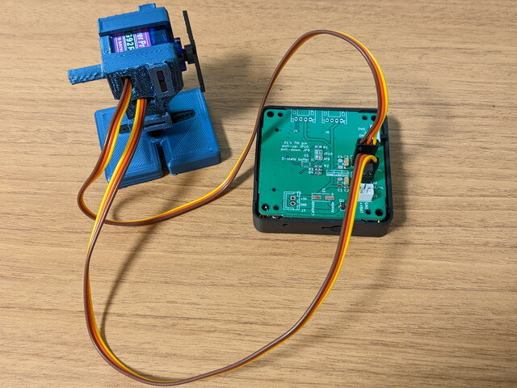
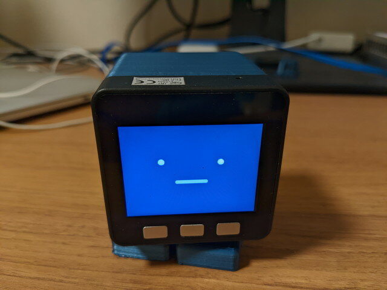
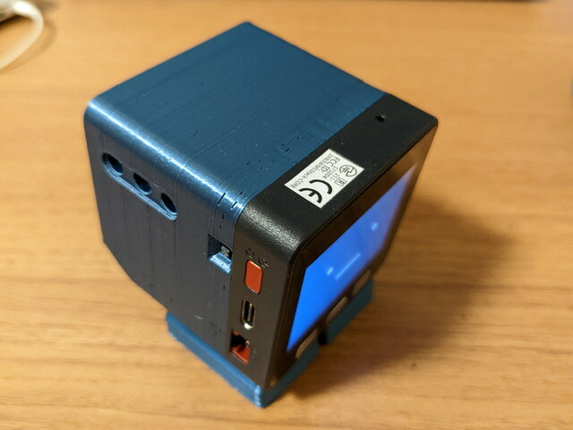

前々から気になっていた@meganetaaanさんの[スタックチャン](https://github.com/meganetaaan/stack-chan "スタックチャン")ですが、3Dプリンタも自宅に導入したので公開されているデータをもとに製作してみました。製作に必要なデータはGithubから入手しています。

- [meganetaaan/stack-chan: A JavaScript-driven M5Stack-embedded super-kawaii robot.](https://github.com/meganetaaan/stack-chan/ "meganetaaan/stack-chan: A JavaScript-driven M5Stack-embedded super-kawaii robot.")

### 3Dプリンタでのケース出力

GitHubのデータをスライサでGcodeに変換し、まずはShellからプリント開始です。

スライサのサポートの設定が良くなかったのかサポートが多くついてしまいました。慎重にサポートを取り外して何とか形にはなっています。

続いてモーターのケースです。これはまあまあの出来。

足の部分もプリントしました。これはきれいにできました。

残るバッテリーケースをプリントして、ケースのパーツが揃いました。

### ケースの仮組み

ケースにモーターを取り付けて仮組みをしてみました。今回は安価な[SG92](https://akizukidenshi.com/catalog/g/gM-08914/ "マイクロサーボ　ＳＧ９２Ｒ")を使っています。

モーターはぴったり収まりました。これに足の部分を取り付けます。

さらにこれをシェルに取り付けます。

スタックチャンの形になってきました。

### プリント基板の入手とはんだ付け

ケースができたところで次はM5Stackを取り付けるプリント基板の製作です。

nyaru labさんが[Boothで基板を配布](https://booth.pm/ja/items/4094998)されていたのでそちらを購入しました。コネクタもセットなのでありがたいです。この基板はv0.2.0で、現在の最新版v0.2.1の基板とは若干構成が違いますので、GitHubにあるv0.2.0用のドキュメントを参照しました。

基板に実装するパーツは秋月電子と千石電商で集めました。

ルーペで確認しながらハンダ付けしていきます。

完成した基板です。こちらはM5Stackを取り付ける側。

こちらはモーターとバッテリーを取り付ける側です。

これを仮組みしているスタックチャンのケースに取り付けます。

### テストプログラムでの動作確認

M5Stackを製作した基板に取り付けてテストプログラムによる動作確認を行うため、モーターと基板を仮接続します。

テストプログラムは@mongonta0716 さんのstack-chan-testerを使いました。

- [mongonta0716/stack-chan-tester: stack-chan test application for pwm servo](https://github.com/mongonta0716/stack-chan-tester "mongonta0716/stack-chan-tester")

すでにM5StackのArduino IDE環境を使っていましたので、すぐにプログラムを書き込むことができました。

モーターは問題なく動きました。モーターの回転位置はこのテストプログラムで合わせると調整が楽です。

ケースに仮組してみます。

USBケーブルで給電しているため、本体が固定されてしまい足だけが動いていますが、ハードウェアは問題なさそうです。

### 公式ファームウェアの書き込みと動作確認

最後に公式ファームウェアを書き込みます。Arduino IDEとかで書かれているのかと思っていたのですが、Moddable SDKをつかってJavaScriptで書かれていました。このあたりは初めて使うのでまずはソースを眺めてみました。

手順書通りに書き込んでみましたが、そのままではシリアルモーター用で、PWMモーターのSG90用になっていないようでしたので、ソースコードを追って一部修正して書き込んだら正常に動作しました。

公式ファームウェアでのテストの様子です。いったんケースは外しています。

問題なさそうなので、元通りケースに収めてスタックチャンの完成です。

### まとめ

最初にプリントしたシェルケースがややガタガタでかっこ悪かったので、サポートの取り付けを見直してもう一度プリントしたものに交換し、見栄えが良くなりました。

Moddableは未経験でまだ構造があまり理解できていません。参考書は無いかなと探したところ[「実践Moddable JavaScriptではじめるIoTアプリケーション」](https://nextpublishing.jp/book/12230.html "実践Moddable JavaScriptではじめるIoTアプリケーション")という書籍がありましたので、これを見ながら理解していきたいと思います。そういえば昔、[Firefox OS](https://kanpapa.com/tag/firefox-os)というものもいじっていたのでそれに近いのかなとも思っています。

このような楽しいスタックチャンを開発、公開いただいた作者のみなさまに感謝です。
