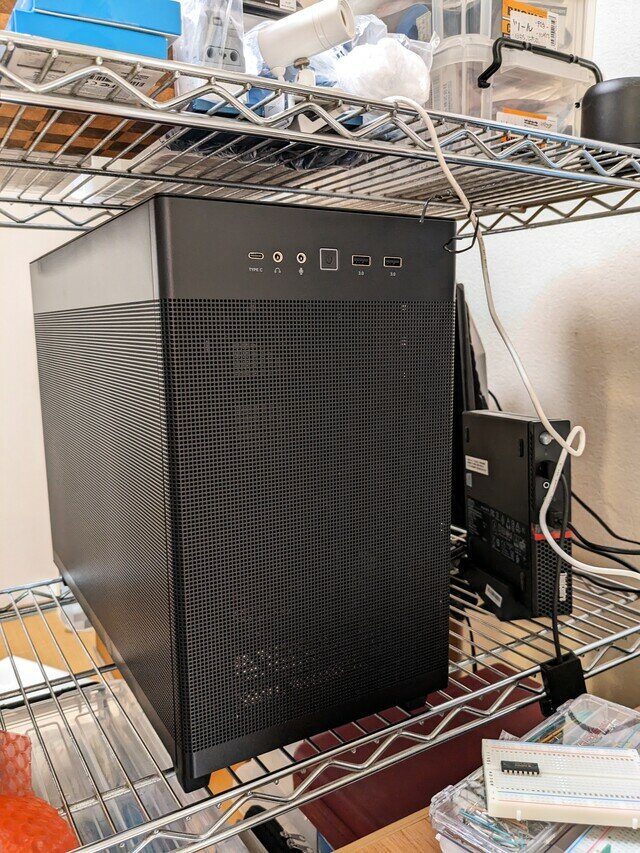
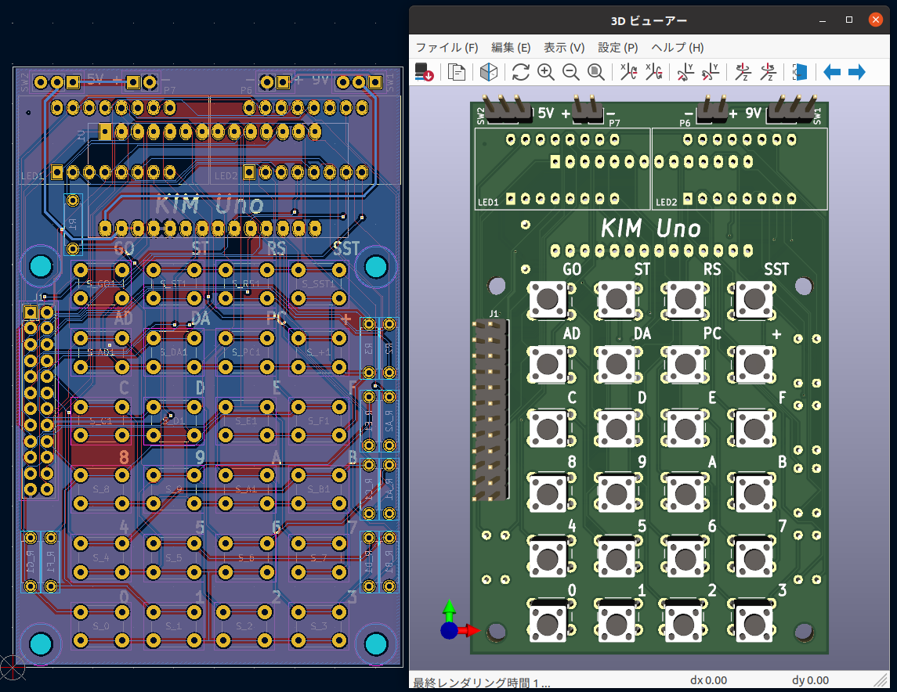
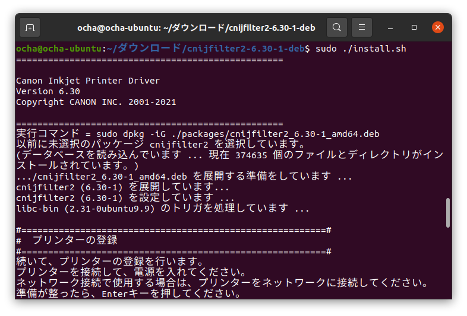
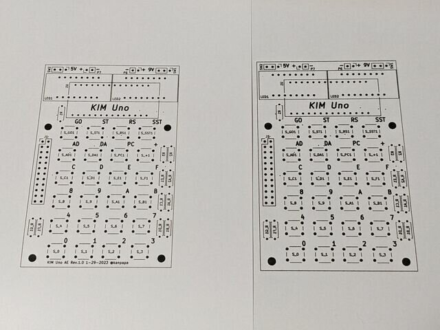
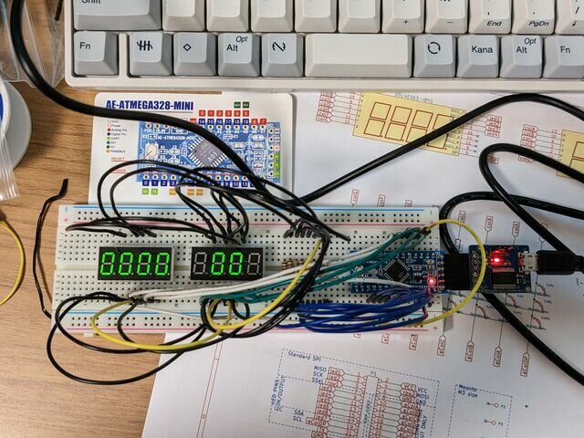
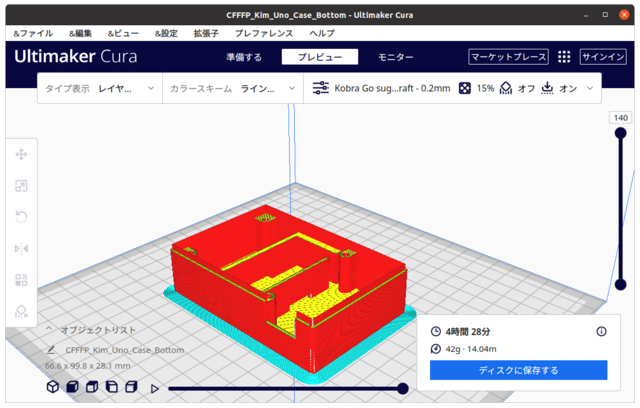

せっかく[組み立てたLinuxデスクトップPC](https://kanpapa.com/2023/01/linux-gpu-pc-assembled.html "久しぶりにLinux専用PCを組み立ててハマりました")ですので、これをメインPCとして使えないか試してみます。

いまこのPCで使用しているのは[Ubuntu 20.04 LTS Desktop 日本語 Remix](https://www.ubuntulinux.jp/download/ja-remix "Ubuntu Desktop 日本語 Remixのダウンロード")です。インストール直後から日本語入力は問題なく行えます。

<!--more-->

### Ubuntuソフトウェアを揃える

これまでWindowsデスクトップで使っていたソフトウェアがUbuntuで動作するかを確認してみます。

| **機能** | **Windows** | **Ubuntu** | **使用感** |
| --- | --- | --- | --- |
| Webブラウザ | Firefox | ○ | ブックマークも同期できるので問題なし |
| エディタ | VSCode | ○ | 全く問題無し |
| 基板設計 | KiCad | ○ | 全く問題なし |
| Arduino開発環境 | Arduino IDE | ○ | 全く問題なし |
| チャットツール | Discord | ○ | 全く問題なし |
| ビデオ会議 | Zoom | ○ | 全く問題なし |
| シリアルターミナル | TeraTeam | GTKTerm | 現在試用中。今のところは問題無し。 |
| スライサー | Ultimaker Cura | ○ | 全く問題なし |
| 3D CAD | Fusion360 | FreeCAD | 現在試用中。やや手強い。 |
| グラフィックデザイン | Illustrator | GIMP | 機能的には差がありそう。 |
| チャットツール | Twitter | Tweetdeck |  |
| クラウドストレージ | OneDrive | ブラウザ版 |  |
| クラウドストレージ | Box | ブラウザ版 |  |
| クラウドメモ | OneNote | ブラウザ版 |  |
| スクリーンショット | ○ | ○ | よく使うので必須。 |

このように開発環境もほぼ揃っていますし、クラウド系のツールはブラウザで問題なく使えます。

### Ubuntuデスクトップ環境でKIM Unoを作ってみる

実際にこのUbuntuデスクトップ環境で[KIM Uno](https://obsolescence.wixsite.com/obsolescence/kim-uno-summary-c1uuh "KIM Uno: a DIY clone of the KIM-1")というKIM-1シミュレーターを作ってみました。配布されているやや古いKiCadデータをベースに、秋月電子で入手できるパーツに置き換えた形でKiCad6で製作してみます。

#### 基板設計

KiCad6で行い特に問題なくガーバーデータまでできました。これまで省電力CPUを使った小型のデスクトップPCだったので自動配線や3Dビューアーにかなり時間がかかっていたのですが、今回はデスクトップ用のCPU＋GPUですのでサクサク作業が進みます。

ただし、部品のレイアウトを確認するために基板レイアウトを印刷してみたところ、Ubuntu標準のプリンタドライバではスケールが一致せず少し小さめに印刷されてしまいました。

私はCanonのプリンタを使っているので調べたところ、Linux用のプリンタドライバが配布されていましたので、これをインストールしてスケールを正確にすることができました。

左側が標準のプリンタドライバ、右側がメーカー配布のプリンタドライバを使ったものです。左側が若干小さいことがわかります。

お使いのプリンタにLinux用のドライバがあるかは確認したほうが良いと思われます。

ガーバーデータの最終確認を行い、基板の製造メーカーに発注しました。

#### Arduinoへの書き込み

次にKIM UnoのスケッチをArduino Pro mini（秋月電子 [AE-ATMEGA328-MINI](https://akizukidenshi.com/catalog/g/gK-10347/ "AE-ATMEGA328-MINI")）に書き込みます。

これも問題なく行うことができました。書き込んだArduino Pro miniを使ってプロトタイプを製作しました。

#### シリアルターミナル

KIM Unoはシリアルターミナルで制御することができますが、Ctrl-Aなど制御文字を多用します。Arduino IDEでのシリアルターミナルではこの制御文字の扱いができないので、GTKTermを使うことで解決しました。

#### ケースの出力

KIM Unoのサイトではケースの3Dプリンタ用データも配布されていたので、これをCuraに読み込ませてスライスデータの作成も行いました。実際の3Dプリントアウトは基板到着後となります。

このように一通りの作業はUbuntuデスクトップで完結することができました。

### Windows/Macとの使い分け

Fusion360とIllustratorはやはり使い勝手がよく、これはWindows/Macで使い続けることになりそうです。

また、GUIでのファイルマネージャーの使い勝手もWindows/Macがやはり良いです。CLIで操作する場合はUbuntuのほうが良いですが。

他にもWindowsでしかドライバがないハードウエアや開発環境もありますので、今後も用途に応じてUbuntu, Windows, Macを使い分けて行くことになりそうです。

なお、KIM Unoの詳細はまた別の記事でまとめます。
