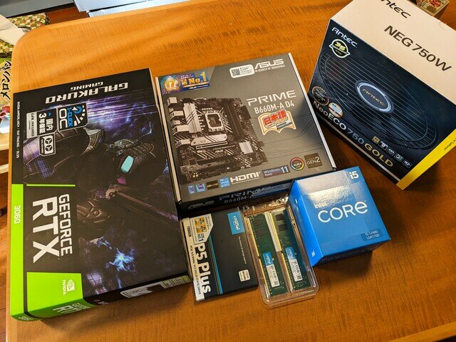
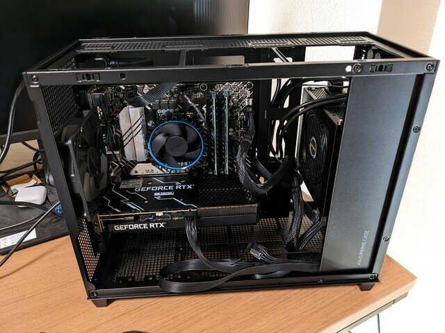
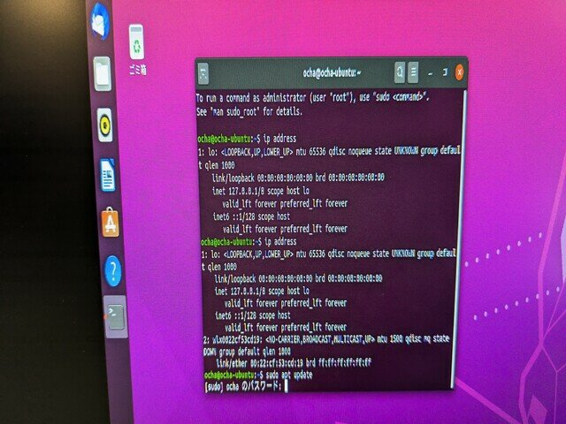
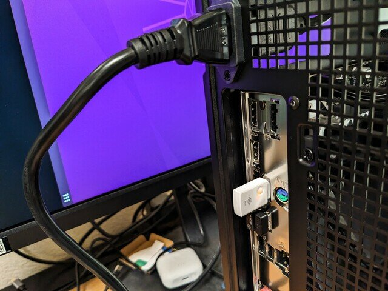
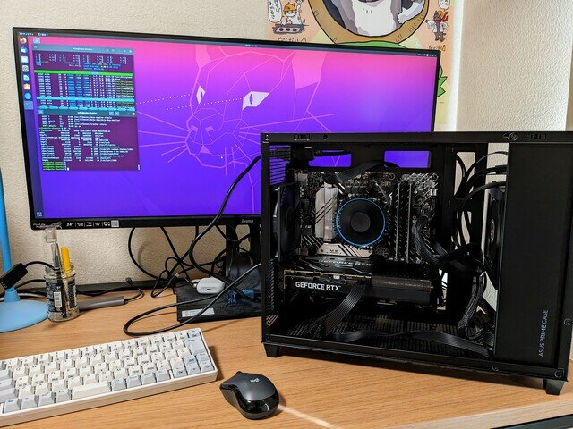

これまでVMWareのLinuxでパフォーマンスが出ない場合はLinuxをインストールしたPCを使っていましたが、最近このPCが処理中に轟音をたてるようになりました。ヤフオクで中古で購入した[ThinkCentureという小型PC](https://kanpapa.com/2021/02/thinkcentre-m715q.html "デスクトップPCをミニPC ThinkCentre M715qにリプレースしてみました")ではやや限界が近づいているようです。

そこでお年玉セールをやっているこのタイミングで新しいPCを購入することにしました。いろいろ調べてみましたが、今後GPUも使っていきたいので、久しぶりにPCを組み立ててみることにしました。

### 組み立てたPCのスペック

超高速である必要はないので、そこそこのスペックかつGPU搭載で検討をすすめました。

| グラフィックボード | NVIDIA GEFORCE RTX 3060 搭載 12GB |
| --- | --- |
| メモリ | DDR4 SDRAM（288pin） / 16GB(8GB × 2枚) / DDR4-3200 |
| ストレージ | 1TB SSD PCIe Gen4 (最大転送速度 6,600MB/秒) NVMe M.2 (2280) |
| マザーボード | Intel B660搭載 LGA1700対応 MicroATXマザーボード DDR4対応 |
| CPU | Intel インテルCore i5-12400 BOX LGA1700（第12世代） |
| ケース | ミニタワー（ルミナスラックに収まる寸法のもの） |
| 電源 | 750W 80PLUS GOLD |

今回購入したパーツです。

 <!--more-->

今回購入したケースです。まず最初に置き場所におけるかを確認しました。右隣の小さいPCがこれまでのLinux専用で使っていたPCです。

### PCの基本動作確認

まずは最低限のパーツで動作確認を行います。マザーボードににCPU、CPUファン、メモリ、SSDを取り付けます。この状態でHDMIディスプレイと電源とケースの電源スイッチを取り付けました。

問題なく動作しているようです。ディスプレイにもきれいに表示されています。

### ケースへの組み込み

動作確認したMBをケースに取り付けて配線します。最近のケースは配線しやすいですね。このときにグラフィックカードも取り付けました。

### PCの画面表示がおかしい

この状態で電源を投入したところ、なぜかBIOS画面が表示されません。いろいろ試しているうちに縦長の状態で表示されたので、その状態でUSBメモリからUbuntuをインストールしました。インストール後も画面表示は縦長の表示のままです。  仮組のときは問題なく表示されていたのにと思いつつUbuntuのパッケージを最新にすると直るだろうと安易に考えて次に進みました。

### 有線LANが使えない

とりあえずUbuntuを最新の状態にアップデートしようと、マザーボードの有線LANにケーブルを接続したところ、有線LANを認識してくれません。Linuxのドライバが対応していないようです。  これはよくあることなので、手持ちのレガシーなWiFi USBドングルを接続したところあっさりWiFiを認識してネットワークに接続できました。  設定画面でWiFiに接続してapt update、apt upgradeを行いました。

### PCの画面が表示されない

ここからが一番ハマったところです。Ubuntuのアップグレード後に再起動をしたところ、画面が表示されません。何度か電源の再投入を行なっても変化がありません。ディスプレイ側ではHDMIの信号は認識しているようで表示しようと頑張っているようですが、結局表示されずにディスプレイがスタンバイ状態になってしまいます。どうもディスプレイとの接続が不安定に見えます。

### トラブルシューティング

事前に仮組みで動作確認を行っているので、基本的には動くはずなのですが、原因として考えられるのは以下の点です。

1. GPUビデオカードとマザーボードの相性
2. GPUビデオカードとディスプレイの相性
3. HDMIケーブルの不良

まずは仮組みのときに取り付けていなかったGPUビデオカードとの相性を疑いました。このため一度GPUビデオカードをとりはずし、マザーボードのHDMI端子に接続してみましたが変化がありません。 　GPUビデオカードとディスプレイの相性の可能性もあるので、別のディスプレイとして手元にあったRaspberry Pi用のミニHDMIディスプレイをマザーボードのHDMIやGPUビデオカードのHDMIに接続したところ問題なく表示されました。HDMIのケーブルも問題なさそうです。  　ここでふと思いつきました。Raspberry Pi用のミニHDMIディスプレイやこれまで使っていたThinkCentureは画面解像度が低かったなと。今回接続しようとしているディスプレイはUWQHD（3440x1440）という高解像度です。 そこでGPUビデオカードのDisplayPortにディスプレイを接続したところあっさり画面が表示されました。もしやと思って別のHDMIケーブルを使ったら正常に表示されました。  仮組みのときの写真を見返してみると画面表示には問題ありません。この時はたまたま高解像度対応のHDMIケーブルを使っていたのです。 結局、これまでのUbuntu PCで使っていたHDMIケーブルが高解像度に対応していなかったのがトラブルの原因でした。

このトラブルシューティングで数時間使ってしまいました。すぐ高解像度対応のHDMIケーブルをオーダーしたのは言うまでもありません。

### まとめ

PCの組み立ては十数年ぶりとなります。当時はなるべく安く組み立てることを目的としていたので、ケースやマザーボードなど格安品を使って、パーツの相性問題やケースの構造による問題などにぶつかることが多かったです。 今回は当時にくらべると、マザーボードだけでストレージを含めた動作確認もでき、基板も洗練されていてシンプルになっています。ケースもしっかりしたものになっていて配線まで考慮されて設計されています。組み立てが昔より容易になっていると感じました。 また、高性能のGPUを搭載することである程度の音が発生すると思っていたのですが、現時点ではとても静かです。いままでのThinkCentureの轟音が嘘のようです。

しばらくはこのLinux PCをベースに使い込んで行きたいと思います。
