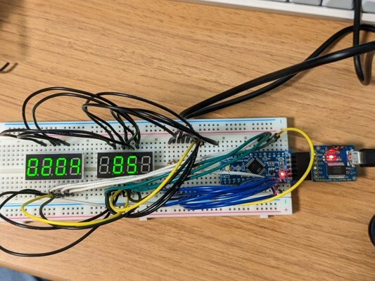
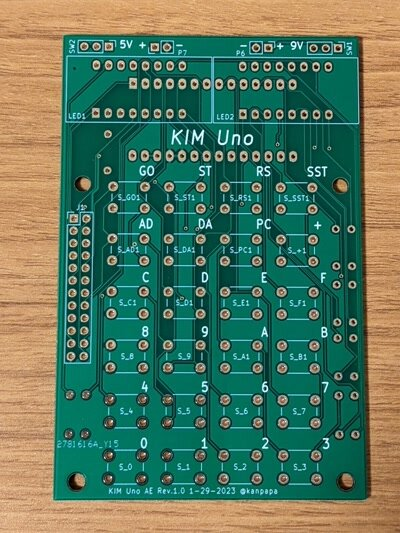
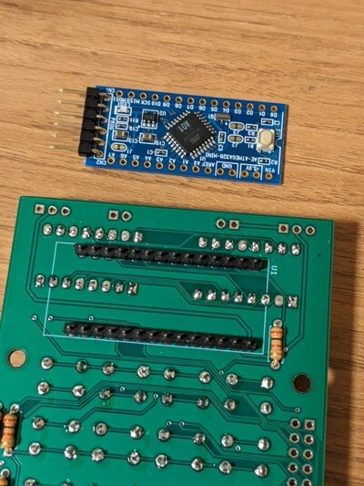
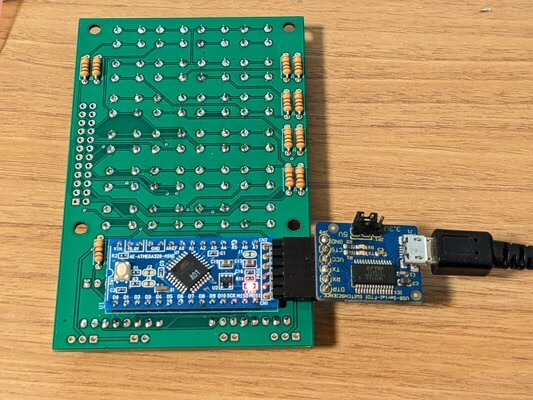
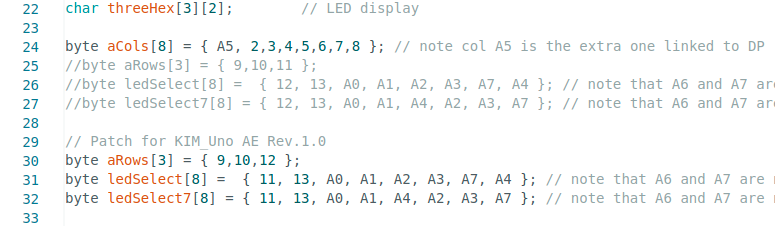
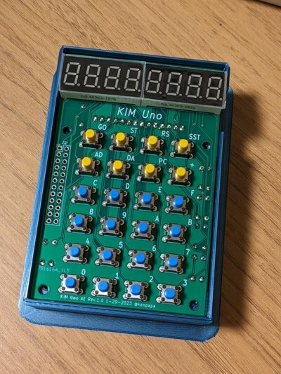

COSMACの記事を探していたところ、KIM UnoというKIM-1クローンを見つけました。

- [KIM Uno: a DIY clone of the KIM-1](https://obsolescence.wixsite.com/obsolescence/kim-uno-summary-c1uuh "KIM Uno: a DIY clone of the KIM-1") (Obsolescence Guaranteed)

[KIM-1](https://ja.wikipedia.org/wiki/KIM-1 "KIM-1")とは、6502 CPUを動かせるホビー向けのマイコンボードで、COSMACでいうと[COSMAC ELF](https://en.wikipedia.org/wiki/COSMAC_ELF "COSMAC ELF")に近いものでしょうか。最低限の7セグメントLEDと入力のための簡単な16進キーボードを持っているものです。

KIM Unoという名前からある程度想像できますが、KIM-1の機能をArduino Pro Miniでエミュレーションしているものです。Arduinoに書き込むスケッチを変えることで、KIM-1やCOSMAC ELFの機能を動かすことができるようです。

### プロトタイプの製作

KIM Unoの製作に必要なパーツは秋月電子で揃えました。KIM Unoで使用しているArduino Pro Miniと7セグメントLEDは秋月電子で入手できる同等品（ [AE-ATMEGA328-MINI \[K-10347\]](https://akizukidenshi.com/ "AE-ATMEGA-328 MINI"), [OSL40363-IRYG \[I-15998\]](https://akizukidenshi.com/ "OSL40363-IRYG") ）を使っています。回路図はGitHubに載せておきました。

- [kanpapa/kim\_uno\_ae/schematics/kimuno4\_ae\_sch.pdf](https://github.com/kanpapa/kim_uno_ae/blob/main/schematics/kimuno4_ae_sch.pdf)

Arduino Pro MiniにはKIM-1のスケッチを書き込みます。最新のファームウェアを書き込もうとしたのですが、スケッチのサイズが大きすぎるというエラーがでてしまったので、一つ前のファームウェアを書き込みました。もしかするとArduinoライブラリの更新でメモリに収まらなくなってしまったのかもしれません。この点はあとで調べてみたいと思います。

ブレッドボードに組み上げて動作確認です。16進キーボードはブレッドボードの試作では省略しましたが、Arduinoのシリアルモニタからの入力で動作確認ができました。

### 専用基板の製作

KIM Unoは専用基板を使って、電卓のようにコンパクトに仕上げています。公式サイトでKiCadデータとガーバーデータが公開されていますので、これをそのまま使おうとしたのですが、7セグメントLEDが秋月電子で入手できるものとやや仕様が異なります。このため、KiCadデータを改変することにしました。ついでにArduino Pro Miniも秋月電子で販売している[AE-ATMEGA328-MINI \[K-10347\]](https://akizukidenshi.com/ "AE－ATMEGA328－MINI （Arduino Pro Mini上位互換）")に置き換えています。また、KiCadデータはやや古い形式で互換性に課題があったのでKiCad6で作り直しました。

パーツの位置やネジ穴はオリジナルと同じにしてありますので、後で紹介する専用ケースもそのまま使えます。

今回製作した基板です。KIM Uno AE Rev.1.0という名前にしています。JLCPCBさんで１週間で到着しました。

### 専用基板への実装

パーツを半田付けしていきます。組み立て時に注意すべき点としては、AE-ATMEGA328-MINIと7セグメントLEDが表裏で実装されますので、先にAE-ATMEGA328-MINIを実装してしまうと、7セグメントLEDがハンダづけできなくなります。このため、専用基板側にAE-ATMEGA328-MINI用のピンヘッダのみを取り付けた状態で、7セグメントLEDをハンダづけします。

AE-ATMEGA328-MINIを実装したあとは修正が困難ですので、ハンダ不良やブリッジがないかを慎重に確認した上で、AE-ATMEGA328-MINIの向きに注意し、１番ピンの位置を必ず確認してAE-MEGA328-MINIを取り付けてください。表側から見てシリアルコネクタは右側に来ることになります。

### 動作確認

ハンダづけが終わったら動作確認です。AE-ATMEGA328-MINIにシリアルUSB基板を接続しKIM Unoのファームウェアを書き込みます。

動作確認をしたところ左端のLEDが妙に明るい状態になっています。

16進キーボードを順に押して行くと、特定のキーの入力ができませんでした。どうも配線が間違っているようです。

回路図を再度確認したところ、AE-ATMEGA328-MINIの13ピンと14ピンが入れ替わっていました。

しかも、AE-ATMEGA328-MINIと7セグメントLEDが表裏に実装されているのでパターンカットなどでの修正ができない状態です。

そのためファームウェアのスケッチを修正することで動作を確認しました。

### 回路図の修正と基板の再発注

配線が間違っていた原因ですが、Arduino Pro MiniからAE-ATMEGA328-MINIに置き換えるために作成したシンボルデータにミスがありました。

この部分を修正して、基板データを再作成し、再度発注しました。今回はKIM Uno AE Rev.1.1としました。

基板は１週間後に無事到着しています。

### 修正した専用基板での動作確認

再び専用基板に実装します。２度目なので手慣れたものですが、AE-ATMEGA328-MINIの取り付けには十分注意してください。

前回は回路が間違っていたのでパッチを当てたファームウェアでしか動作しませんでしたが、今回は標準ファームウェアでの動作が確認できました。KIM-1の機能も問題なく動作しているようです。

### 専用ケースへの実装

KIM Unoはさまざまなかたが製作しているようで、専用ケースの3Dプリントデータも配布されています。

最初に以下のデータを印刷してみました。箱型のシンプルなものです。

- [KIM Uno Case](https://www.thingiverse.com/thing:1157552 "KIM Uno Case") by [trgt](https://www.thingiverse.com/trgt) November 27, 2015

出力結果は以下のようになりました。

専用基板のサイズにぴったり合っているのですが、基板下側のネジ穴がややずれています。今の基板と以前の基板ではネジ穴の位置が異なっていたようです。使えないことはないので一旦このケースを使いました。

ただ、このケースはお弁当箱みたいな感じで蓋を開けて操作しなければなりません。もう少し探したところ、これらをアップデートしたケースデータを見つけました。

- [KIM Uno Full Case](https://www.thingiverse.com/thing:4862784 "KIM Uno Full Case") by [fixoid](https://www.thingiverse.com/fixoid) May 19, 2021

こちらは、ケースにLEDとキーボード用の穴が空いていて、キーボードのボタンまであります。またケースのネジ穴の位置も修正されているようです。すべてを出力すると時間がかかるので、ケースのパネルだけ出力しました。

なかなか良い感じです。

### 専用ケースを3Dプリント発注

この専用ケースは気に入ったので、もう少しきれいなものにしたく、JLCPCBの3Dプリントサービスに発注しておきました。

外部の3Dプリントサービスの利用は今回は始めてです。ただしキーボードのボタンの部分はボタン同士をつなげている薄い部分が最低限の厚みが満たせず製造不可とのことでしたので、ここだけは自宅の3Dプリンタで出力したものを使うことにします。まだケースは到着していませんが、到着したら掲載したいと思います。

### まとめ

今回ひょんなことから、KIM-1というものを知ることができました。COSMAC ELFと同様に過去の資料が多数公開されており、マニュアルにはゲームプログラムが多数掲載されていますので、6502 CPUを楽しめることができそうです。Arduinoでのエミュレータでシンプルな設計のため、電池駆動のコンパクトな筐体で、KIM-1以外にも応用ができ、末長く楽しめるものとなりそうです。

なお、今回設計した基板のKiCadデータですが、配布条件を確認するために製作者にコンタクトをとっているのですがまだ返答がありません。配布条件が明確になり次第公開できればと思っています。
