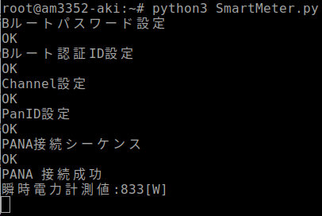
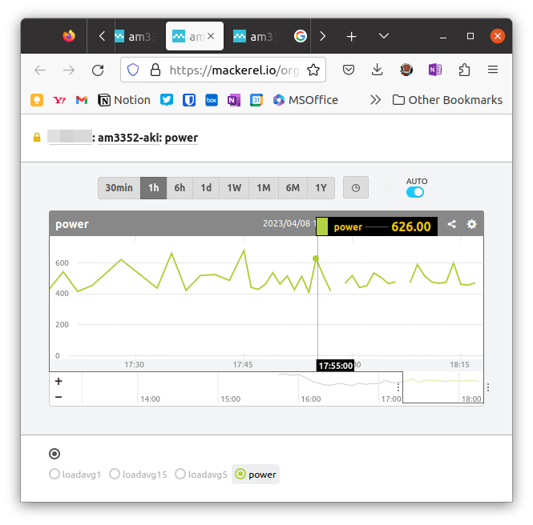

[前回までの記事](https://kanpapa.com/2023/03/aesoc-yocto-custom-kernel.html "秋月電子のSoC基板でyocto-linuxを動かしてみました（その２ カスタムカーネル編）")でかろうじてLinuxが秋月SoC基板で動くようにはなりましたが、今後の作業で使用するLinuxはYocto Project 4.0 Kirkstone上でみつきんさんの[mickey-happygolucky](https://github.com/mickey-happygolucky)/[meta-am3352-aki](https://github.com/mickey-happygolucky/meta-am3352-aki)を使わせていただくことにしました。3GモデムやSPIフラッシュまでサポートされていて申し分ありません。以下のみつきんさんの記事を参考にさせていただきました。

- [秋月の「アレ」をYoctoProjectで遊ぶ(u-boot起動まで)](https://mickey-happygolucky.hatenablog.com/entry/2023/03/25/103737)
- [秋月の「アレ」をYoctoProjectで遊ぶ(Linux起動まで)](https://mickey-happygolucky.hatenablog.com/entry/2023/03/25/122118)
- [秋月の「アレ」をYoctoProjectで遊ぶ(SPIフラッシュ)](https://mickey-happygolucky.hatenablog.com/entry/2023/04/06/010052)


今回はこのハードウェアを活かしたアプリケーションを載せてみます。

<!--more-->

### スマートメーターから瞬時電力値を取得する

秋月SoC基板にはWi-SUNのモジュールが搭載されています。これを使うと[電力メーター情報発信サービス（Bルートサービス）](https://www.tepco.co.jp/pg/consignment/liberalization/smartmeter-broute.html)が利用できるようです。

Wi-SUNを使用してスマートメーターの情報を取得するまでの流れやプログラムはいくつか公開されていますが、今回は[@kanon700](https://qiita.com/kanon700)さんの記事を参考にしています。

- [Pythonでスマートメーターの情報を引っこ抜く](https://qiita.com/kanon700/items/d4df13d45c2a9d16b8b0 "Pythonでスマートメーターの情報を引っこ抜く")

まずはスマートメーターにアクセスするためのIDとパスワードが必要になります。東京電力の場合Webから申し込んで数日でIDが郵送されてきました。


記事にあるプログラムはPythonで書かれているのでまずはPython3を追加したイメージをYoctoで作ります。

他にも含めたいものがあったので、build/conf/local.confに以下の記述を追加してbitbake core-image-minimalでビルドしました。

```
# Permit root login without a passwordEXTRA_IMAGE_FEATURES += " debug-tweaks"# Enable SSH accessEXTRA_IMAGE_FEATURES += " ssh-server-dropbear"# Python3CORE_IMAGE_EXTRA_INSTALL += " python3 python3-pip"# ntpCORE_IMAGE_EXTRA_INSTALL += " ntp ntpdate"# systemdDISTRO_FEATURES += " systemd"DISTRO_FEATURES_BACKFILL_CONSIDERED += "sysvinit"VIRTUAL-RUNTIME_init_manager = "systemd"VIRTUAL-RUNTIME_initscripts = "systemd-compat-units"
```

すでに同様に試されたかたの情報があり、その修正を行った上でPythonプログラムを動かしたところ電力量が表示されました。



### サーバ監視を組み込む

秋月SoC基板も立派なサーバですのでサーバ監視を行うことにしました。私は[Mackerel](https://mackerel.io/ "Mackerel")というはてなの監視サービスの無料版を使っています。無料版はサーバが5台まで、ログ保持期間が1日などの機能制限はありますが、このブログを立ち上げている[ConoHa VPSサーバ](https://www.conoha.jp/ "ConoHa")や[自宅NanoPiサーバ](https://kanpapa.com/2018/09/armbian-nano-pi-neo-nas-ssd.html "armbianでNano Pi NEO NASをSSDベースのサーバにしてみた")もMackerelで監視していて、障害が起こった場合はアラートが届きます。Raspberry Piなどでも使えるarmのパッケージも公開されています。

- [https://github.com/mackerelio/mackerel-agent](https://github.com/mackerelio/mackerel-agent "mackerel-agent")

Raspberry Piの監視設定の事例はいくつかありますが、今回は以下の記事を参考にして設定を行いました。

- [Raspberry PiにMackerelを導入する - 高木のブログ](https://takagi.blog/adding-mackerel-to-raspberry-pi/)

これで秋月SoC基板の稼働監視が行えるようになりました。ハングアップやディスク容量の枯渇、ネットワークの切断など秋月SoC基板に異常が発生したらアラートメールが届きます。


### 瞬時電力値をメトリクスとして監視グラフに追加する

Mackerelの機能として独自で設定したメトリクスを監視することもできます。瞬時電力量の情報をメトリクスとして取り込むことで、グラフが表示できます。無料版では１日分しか表示できませんが、実験では十分です。

今回は[MackerelのAPI](https://mackerel.io/ja/api-docs/ "Mackerel API ドキュメント（v0）")を利用して、電力量取得のプログラムに組み込みました。Pythonのライブラリが公開されていましたのでこちらを使わせてもらいました。

- [https://github.com/cm-watanabeseigo/mackerel-api-client-python](https://github.com/cm-watanabeseigo/mackerel-api-client-python "mackerel-api-client-python")

[Pythonでスマートメーターの情報を引っこ抜く](https://qiita.com/kanon700/items/d4df13d45c2a9d16b8b0 "Pythonでスマートメーターの情報を引っこ抜く")の記事にあるSmartMeter.pyをベースにMackerel APIに対応したSmartMeterMackerel.pyを作りました。ソースファイルはGithub.comにあげておきました。

- [SmartMeterMackerel.py](https://github.com/kanpapa/ae-am335x-wisun-3g-board/blob/main/SmartMeter/SmartMeterMackerel.py "SmartMeterMackerel.py")

まだデバック中なので、いろいろな出力がでていますが、Bルートの仕組みを知るための勉強にもなります。

実際に動き出すとこのようなグラフが表示されます。これで外出先からでもMackerelの監視画面で自宅の電力使用状況を知ることができます。



### 今後の応用

思わぬところからYoctoによる組み込みLinuxのカスタマイズ方法とＢルートという新たな知見を得ることができました。

また、Bルートのデータで生活行動がある程度わかるので安否確認に使えるなあと思ったりしています。秋月SoC基板は3G+Wi-SUNなのでこの用途には理想的かもしれません。
