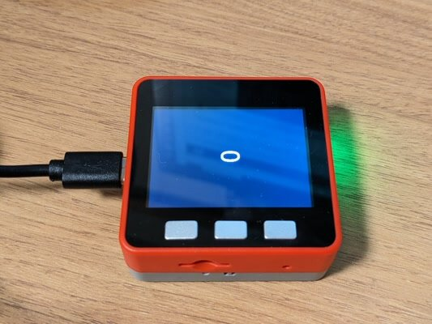
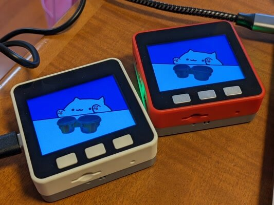

M5StackでModdable SDKを試してみましたので、ファースト・インプレッションを書いてみました。

### Moddable SDKとは

Moddable SDKはJavaScriptでIoTアプリケーションを作成できるSDKです。通常ですと、CやC++、Pythonといった言語をSDKで使うのが一般的ですが、やや専門的で敷居が高く感じるかたもいると思います。Webエンジニアなら良く知っているJavaScriptであれば、IoTアプリケーションを作成する敷居が低くなると思われます。

Moddableの公式サイトは以下にあります。

- [https://www.moddable.com/](https://www.moddable.com/ "https://www.moddable.com/")

今回参考にしたのは以下の書籍です。

- [実践Moddable　JavaScriptではじめるIoTアプリケーション](https://nextpublishing.jp/book/12230.html "実践Moddable　JavaScriptではじめるIoTアプリケーション")

この書籍で使用されているプログラムはGitHubに登録されています。

- [https://github.com/meganetaaan/moddable-examples](https://github.com/meganetaaan/moddable-examples "https://github.com/meganetaaan/moddable-examples")

### Moddable SDKをインストールする

Moddable SDKはGitHubで公開されていますので、公式ドキュメントの通りにインストールすれば動きます。

- [Moddable SDK - Getting Started](https://github.com/Moddable-OpenSource/moddable/blob/public/documentation/Moddable%20SDK%20-%20Getting%20Started.md "Moddable SDK - Getting Started")
- [Using the Moddable SDK with ESP32](https://github.com/Moddable-OpenSource/moddable/blob/public/documentation/devices/esp32.md)

私はUbuntu 20.04 LTSとｍacOS 13.2.1 Venturaで試して問題なくサンプルプログラムまで動かすことができました。

### M5Stackで動かしてみる

私が持っているM5Stackは以下の２つです。

- M5Stack FIRE 初期のもの MPU9250版
- M5GO 初期のもの

標準的なM5Stackなので問題なく動くと思っていたのですが、参考書籍のサンプルプログラムの[counter](https://github.com/meganetaaan/moddable-examples/tree/master/counter "counter")をM5Stack FIREで試したところ、いろいろ発見がありました。

#### 画面が横向きに表示される

画面表示の向きが90度ずれていました。



moddableのSDKを確認したところ、rotation: 90と指定すると良さそうです。

以下の記述をcounter/manifest.jsonに追加したら正しい向きになりました。

```
  "platforms": {     "esp32": {        "config": {            "rotation": 90        }     }  }
```

#### 起動音を止める

ビルドしたプログラムをアップロードして起動する際に大きな音がなります。これを止めるにはstartupSoundをfalseにすれば良さそうです。counter/manifest.jsonを以下のように修正しました。

```
  "platforms": {       "esp32": {           "config": {               "rotation": 90,               "startupSound": false           }       }   }
```

#### Neopixelが動かない

次にunit/neopixelを試しましたが、デバッガで確認すると途中でエラーになって止まっているようです。

こちらはM5GOで試したところ何故か問題なく動きました。


これは原因がよくわからないのでSDKを確認して行くしかなさそうです。

M5Stack FIREはこれまで何度かアップデートがあり、その都度使用しているチップが変わったりしているようですので、私の持っているM5Stack FIREがたまたま対応していないのかもしれません。

試したプログラムをまとめてみました。M5Stack FIREとM5GOは同じ動きをしているようです。

|  | **ビルド方法**  | **M5Stack FIRE** | **M5GO** |
| --- | --- | --- | --- |
| **counter** | esp32/m5stack  | 画面向きOK、色反転 | 画面向きOK、色反転 |
| esp32/m5stack\_fire | 画面横向き、色OK | 画面横向き、色OK |
| **bongo** | esp32/m5stack  | 画面向きOK、色反転 | 画面向きOK、色反転 |
| esp32/m5stack\_fire | 画面横向き、色OK | 画面横向き、色OK |
| **unit/neopixel** | esp32/m5stack  | 正常に光が流れる。 | 正常に光が流れる。 |
| esp32/m5stack\_fire | 途中まで光るが、光が流れず、再起動 | 途中まで光るが、光が流れず、再起動 |

### 今後について

私の手持ちのM5Stackは初期のものばかりで最近のものだと問題ないのかもしれません。まずは安定して動く環境を整えたいと考えていますが、次々とリリースされるM5StackにSDKが追従するのは難易度が高いのかもしれません。

また、SDKの問題なのか、ハードウェア固有の問題なのかの切り分けをするためにも、M5Stack Core2など最近のリファレンスモデルを1つ入手しておくのが良さそうです。


