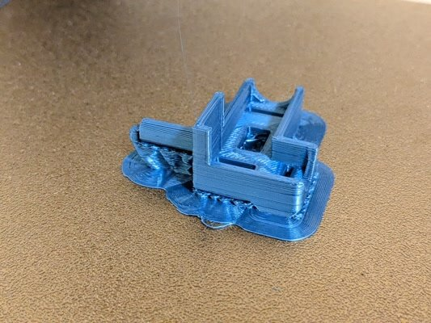
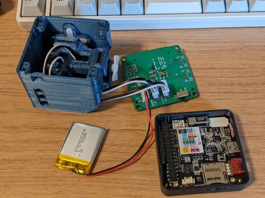

以前、[PWMサーボをつかったスタックチャンを組み立てました](https://kanpapa.com/2022/12/stackchan-m5stack-assembly.html "スタックチャンを組み立てました")が、PWMモーターが動くと同時にM5Stackの電源が落ちることが多くなってしまいました。シリアルサーボを使うとそのようなことは起こらないようなので、シリアルサーボに変更してみました。

### シリアルサーボ用の3Dパーツの製作

今回使用するシリアルサーボはFEETECH社の[SCS0009](https://www.switch-science.com/catalog/8042/ "SCS0009")です。これに適合したブラケットの3Dデータが[Github](https://github.com/meganetaaan/stack-chan/tree/dev/v1.0/case "stackchan case")にありますので、3Dプリンタで出力します。

モーターブラケットを組み立てるとこのような形になります。

### スタックチャン基板をシリアルサーボ用に変更する

PWM用に組み立てた基板のパーツを付け替えることでシリアルサーボ用に変更します。新たに追加したパーツは以下のものです。

- チップ抵抗 表面実装 0603(1608Metric)
    - 1kΩ \* 1pc
    - 10kΩ \* 1pc
    - 100Ω \* 1pc
    - 0Ω \* 3pc（内2個はPWM用の設定で使っているものを付け替えます）
- [TC7WH241FK \[I-10884\]](https://akizukidenshi.com/ "２回路入３ステートバスバッファ　ＴＣ７ＷＨ２４１ＦＫ") \* 1pc

### シリアルサーボの動作確認

スタックチャン基板にシリアルサーボを接続して、シリアルサーボが問題なく使えるかの確認を行います。[秋月電子のホームページ \[M-16312\]](https://akizukidenshi.com "ＦＥＥＴＥＣＨサーボ　ＳＴＳ３２１５")に[Arduino用のシリアルサーボライブラリ(SCServo.zip)](https://akizukidenshi.com/download/ds/feetech/SCServo.zip "SCServo.zip")がありましたので、これを使います。

Arduino IDEをM5Stack用に設定し、シリアルサーボライブラリのサンプルプログラムをM5Stack＋スタックチャン基板用に書き換えました。

- [SCS0009\_sample1.ino](https://github.com/kanpapa/scs0009/blob/main/Arduino/SCS0009_sample1/SCS0009_sample1.ino "SCS0009_sample1.ino")

まず1個だけモーターを接続して動かしてみます。

問題なく動作確認ができました。



### シリアルサーボのIDと位置を設定する

スタックチャンで使用する場合、シリアルサーボのIDを設定しなければなりません。工場出荷値はID=１となっています。２個のモーターのうち１個をID=2にしなければなりません。

- ID1: 足側（左右回転、パン軸）
- ID2: 顔側（上下回転、チルト軸）

本来であれば、[シリアルサーボを設定するツール](https://www.switch-science.com/products/7490 "FEETECH FE-URT1-C001 シリアルバスサーボ用USBプログラマ ")を使うのですが、持っていないのでスタックチャン基板を使って設定することにしました。秋月電子のシリアルサーボのライブラリにもIDを変更するサンプルプログラムがありました。これを流用しました。

- [SCS0009\_set\_ID2.ino](https://github.com/kanpapa/scs0009/blob/main/Arduino/SCS0009_set_ID2/SCS0009_set_ID2.ino "SCS0009_set_ID2.ino")

これでID=1、ID=2のモーターに設定できたので個々に制御することができるようになりました。プログラムは以下におきました。

- [SCS0009\_check\_twin.ino](https://github.com/kanpapa/scs0009/blob/main/Arduino/SCS0009_check_twin/SCS0009_check_twin.ino "SCS0009_check_twin.ino")



また、スタックチャンのモーターの位置決めをしておく必要があります。正しい位置でケースや足を固定しないと動作位置がおかしくなってしまいます。これもシリアルサーボのライブラリで設定します。基準位置は「Goal」の値を511にするとのことなのでそのようにプログラムで指定しました。

- [SCS0009\_set511.ino](https://github.com/kanpapa/scs0009/blob/main/Arduino/SCS0009_set511/SCS0009_set511.ino "SCS0009_set511.ino")

ケースを取り付ける直前にこのプログラムで位置決めを行い、ケースと足を取り付けるようにします。

### ファームウェアを書き込む

[Github](https://github.com/meganetaaan/stack-chan/tree/dev/v1.0/firmware "firmware")の説明通りにファームウェアを書きこんでいきます。PWM版を製作した後にPCを新しくしてしまったので、ゼロから環境設定を行いました。

途中npm installがなかなか進まず、unreachableというメッセージがいくつも出ていました。これはおかしいということで確認したところIPV6が悪さをしているようで、IPV6を停止したらスムーズにインストールが進みました。

### シリアルサーボが動かない

ファームウェアの書き込みが終了し、スタックチャンの顔が無事表示されました。しかしシリアルサーボが動きません。

オシロスコープではシリアル信号が頻繁に流れているのが気になったのですが、作者のかたからそれは問題ない動きで、Aボタンを押せば動くはずとのこと。Aボタンを押したところシリアルサーボが不定期に動くことを確認しました。これでケースに納めることができます。



### スタックチャンを組み立てる

あとはPWM版と同様にケースに組み込んでいきます。

ケースに基板をねじ止めして、足も固定します。

USBケーブルで充電を行っているため、足だけが動いていますが、動作は問題なさそうです。



### バッテリケースを取り付けて完成

最後に背中にバッテリーケースを取り付けます。これで自由にスタックチャンが動くようになりました。モーターが動作しても電源が落ちるということはなくなりました。



シリアルサーボなのでフィードバック情報も取れるとのことで、PWM版に比べて多彩な動きができそうです。
