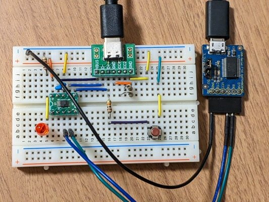

[CH552Eの実験をブレッドボードで行っていた](https://kanpapa.com/2023/05/ch552e-prototype1.html "CH552Eをブレッドボードで使ってみました")ところに、TwitterでCH552のモニタプログラムを公開しましたという情報が流れてきました。

<blockquote class="twitter-tweet" data-cards="hidden" data-conversation="none" data-partner="tweetdeck"><p dir="ltr" lang="ja">CH552用のBASIC-52とモニターをGoogle Driveで公開しました。BASIC-52はシリアルポートの速度自動認識機能が使えない（どのように修正すれば良いのか分からない）ので、19.2Kbps固定です。また、タイマー機能等も修正していませんので、動くかどうかも分かりません。<a href="https://t.co/X2wF9LxIwd">https://t.co/X2wF9LxIwd</a></p>-- みかんとひよどり (@hiyodori5) <a href="https://twitter.com/hiyodori5/status/1654696519763910656?ref_src=twsrc%5Etfw">May 6, 2023</a></blockquote>

まずはこのモニタプログラムを[私のCH552Eブレッドボード](https://kanpapa.com/2023/05/ch552e-prototype1.html "CH552Eをブレッドボードで使ってみました")で動かしてみることにします。

このモニタプログラムは8051と互換性があるUART0で動くようになっていました。CH552EではUART0のピンが出ておらず、UART1しかありませんので、UART1を使うように書き換えればそのまま動作するはずです。

### 開発環境の準備

私のメインPCはUbuntu Linuxなので、Ubuntuで開発環境をそろえてみました。調べたところ as31という[An Intel 8031/8051 assembler](https://manpages.ubuntu.com/manpages/focal/man1/as31.1.html)パッケージがあるようなのでこれをインストールします。

$ sudo apt install as31

起動してみるとオプションがわかります。

$ as31  
AS31 2.3.1  
Usage: as31 \[-h\] \[-l\] \[-s\] \[-v\] \[-Aarg\] \[-Ffmt\] \[-Ofile\] file.asm

  -h       shows this help  
  -l       create list file  
  -s       send output to stdout  
  -v       print version number  
  -Aarg    optional output format argument  
  -Ffmt    output format \[hex|bin|tdr|byte|od|srec2|srec3|srec4\] (default=hex)  
  -Ofile   send output to file

Look at the manpage for more details.  
$

モニタのソースファイルをそのままアセンブルしてみたところ、定数の記述の仕様が異なりエラーがいくつかでました。その部分を修正することでエラーなくアセンブルが行われHEXファイルができました。

オリジナルの例

.equ hf8,h'f8

.equ h55,h'55 ; CH552 Keyword-1 for Enter safe mode

.equ haa,h'aa ; CH552 Keyword-2 for Enter safe mode

as31用に修正した例

.equ hf8,0xf8

.equ h55,0x55 ; CH552 Keyword-1 for Enter safe mode

.equ haa,0xaa ; CH552 Keyword-2 for Enter safe mode

念のためオリジナルのアセンブルリストとas31で生成されたアセンブルリストを確認したところ問題なさそうです。

### CH552Eで動くように修正する

UART0で使用しているレジスタをUART1のレジスタを使うように置き換える必要があります。まず以下のように追加しました。

;UART1 registers and values

.equ sbaud1,0xc2 ; SBAUD1: UART1 baud rate setting register

.equ sbuf1,0xc1 ; SBUF1: UART1 data register

.equ scon1,0xc0 ; SCON1: UART1 control register

  

.equ u1ri,0xc0 ; U1RI: Receive interrupt flag bit

.equ u1ti,0xc1 ; U1TI: Transmit interrupt flag bit

  

.equ h32,0x32 ; Define the set value of SCON1

次にUART0の初期化を行っている部分をコメントにして、UART1を初期化するように書き換えます。

;initialize CPU's serial port

mov scon1,#h32 ; patch by kanpapa

; mov scon,#h52

; mov tmod,#h20

; orl pcon,#h80 ; Set Pcon.7 ( Smod:double baud rate bit )

; -- CH552 ---

; .equ t2mod,0xc9 ; t2mod define

; orl t2mod,#0xa0 ; Set bTMR\_CLK, bT1\_CLK ( Set Timer1 Clock, MAX Speed = Fsys = 6MHz )

; ------------

通信速度を設定しているSet\_baudのルーチンは以下のようにsbaud1を使うように変更しました。Timer1の設定は使用しないのでコメントアウトしています。

mov sbaud1,a

; clr tr1 ; stop timer for serial port

; mov th1,a ; Set Timer1 Value

; orl pcon,#h80 ; Set Pcon.7 ( Smod:double baud rate bit )

; setb tr1 ; start timer for serial port

あとは、ソースコードを見ながら、UART0のレジスタであるti, ri, sbufにアクセスしている部分を、UART1のレジスタ u1ti, u1ri, sbuf1 に書き換えます。書き換えた例として、chr\_outのサブルーチンを示します。

;------------------------------------------------------------------------

; sends a character in a out the serial port. must be an ascii character

;

chr\_out:

jnb u1ti,\*

clr u1ti

mov sbuf1,a

ret

修正した状態で再度アセンブルを行い、HEXファイルを作ります。

$ as31 -l MON31C55.ASM

### HEXファイルをバイナリファイルに変換する

UbuntuのコマンドでHEXファイルをバイナリ形式に変換します。

$ objcopy -I ihex -O binary MON31C55.hex MON31C55.bin

正しくバイナリファイルに変換されているかは以下のコマンドでバイナリの内容を見て確認できます。

$ hexdump -C MON31C55.bin

### バイナリファイルをCH552Eに書き込む

CH552Eに書き込むには以下のツールを使いました。

- [https://github.com/MarsTechHAN/ch552tool](https://github.com/MarsTechHAN/ch552tool "ch55xtool")

python3で書かれていますので以下の手順でインストールします。

$ python3 -m pip install ch55xtool

もし、pyusbが無いと表示された場合は以下の手順でインストールします。

$ python3 -m pip install pyusb

また、README.mdにあるように、USBに接続したときに適切な権限が付与されるように以下の１行を/etc/udev/rules.d/50-ch55x.rulesに書き込んでおくと、PCのUSBにCH552Eが接続されたら自動的にデバイスのパーミッションが"0666"に設定されますので便利です。

SUBSYSTEM=="usb", ATTRS{idVendor}=="4348", ATTRS{idProduct}=="55e0", MODE="0666"

書き込みはArduino IDEを使って書き込んだ時のようにDFUスイッチを押しながら、USBを接続して、以下のコマンドを実行します。パラメタとして書き込むバイナリファイルを指定します。

$ python3 -m ch55xtool -f MON31C55.bin

正常に書き込めれば以下のように表示されます。

```
$ python3 -m ch55xtool -f MON31C55.bin
Found CH552 with SubId:17
BTVER:02.50
UID:17-45-9D-BC-00-00-00-00
Erasing chip flash. Done.
Flashing chip. Done. 
Finalize communication. Done.
$
```

### モニタプログラムを使ってみる

CH552EのUART1にUSBシリアル(3.3V)を接続します。回路図は以下のようになります。


これをブレッドボードで組み立てます。



USBシリアルにPCを接続して、GTKTermなどのターミナルプログラムを起動しておきます。通信速度は19200bpsです。この状態でUSB-Cから電源を投入すると、ターミナルにモニタプログラムからメッセージが表示されモニタプログラムが起動します。

### 

### まとめ

CH552Eで実験するためにはモニタプログラムを使って小さなプログラムを動かしていくのが早道と思います。

実は8051系のCPUを使うのは今回が初めてなのですが、アセンブラはどこかで見たような書き方だったので容易に理解することができました。

このような10ピン足らずのマイコンでも十分楽しめそうです。

モニタプログラムを公開いただいたみかんとひよどりさんに感謝です。

リセットの頻度が増えそうなので、あとでリセットスイッチもつけようと思います。
