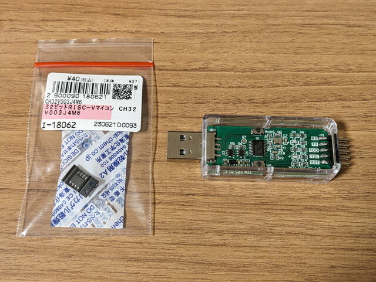
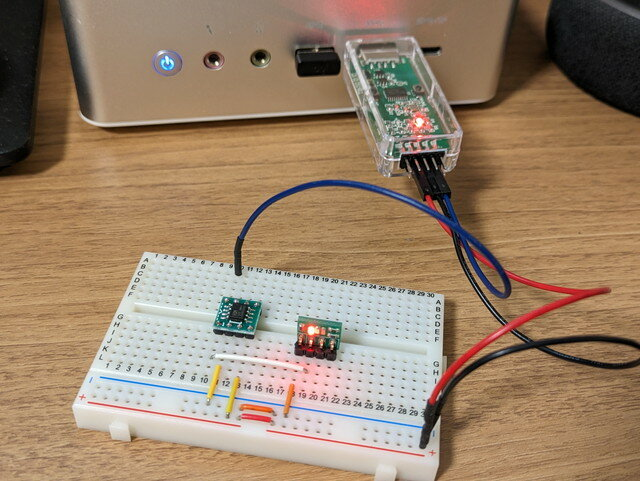
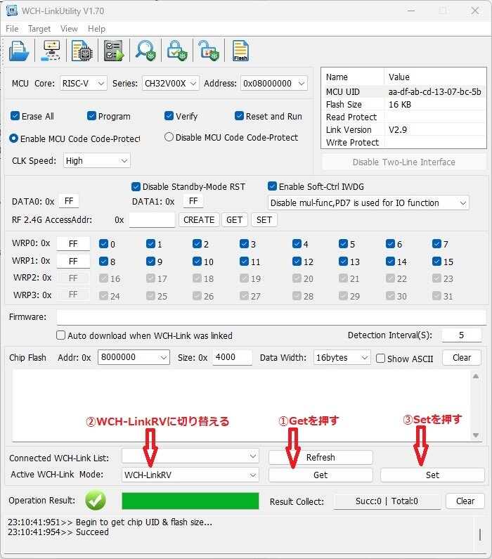
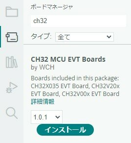
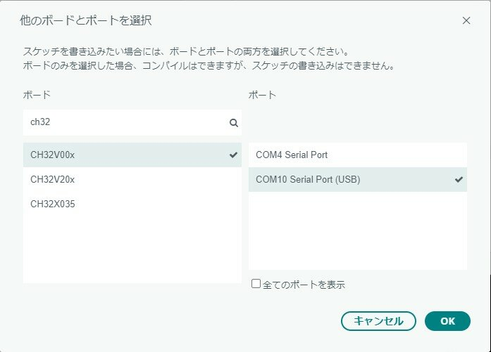
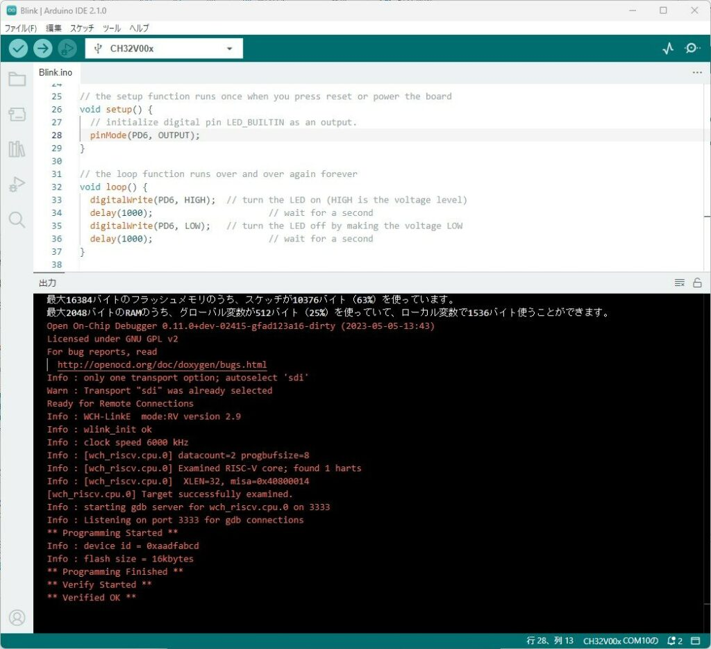

[秋月電子](https://akizukidenshi.com/ "秋月電子通商")さんに新商品のマイコンが入荷したようです。1個40円の[32ビットRISC-Vマイコン CH32V003J4M6 \[販売コード:118062\]](https://akizukidenshi.com/catalog/g/g118062/)です。あまりの安さとSOP8の可愛さで気になってしまいます。開発環境は公式のものもあるのですが、[Arduino IDE](https://www.arduino.cc/en/software "Arduino IDE")もサポートしているようです。今回はお手軽なArduino IDEでセットアップをしてみます。

他にも1個50円の[CH32V003F4P6 \[販売コード:118061\]](https://akizukidenshi.com/catalog/g/g118061/)もあり、こちらはピン数も多く高機能のようですが、まずはSOP8で扱いやすそうなCH32V003J4M6で試してみます。マイコンに書き込むためのツールの[WCH-LinkEエミュレータ \[販売コード:118065\]](https://akizukidenshi.com/catalog/g/g118065/)も販売されていましたのでこちらも購入しました。



### マイコンで簡単な回路を作ってみる

CH32V003J4M6はSOP8なのでピン間隔も1.27mmと広く表面実装部品の中でもはんだ付けはしやすいと思います。まずはブレッドボードで実験ができるように[SOP8変換基板 \[販売コード:105154\]](https://akizukidenshi.com/catalog/g/g105154/)にはんだ付けしました。


マイコンのピンは以下のような配列になっています。たった8ピンですが、いろんな機能が使えることがわかります。（[CH32V003データシート](https://www.wch-ic.com/downloads/CH32V003DS0_PDF.html "CH32V003データシート")から引用）


今回はLチカが目的ですので、以下のような回路を作ってみました。


WCH-LinkEとはダウンロードに必要なSWDIOと3.3V、GNDを接続します。これ一つでターゲットとなるマイコンへの電源供給もできて便利です。



### WCH-LinkEのモード設定をする

最初にWCH-LinkEでCH32V003が書き込めるように設定する必要があるので、以下のサイトからWCH-LinkUtility.ZIPをダウンロードして展開します。Windowsのみのサポートです。

https://www.wch.cn/downloads/WCH-LinkUtility\_ZIP.html

展開したフォルダの中にあるWCH-LinkUtility.exeを実行し、表示される画面の下のあたりにあるActive WCH-Link Mode: のGetボタンを押すと現在のWCH-LinkEのモードが表示されます。最初は「WCH-LinkDAP-WINUSB」になっていると思います。このプルダウンメニューから「WCH-LinkRV」を選択してSetを押すと、WCH-LinkEのモードがCH32V用に切り替わります。



この状態でQuery Chip Infoボタンを押して、接続しているマイコンの情報が表示されれば正常に動作しています。これでターゲットとなるマイコンとWCH-LinkEの接続は完了です。

### Arduino IDEの環境設定

Arduino IDEにCH32V用のボード設定を組み込む必要がありますが、以下のGitHubで公開されています。

- [https://github.com/openwch/arduino\_core\_ch32](https://github.com/openwch/arduino_core_ch32 "arduino_core_ch32")

READMEにあるようにArduino IDEの環境設定の追加のボードマネージャーのURLに以下のURLを追加します。

```
https://github.com/openwch/board_manager_files/raw/main/package_ch32v_index.json
```

あとはボードマネージャーでch32で検索してCH32 MCU EVT Boardsを選択してインストールします。



ボードはCH32V00xを選択し、ポートはWCH-LinkEが割り当てられているCOMxを設定します。私の場合はCOM10にみえました。



### Lチカプログラムを書きこんでみる

サンプルプログラムのBlinkに少し手を加えて以下のスケッチを作成しました。

```
// the setup function runs once when you press reset or power the board
void setup() {
    // initialize digital pin LED_BUILTIN as an output.
    pinMode(PD6, OUTPUT);
}

// the loop function runs over and over again forever
void loop() {
    digitalWrite(PD6, HIGH);  // turn the LED on (HIGH is the voltage level)
    delay(1000);                      // wait for a second
    digitalWrite(PD6, LOW);   // turn the LED off by making the voltage LOW
    delay(1000);                      // wait for a second
}
```

これをいつも通りにチェックボタンで検証後、矢印ボタンでマイコンに書き込みます。



無事Lチカができました。


### まとめ

今回はGPIOを１つ使っただけですが、他にもADC、UART、タイマが使えます。I2Cのサポートはまだのようですが、簡単なものであればこのマイコンで様々なことができそうです。

Arduino IDEにもサンプルスケッチが多数ありますので、ピン数が多いCH32V003F4P6を使えばさらに応用ができそうです。

### おまけ

LEDを3つ使ってみました。PC1,PC2,PC4にLEDを接続しています。


